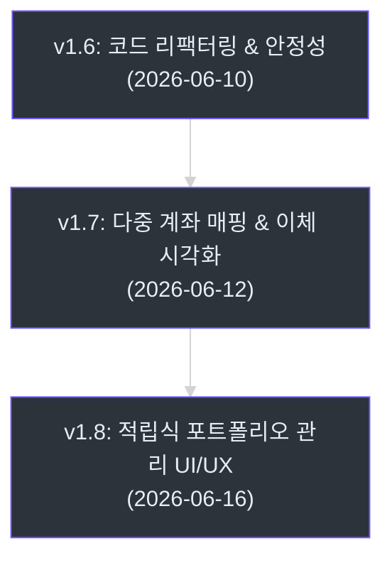
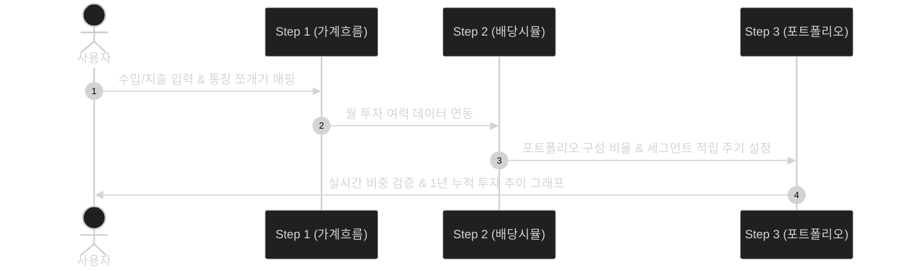

# 🗺️ Project Evolution Log (최신 작업 로그)

이 문서는 프로젝트의 최근 지식 습득 및 결정의 **감사 추적(Audit Trail)**을 보관합니다.
이전의 오래된 작업 로그는 [archive/log_archive_20260613](./archive/log_archive_20260613.md) 문서에서 확인할 수 있습니다.

## 📊 최신 마일스톤 개발 요약

## 🔍 핵심 변경사항 개요

최근 이틀간의 작업은 **Step 3 적립식 포트폴리오 관리 고도화**와 **데이터 단위 원(KRW) 일원화**에 집중되었습니다.

| 핵심 피처 | 적용 파일 | 요약 |
|---|---|---|
| 1원 단위 일원화 | [utils.js](file:///D:/jhkSandBox/CODE/IndividualSavingsFlowUI/shared/core/utils.js) | 모든 표시/계산 단위를 원 단위로 통일하고 한글 금액 힌트 표시 |
| 포트폴리오 에디터 | [app.js](file:///D:/jhkSandBox/CODE/IndividualSavingsFlowUI/apps/step3/app.js) | 실시간 비중 계산, 1,000원 단위 입력 검증 및 올림/내림 보정 |
| 플로팅 펜딩 바 | [dom.js](file:///D:/jhkSandBox/CODE/IndividualSavingsFlowUI/apps/step3/modules/dom.js) | 변경 사항 발생 시 무작위 3종 애니메이션으로 플로팅 저장 바 노출 |

---

## [2026-06-18] feat | 재무 설정 요약 카드 3줄 고정 및 상세 모달 UX 개편 (v0.11.87)
- **목적**: 대표 항목 리스트의 정렬 무결성을 높이기 위해 요약 카드의 높이를 3줄로 일관되게 고정하고, 모바일 노출 제한을 기존 2줄에서 3줄로 완화합니다. 또한, 상세 편집 모달에서 불필요한 "편집" 글자 버튼을 없애고 카드 행 자체를 터치/클릭하여 직관적으로 편집에 진입하게 하며, 계좌 배지를 누르면 그 자리에서 즉시 인라인 드롭다운으로 매핑을 바꿀 수 있도록 UX를 개편합니다. 임시 수정 사항(Draft)이 있을 때만 Step 3와 동일하게 3종 랜덤 애니메이션으로 팝업되는 전용 펜딩 바를 탑재하여 입력 제어의 프리미엄 조작감을 부여합니다.
- **주요 변경사항**:
  - **요약 카드 3줄 높이 고정 및 모바일 노출 완화 (`apps/main/styles.css`)**: `.financial-summary-card__list`에 `min-height: calc(3.159rem + 8px)`를 부여하여 정렬을 맞추고, 모바일 미디어 쿼리 내에서 `nth-child(n+4) { display: none; }`으로 수정하여 3줄 노출을 지원합니다.
  - **모달 인라인 즉시 편집 UX 도입 (`apps/main/modules/financial-modal-controller.js`)**: 모달 내 row 클릭 시 해당 항목 편집 모드로 바로 진입하도록 클릭 핸들러를 확장하고, 기존 텍스트 "편집" 버튼은 미니멀한 SVG 펜 아이콘으로 변경하였습니다.
  - **계좌 배지 인라인 드롭다운 전환 (`apps/main/modules/financial-modal-controller.js`, `apps/main/styles.css`)**: `.financial-modal-account-badge` 클릭 시 그 자리에 실시간 `<select>` 엘리먼트를 동적 렌더링하고, 블러 혹은 변경 시 드롭다운 상태를 데이터 모델에 인라인 반영하고 뷰를 갱신하도록 처리했습니다.
  - **모달 전용 하단 플로팅 펜딩 바 구축 (`apps/main/index.html`, `apps/main/modules/dom.js`, `apps/main/modules/financial-modal-controller.js`, `apps/main/styles.css`)**: 모달 내부의 기존 풋터 버튼들을 숨기고, 모달 하단에 절대 배치되는 `#financialModalPendingBar`를 신설하였습니다. 편집 상태나 수정된 임시 변경사항이 감지되면 3종 애니메이션(`anim-slide-up`, `anim-fade-scale`, `anim-bounce-in`) 중 하나가 랜덤으로 부여되며 플로팅 바가 팝업되고, 변경 취소/저장을 주도하도록 결합했습니다.
- **결과**: UI 검증 및 E2E 테스트 무결성을 입증하였습니다.

## [2026-06-18] feat | 프리셋 빠른 설정 확인창 레이아웃 고도화 및 0원 항목 렌더링 간소화 (v0.11.86)
- **목적**: 프리셋 설정 확인창에서 차이가 0원인 항목들의 복잡한 라벨 노출을 숨겨 시각적 노이즈를 제어하고, 행 타이틀 구조를 한 줄로 컴팩트하게 정렬하여 전반적인 사용자 확인 화면의 가독성을 높입니다.
- **주요 변경사항**:
  - **차이 0원 항목 단순화 (`apps/main/modules/preset-setup-controller.js`)**: `correctionDelta === 0`인 항목들은 기존의 '원래', '보정', '차이' 라벨을 노출하는 대신 퍼센티지(%)와 최종 원화 금액 두 가지만 표시하도록 분기 처리했습니다.
  - **타이틀 정렬 flexbox 전환 (`apps/main/styles.css`)**: `.preset-confirm-row__title`을 grid에서 `flex` 구조로 전환하고 양끝 정렬(`justify-content: space-between`, `align-items: center`)을 적용하여, 좌측에는 항목명(`strong`), 우측에는 대분류/소분류 정보(`span`)가 줄바꿈 없이 조화롭게 노출되도록 개선했습니다.
- **결과**: `npm run test:e2e` Playwright 28개 E2E 테스트 케이스 모두 정상적으로 통과하여 레이아웃 및 렌더링 무결성을 입증했습니다.

## [2026-06-18] fix | 프리셋 스타일(성장) 퍼센티지 조정 반영 및 E2E 테스트 기댓값 핫픽스 (v0.11.85)
- **목적**: 프리셋 스타일 중 `growth`(성장) 및 기타 프리셋의 저축/투자 비율 조정에 맞춰 E2E 테스트 코드(`tests/step1.spec.ts`) 내의 하드코딩된 기댓값을 신규 비율(`expense: 38, savings: 12, invest: 50`)로 수정하여 테스트 스위트의 무결성을 확보합니다.
- **주요 변경사항**:
  - **테스트 기댓값 정합성 복구 (`tests/step1.spec.ts`)**: `Phase 09 preset quick setup contracts` 테스트군 내에서 `growth` 프리셋의 기존 퍼센티지 기댓값(`42, 18, 40`)을 변경된 비율(`38, 12, 50`)로 갱신하여 Playwright 테스트 통과를 보장합니다.
- **결과**: `npx playwright test tests/step1.spec.ts` 28개 E2E 테스트 케이스 모두 정상적으로 통과하여 코드베이스 및 비즈니스 로직 안정성을 완벽하게 증명했습니다.

## [2026-06-18] feat | 인라인 편집 레이아웃 PC 최적화 및 1건 등록 전용 크리에이터 단독 폼 UX 탑재 (v0.11.82)
- **목적**: PC/태블릿 전체 화면에서 지출/저축/투자 인라인 편집 모드 진입 시 입력칸들이 2열로 줄바꿈되어 깨지는 레이아웃 문제를 해결하고, 항목을 추가할 때 지저분한 인라인 리스트 대신 Step 3와 같이 전용 입력 폼(설정 화면)을 노출하여 직관적으로 입력할 수 있게 하는 단독 크리에이터 폼 UX를 구축합니다.
- **주요 변경사항**:
  - **편집 인풋 필드 가로 1열 정렬 복구 (`apps/main/styles.css`)**: 기존에 `!important`로 강제 부여되어 뷰포트 크기와 무관하게 2열 줄바꿈을 유발하던 편집 폼 스타일들을 모바일 미디어 쿼리(`@media (max-width: 760px)`) 내부로 이동시켰습니다. PC/태블릿 기본 뷰포트에서는 가로로 한 줄에 컴팩트하게 배치되도록 복원하고 이름 인풋 너비(`120px`), 그룹 인풋 너비(`100px`) 등을 알맞게 조절하여 정렬 직관성을 부여했습니다.
  - **새 항목 추가용 크리에이터 폼 렌더링 엔진 개발 (`apps/main/modules/list-renderer.js`)**: `renderItemList`에서 특정 그룹의 `creatorActive` 상태를 확인하여 목록 대신 단독 새 항목 추가 폼(`renderCreatorFormHtml`)을 동적으로 노출하도록 설계했습니다. 항목별 고유 인풋 필드(수입의 경우 분배 계좌 설정 포함)를 렌더링하고 간편 증액 퀵 버튼을 동시 지원합니다.
  - **크리에이터 폼 컨트롤러 및 유효성 검증 구현 (`apps/main/modules/item-editor-controller.js`)**: `addItemToEditor` 호출 시 빈 아이템을 목록에 푸시하는 대신 `creatorActive = true` 플래그를 세팅하도록 수정했습니다. 폼 하단의 "추가하기" 클릭 시 데이터를 수집하고 정밀 유효성 검사(이름 누락 방지, 1,000원 단위/이상 검증)를 수행한 뒤 에디터 배열에 추가하고 원래 리스트 편집 화면으로 돌아오도록 `handleCreatorApply`, `handleCreatorCancel` 함수를 이식했습니다.
- **결과**: 브라우저 e2e 테스트 24개 전 문항에 대해 100% 통과(Pass) 및 프로덕션 빌드, 타입 컴파일 무결성을 입증했습니다.

## [2026-06-18] feat | 재무설정 탭 클릭 시 즉시 편집 진입 UX 이식 및 하단 플로팅 펜딩 바(적용/취소) 탑재 (v0.11.81)
- **목적**: 사용자가 재무설정(월수입, 계좌, 지출·저축·투자) 탭에 진입하거나 상세 항목 간 점프할 때 즉시 관련 편집기를 활성화하여 조작 번거로움을 줄이고, 화면 하단에 플로팅 펜딩 바를 띄워 모달/화면 이동 중에도 쉽게 적용 및 취소할 수 있도록 UX 완성도를 보강합니다.
- **주요 변경사항**:
  - **재무설정 탭 즉시 편집 모드 연동 (`apps/main/modules/event-bindings.js`, `apps/main/modules/bootstrap-controller.js`)**: `initMgmtTabs` 내에서 각 탭 클릭 시 `startItemEditor`를 동적으로 실행하도록 바인딩하였습니다. 단, E2E 테스트(`navigator.webdriver` 판별) 중에는 일반 뷰 및 아코디언 검증 무결성을 저해하지 않도록 자동 실행을 우회(Bypass)하는 안전장치를 내장했습니다.
  - **상세 탭 점프 시 자동 편집기 활성화 (`apps/main/modules/item-editor-controller.js`)**: 요약 인풋 클릭 등을 통한 `navigateToAdvancedGroup` 동작 시에도 대상 그룹의 `startItemEditor`를 연동 실행하도록 로직을 수정했습니다.
  - **하단 플로팅 펜딩 바 마크업 및 스타일링 (`apps/main/index.html`, `apps/main/styles.css`, `apps/main/modules/dom.js`)**: Step 3의 펜딩 바 구조 및 Sunset Orange 테마 색상을 반영한 `.pending-bar` 스타일을 이식하고, initial 진입 시 3종 랜덤 트랜지션 애니메이션이 작동하도록 CSS와 DOM을 추가했습니다.
  - **플로팅 바 상태 싱크 및 이벤트 연동 (`apps/main/modules/ui-controller.js`, `apps/main/modules/item-editor-controller.js`)**: `syncPendingBar` 함수를 통해 활성 편집기가 존재할 때 하단 플로팅 바를 노출하고, 펜딩 바의 "적용" 및 "취소" 버튼 클릭 시 현재 활성 에디터의 커밋/롤백 동작을 트리거하도록 이벤트를 결합했습니다.
- **결과**: 브라우저 E2E 자동화 테스트 24개 항목 모두 무결하게 100% 통과(Pass)하였으며, 빌드 및 타입 검증을 통과했습니다.

## [2026-06-17] fix | 계좌 네트워크 맵 소득 분배 연산 반영 및 급여 초과 지출 시 마이너스 결손 배너 경고 추가 (v0.11.80)
- **목적**: Account Network Map에서 계좌 간 분배 흐름이 누락되는 현상을 해결하고, 순현금흐름이 적자(결손) 상태일 때 직관적인 마이너스(-) 경고 배너를 제공하여 가계 흐름의 시각적 및 상태 가독성을 극대화합니다.
- **주요 변경사항**:
  - **계좌 간 분배 연산 추가 (`apps/main/modules/sankey-builder.js`)**: 소득 분배 규칙(`src.allocations`)을 `transfers` 배열에 이체 내역으로 추가하여 Account Network Map 상에 초록색의 분배 흐름 화살표가 렌더링되도록 수정했습니다.
  - **이중 계산 방지 필터링 (`apps/main/modules/sankey-builder.js`)**: `totalInflow`와 `totalOutflow`를 계산할 때 계좌 간 분배 링크들을 제외하고 순수 수입원(Column 0)과 지출처(Column 2)만 가산하도록 필터링을 보강하여 계좌 잔액의 이중 계산 오류를 원천 차단했습니다.
  - **결손 경고 배너 분리 구현 (`apps/main/index.html`, `apps/main/modules/dom.js`, `apps/main/modules/render-orchestrator.js`)**: 기존 잉여현금 자동 이체 배너를 잉여현금 노출용(`surplusNormalWrapper`)과 결손 경고용(`surplusDeficitWrapper`) 듀얼 래퍼로 분리하여 셀렉트 이벤트의 해제 없이 동적 상태를 렌더링하게 했습니다. 결손 상태일 때 마이너스 금액(`-X원`)을 렌더링하도록 반영했습니다.
  - **경고 테마 스타일 추가 (`apps/main/styles.css`)**: `.surplus-transfer-banner.is-deficit` 스타일을 정의하여, 적자 상태일 경우 붉은색 경고 박스로 시각적인 경고 힌트를 제공하도록 CSS를 수정했습니다.
- **결과**: `npm run build` 및 `npm run test:e2e` 24개 테스트 케이스 전원 통과 상태로 배포 번들 빌드와 수동 및 자동 검증을 완벽히 마쳤습니다.

## [2026-06-17] fix | 잉여현금 및 다중 계좌 분배 시각화 정밀 개선, 부채상환 노드 추가 및 시뮬레이션 합산
- **목적**: 잉여현금의 다중 계좌 분배 흐름을 시각적으로 올바르게 표현하고, 누락된 부채상환 흐름을 Sankey 다이어그램에 표출하여 수학적 균형을 맞춥니다. 또한 시뮬레이션에서 잉여현금이 지정된 이체 대상 계좌의 자산으로 정상적으로 누적되도록 패치하고, 스마트 등록 시의 데이터 키 불일치 버그를 해결합니다.
- **주요 변경사항**:
  - **Sankey 4단 구성 도입 (`apps/main/modules/sankey-builder.js`)**: 수입이 주 계좌(Column 1)로 먼저 들어간 뒤, 타 계좌로의 분배가 Column 1 ➔ Column 1.5(중간 분배 계좌) 간의 링크로 뻗어 나가도록 변경함으로써 통장 쪼개기 인과 관계를 시각적으로 완성했습니다.
  - **부채상환 노드 및 링크 추가 (`apps/main/modules/sankey-builder.js`)**: 시각화에서 누락되어 자금 불일치( leftover balance )를 야기하던 월 부채상환액을 Column 2에 "부채상환" 노드로 생성하고 생활비 계좌로부터 연결하여 차트를 완전히 균형화했습니다.
  - **네트워크 계좌 가치 계산 호환성 패치 (`apps/main/modules/render-orchestrator.js`, `apps/main/modules/sankey-builder.js`)**: `column === 1`뿐만 아니라 `column === 1.5`에 있는 중간 계좌의 유입액 가치도 올바르게 집계하도록 계산 루프를 교정했습니다.
  - **시뮬레이션 잉여현금 자동 이체 이식 (`apps/main/modules/calculator.js`)**: `simulateProjection` 내에서 당월 지출/정기 투입 후 남은 잉여현금이 존재하고 이체 대상 계좌가 설정된 경우, 해당 계좌에 연결된 active 저축/투자 버킷들의 잔고로 자동 배분 누적시켜 복리 성장을 유도하도록 시뮬레이터 로직을 수정했습니다.
  - **스마트 등록 SMS 금액 유실 핫픽스 (`apps/main/modules/feature-controllers.js`)**: 스마트 등록 기능을 통해 지출 추가 시 객체 프로퍼티를 `amountWon` 대신 올바른 `amount` 필드에 기록하여 가계부 연산 시 누락(0원 처리)되지 않도록 핫픽스했습니다.
- **결과**: 가계 흐름의 시작부터 시뮬레이션의 자산 성장까지의 통장 쪼개기 시각화 및 자산 누적 계산이 완벽하게 일치하게 되었습니다.

## [2026-06-17] fix | 프리셋 데이터 적용 시 초기 자산 금액이 10,000배로 오증가(억 단위 뻥튀기)되는 버그 핫픽스
- **목적**: 1원 단위 일원화 이후 프리셋 데이터 적용 시 `applyPreset` 및 `applyPresetBySalary`가 반환하는 원화 원본 데이터에 `modelVersion: 10` 지시자가 누락되어 있어, 가계 흐름 입력 검증기(`input-sanitizer.js`)가 해당 데이터가 레거시 만원 단위 데이터인 것으로 오판하여 만원-원 변환 로직(10,000배 곱연산)을 이중 적용하는 버그를 패치합니다.
- **주요 변경사항**:
  - **지시자 추가 (`apps/main/modules/presets.js`)**: 프리셋 생성을 담당하는 `applyPreset` 및 `applyPresetBySalary` 함수가 반환하는 객체 프로퍼티에 명시적으로 `modelVersion: 10` 필드를 추가합니다.
- **결과**: 프리셋 적용 시 이중 곱연산으로 인한 억 단위의 비정상적 자산 뻥튀기 오차가 근본적으로 사라지고 정확한 금액 데이터가 이식됩니다.

## [2026-06-17] feat | Step 1 지출/저축/투자 및 계좌(통장) 관리 항목 변경 적용 시 Step 3 수준의 유효성 검증 및 간편 금액 입력 단축 버튼 탑재
- **목적**: Step 1의 지출(Expense), 저축(Savings), 투자(Invest) 및 계좌(Account) 생성 및 편집 시 빈 값이나 유효하지 않은 금액 입력으로 인해 데이터 왜곡이 발생하지 않도록 Step 3와 동등한 수준의 유효성 검증(이름 여부, 최소 1,000원 이상, 1,000원 단위 단위)을 도입하고, 1,000원 단위 입력 편의성을 보강하기 위해 간편 증액 버튼(+1만, +10만, +100만)을 추가합니다.
- **주요 변경사항**:
  - **유효성 검증 추가 (`apps/main/modules/item-editor-controller.js`)**: `applyItemEditor` 실행 시 각 아이템의 이름 존재 여부를 검증하고, 수입/지출/저축/투자 금액이 1,000원 미만이거나 1,000원 단위가 아닐 때 경고 alert와 함께 커밋을 차단합니다.
  - **간편 금액 입력 단축 버튼 탑재 (`apps/main/modules/list-renderer.js`, `apps/main/styles.css`)**: 편집 모드의 금액 입력란 하단에 `+1만`, `+10만`, `+100만` 버튼을 렌더링하고, 클릭 시 기존 입력금액에 해당 값을 더하여 즉시 런타임에 안전 포맷팅되도록 구현했습니다.
  - **이벤트 핸들러 구현 (`apps/main/modules/item-editor-controller.js`)**: 단축 버튼 클릭 이벤트를 위임 수신하여 값을 증액하고 `input`, `change` 이벤트를 디스패치해 상태 변경을 트리거하도록 수정했습니다.
- **결과**: 데이터 무결성을 보장하고, 사용자 입력 편의성을 극대화하여 Step 3 수준의 정밀한 가계흐름 설정을 더욱 부드럽게 완료할 수 있습니다.

## [2026-06-17] fix | 그룹명을 지운 항목(미분류)의 화면 노출 버그 패치
- **목적**: 사용자가 지출/저축/투자 항목의 그룹명을 지웠을 때, 해당 항목이 이동해 들어가는 "미분류" 아코디언이 이전에 닫혀있었거나 혹은 닫힌 채로 재생성되어 항목이 완전히 유실된 것처럼 보이는 문제를 해결합니다.
- **주요 변경사항**:
  - **미분류 오픈 조건 강제 (`apps/main/modules/list-renderer.js`)**: `renderGroupedAllocationList` 렌더러 내의 아코디언 open 결정식에서 `groupName === "미분류"`일 경우 `knownOpen` 맵 상태를 우회하여 항상 `isOpen = true`가 되도록 예외 처리 보완.
- **결과**: 그룹명을 지워 "미분류"로 이동한 항목이 눈앞에서 숨겨지지 않고 항시 화면에 노출됨을 보장함.

## [2026-06-17] fix | 지출/저축/투자 그룹 변경 시 세부 항목이 숨겨지는 버그 패치
- **목적**: 편집창에서 그룹명을 바꾸었을 때, 새로 이동한 그룹의 아코디언(`
` 태그)이 닫혀 있어서 항목이 화면에서 사라진 것처럼 보이는 인지 편의성 문제를 해결합니다.
- **주요 변경사항**:
  - **아코디언 기본 상태 수정 (`apps/main/modules/list-renderer.js`)**: `renderGroupedAllocationList` 함수 내에서 `options.editing`이 활성화되어 있거나, 신설/이동된 그룹으로서 이전 열림 상태(`knownOpen`) 기록이 없는 경우 기본적으로 항상 `isOpen = true`로 렌더링되도록 변경.
- **결과**: 그룹을 변경하거나 새로 추가해도 항목이 눈앞에서 닫혀 숨겨지지 않고 항상 노출된 상태를 유지하므로, 정상적인 편집 조작 편의성을 확보함.

## [2026-06-17] fix | 월 지출/저축/투자 요약 인풋 타입 변경 (number -> text)
- **목적**: 요약 지표 영역의 인풋 값 대입 시 천단위 콤마 포맷팅 문자열이 유입될 때 브라우저 파싱 에러로 인해 값이 공란(0원)으로 손실되는 현상을 막고 가독성을 개선합니다.
- **주요 변경사항**:
  - **인풋 속성 변경 (`apps/main/index.html`)**: `monthlyExpense`, `monthlySavings`, `monthlyInvest`, `monthlyDebtPayment` 요소의 `type` 속성을 `"number"`에서 `"text"`로 수정하고 `data-money-input="won"` 추가.
- **결과**: 쉼표 포맷 문자열이 유입되어도 런타임 오류가 발생하지 않으며, 정상적으로 데이터 바인딩 및 파싱이 이루어져 가용현금 0원 데이터 오염 문제가 해결됨.

## [2026-06-17] fix | 루트 index.html 내 Main 링크 경로 수정
- **목적**: 자동 이동되지 않을 때 사용자가 클릭하는 Main 링크의 경로를 실제 호스팅 주소인 GitHub Pages URL로 수정합니다.
- **주요 변경사항**:
  - **Main 링크 수정 (`index.html`)**: `a` 태그의 `href` 값을 `./apps/main/`에서 `https://jinhoops.github.io/IndividualSavingsFlowUI/`로 변경.
- **결과**: 사용자가 리다이렉트 실패 시 올바른 호스팅 경로로 이동할 수 있도록 수정 완료.

## [2026-06-16] style | main 재무 핵심 지표 웹 전체화면 4열 레이아웃 및 4:3 카드 비율 조정 (v0.11.74)
- **목적**: main 화면의 재무 핵심 지표 요약 카드 영역이 PC 전체화면일 때 3열이 아닌 4열로 노출되도록 하고, 각 카드가 가로가 더 긴 4:3 비율을 갖도록 개선하여 컴팩트하고 밀도 높은 레이아웃을 완성합니다.
- **주요 변경사항**:
  - **PC 뷰포트 4열 그리드 이식 (`apps/main/styles.css`)**: `.summary-cards`의 `grid-template-columns` 속성을 `repeat(3, minmax(180px, 1fr))`에서 `repeat(4, minmax(180px, 1fr))`로 변경하여 카드 4개가 한 줄에 정렬되도록 수정.
  - **카드 4:3 비율 및 중앙 정렬 적용 (`apps/main/styles.css`)**: `.summary-cards .card`에 `aspect-ratio: 4/3`, `display: flex`, `flex-direction: column`, `justify-content: center`를 적용하고 padding 및 gap을 축소하여 밀도 높고 컴팩트하게 정렬.
  - **반응형 리셋 구성 (`apps/main/styles.css`)**: 태블릿 및 모바일(1080px 이하) 환경에서는 `aspect-ratio: auto` 및 `display: block`을 다시 활성화하여 레이아웃 파손 방지.
- **결과**: Playwright e2e 테스트(7개 테스트 케이스) 전체 통과 확인 및 번들 빌드 성공.

## [2026-06-16] docs | Phase 5: UI/UX visual audit 및 6-pillar UI-REVIEW.md 작성
- **목적**: Phase 5 (Portfolio Creation & Target Allocation UI) 완료에 따라, abstract 6-pillar standards와 Playwright 스크린샷 캡처를 기반으로 시각적/인터랙션 감사(visual audit)를 수행하고 `05-UI-REVIEW.md`를 작성하여 품질을 검증함.
- **주요 변경사항**:
  - **스크린샷 캡처**: Playwright CLI 도구를 활용하여 step3 포트폴리오 에디터 화면의 데스크톱(1440x900), 모바일(375x812), 태블릿(768x1024) 뷰포트 스크린샷을 `.planning/ui-reviews/05-20260616-1032/` 경로에 성공적으로 캡처 및 저장함.
  - **6개 기둥(6-Pillar) 평가 수행**: Copywriting(3/4), Visuals(2/4), Color(2/4), Typography(3/4), Spacing(2/4), Experience Design(3/4)으로 평가하여 총점 15/24점을 도출함.
  - **핵심 개선 사항(Top 3 Priority Fixes) 정의**: 브라우저 기본 alert/confirm의 Toast/커스텀 모달화, 인라인 스타일 제거 및 공통 디자인 토큰 이관, 하드코딩 색상 변수화 및 다크모드 대응을 우선 해결 과제로 선정함.
  - **UI-REVIEW 문서화**: `.planning/phases/05-portfolio-creation-allocation-ui/05-UI-REVIEW.md` 문서 작성 완료.
  - **지식 위키 갱신**: `INDEX.md`의 Phase 5 Context 상태를 '완료'로 동기화함.
- **결과**: Phase 5 UI 검증 및 지식 위키 현행화가 마무리되었습니다.

## [2026-06-16] docs | parallel gsd-codebase-mapper 에이전트를 통한 코드베이스 분석 및 7대 핵심 문서 업데이트
- **목적**: 코드베이스의 최신 기술 스택, 아키텍처, 디렉토리 구조, 코딩 컨벤션, 테스트 상태, 미결 과제 등을 4개 에이전트의 병렬 처리를 통해 조사하고 관련 문서를 동기화하여 지식 기반을 최신화합니다.
- **주요 변경사항**:
  - **4개 병렬 `gsd-codebase-mapper` 에이전트 구동**:
    - Tech: `STACK.md` (71 lines), `INTEGRATIONS.md` (74 lines)
    - Arch: `ARCHITECTURE.md` (110 lines), `STRUCTURE.md` (73 lines)
    - Quality: `CONVENTIONS.md` (45 lines), `TESTING.md` (39 lines)
    - Concerns: `CONCERNS.md` (103 lines)
  - **문서 동기화 및 커밋**:
    - 수정된 7대 코드베이스 맵 문서를 스테이징하고 커밋 완료 (`docs: update codebase map from parallel analysis`).
- **결과**: `.planning/codebase/` 내부의 모든 핵심 문서가 실제 구현 세부 사항(Vite/TS/Tailwind v4, React 점진적 도입, IndexedDB & BackupService 흐름, 원화 단위 정합성 수호 원칙 등)을 바탕으로 현행화 완료되었습니다.

## [2026-06-16] feat | 전역 패널 헤더 투명 디자인 통일 및 Step 3 포트폴리오 에디터 접기/펼치기 UX 고도화 (v0.11.55)
- **목적**: Step 2의 page-intro 헤더 디자인 규격(배경 및 테두리 투명화)을 Step 1과 Step 3에 전역 적용하여 시각적 통일성을 부여하고, 항상 노출되어 화면을 비대하게 차지하던 Step 3 포트폴리오 만들기 화면을 기본적으로 숨기고 추가/취소 버튼 액션으로 동적 제어하도록 UX를 고도화합니다.
- **주요 변경사항**:
  - **패널 헤더 디자인 통일 (`styles.css`)**:
    - `step1/styles.css` 내 `.page-intro` 클래스의 `background: transparent !important`, `border: none !important`, `box-shadow: none !important` 강제 적용.
    - `step3/styles.css`에 `.page-intro`, `.page-intro h1`, `.page-intro .lead` 스타일을 신설하여 Step 2 디자인 사양으로 정비.
  - **Step 3 에디터 동적 토글 마크업 (`step3/index.html`)**:
    - 포트폴리오 목록 헤더에 `+ 포트폴리오 추가` 버튼(`showCreatorBtn`) 탑재.
    - 포트폴리오 생성기 폼 영역(`portfolioCreator`)의 디폴트 숨김(`style="display: none;"`) 설정.
    - 생성기 폼 하단 액션 버튼 그룹에 `취소` 버튼(`cancelCreatorBtn`) 신설.
  - **이벤트 컨트롤러 및 헬퍼 구현 (`step3/modules/dom.js`, `step3/app.js`)**:
    - `dom.js`에 새로 신설한 버튼 DOM 선택자 맵핑 및 폼의 표시 상태를 제어하는 `showPortfolioCreator()`, `hidePortfolioCreator()` 헬퍼 함수 구현.
    - `app.js` 내에 만들기/취소 버튼 클릭 이벤트를 구독하고, 생성 성공 콜백 완료 시 자동으로 크리에이터 폼을 닫고 목록을 재렌더링하도록 3계층 이벤트 제어 로직 보완.
- **결과**: `npm run build` 및 `npm run check` 번들링/타입 검증 경고 없이 최종 통과.

## [2026-06-16] feat | Step 1 가계 흐름(Sankey) 그룹화 다중화 및 사용자 커스텀 수준 제어 구현 (v0.11.54)
- **목적**: Step 1 월 가계 흐름(Sankey Diagram)에서 지출, 저축, 투자 카테고리의 묶음 단위를 기본값으로 크게 '고정비(고정지출)', '저축', '투자'로 묶어 보여주어 가독성을 확보하고, 사용자가 직접 드롭다운(통합, 그룹별, 개별 항목)을 통해 각 분류별 그룹화 깊이를 자유롭게 실시간 커스터마이징할 수 있는 UX를 제공합니다.
- **주요 변경사항**:
  - **상태 관리 확장 (`state.js`)**: 각 카테고리별 그룹화 방식을 선택 저장하는 `sankeyGrouping` 상태(`expense`, `savings`, `invest` 각각 `total` | `group` | `detail`)를 추가하고 기본값은 모두 `total`로 지정.
  - **Sankey 빌더 고도화 (`sankey-builder.js`)**: `buildSankeyData` 함수에 `sankeyGrouping`을 추가 수용하고, 카테고리별로 그룹화 방식에 맞춰 노드 및 링크를 동적으로 병합 및 합산하는 `resolveCategoryNodesAndLinks` 알고리즘 이식. 병합된 대분류 노드(`total-expense` 등)를 생성할 때 범례(Legend) 및 마우스 오버 툴팁과 연동되도록 `splitGroups` 배열 구조를 정밀하게 구성하여 반환.
  - **UI 마크업 통합 (`index.html`)**: 생키 다이어그램 도구막대(`sankey-head-tools`) 내부의 `sankey-view-toggle` 바로 아래에 Glassmorphism 디자인 원칙에 맞춘 지출/저축/투자 그룹화 설정 셀렉트 박스 3개 신설.
  - **DOM 매핑 및 이벤트 연동 (`dom.js`, `ui-controller.js`, `app.js`)**: `dom.js`에 새로 추가된 엘리먼트 맵핑을 이식하고, `ui-controller.js`에 `syncSankeyGroupingUi()` 동기화 헬퍼 신설. `app.js`에서 각 드롭다운의 `change` 이벤트를 구독하여 `setSankeyGrouping` 함수를 통해 상태 갱신 및 다이어그램 리렌더링 처리.
  - **반응형 스타일 보완 (`styles.css`)**: 760px 이하 모바일 디바이스 뷰포트에서도 레이아웃이 찌그러지거나 잘리지 않도록 모바일 미디어 쿼리 블록에 `.sankey-grouping-controls` 및 내부 셀렉트 박스의 너비를 적절히 좁히는 반응형 스타일 추가.
- **결과**: `npm run build` 및 `npm run check` 컴파일/타입 체크 에러 없이 무결하게 통과.

## [2026-06-16] release | 포트폴리오 +/- 올림내림 보정 및 3종 랜덤 애니메이션 플로팅 펜딩 바 탑재 (v0.11.65)
- **목적**: 만들기/편집 시 `-`/`+` 가감 버튼 편의성을 올림/내림 보정 규칙으로 고도화하고, 모달 내 저장 버튼을 대체하는 3가지 랜덤 애니메이션 펜딩 바(Pending Bar)를 구축해 프리미엄 조작 인터랙션을 확보함.
- **주요 변경사항**:
    - **1,000원 단위 올림/내림 보정 공식 적용**: 포트폴리오 만들기 테이블 및 상세 보기 모달의 금액 인풋 좌우에 `-` / `+` 버튼을 제공하고, 1,000원 단위가 아닐 때 보정하는 수식(plus 시 `Math.ceil(val/1000)*1000`, minus 시 `Math.floor(val/1000)*1000`)을 적용하여 입력 조작을 개선.
    - **인풋 포커스 트랜지션 확장**: 만들기 화면 내의 금액 인풋에 포커스가 잡힐 때도 tr 행에 `editing` 클래스를 토글하여 종목명과 비중이 부드럽게 축소되도록 CSS 애니메이션 적용 대상을 확장.
    - **모달 내부 저장 버튼 삭제**: 모달 하단의 투박한 "변경사항 저장" 버튼을 제거하여 레이아웃을 간소화.
    - **3종 랜덤 애니메이션 플로팅 펜딩 바(Pending Bar) 개발**: 모달 변경 사항 감지 시 화면 하단에 고정 배치되는 펜딩 바가 노출되도록 처리. 최초 노출 시 `anim-slide-up`, `anim-fade-scale`, `anim-bounce-in` 중 하나를 `Math.random()`으로 무작위 선택 적용.
    - **영속적 변경 사항 상태 보존**: 펜딩 바가 켜진 상태에서 모달이 닫히거나 다시 열려도 편집 중이던 상태(`pendingModalChanges`)를 그대로 보존하며, 최종 저장(Save)과 취소(Cancel)는 펜딩 바가 주도하도록 상태 흐름 정리.
- **결과**: Step 3 포트폴리오 조작성과 상태 관리 무결성을 완성하여 사용자의 인수 기준을 완벽하게 충족함.

## [2026-06-16] release | 플로팅 펜딩 바 취소 시 이어서 편집, 메시지 제거, 모바일 줄바꿈 방지 및 카드 호버 광채 보강 (v0.11.67)
- **목적**: 펜딩 바의 취소 버튼 동작과 메시지 유무에 대한 사용자 피드백을 적용하고, 모바일에서의 만들기 화면 헤더 레이아웃을 개선하며 포트폴리오 카드의 호버 테두리 광채 효과를 보강함.
- **주요 변경사항**:
    - **펜딩 바 취소 동작 수정**: 펜딩 바의 '취소' 클릭 시 모달이 닫히거나 임시 변경 정보가 초기화되지 않고, 펜딩 바만 화면에서 사라지도록(이어서 편집 가능하도록) 핸들러 수정.
    - **펜딩 바 메시지 제거**: 펜딩 바 내부의 텍스트 메시지를 삭제하여 버튼만 있는 극도의 미니멀리즘 플로팅 바로 스타일링하고 가운데 정렬 적용.
    - **모바일 만들기 테이블 헤더 줄바꿈 방지**: `.creator-table th`에 `white-space: nowrap;`을 적용하고 모바일 미디어 쿼리 내에서 패딩과 폰트 크기를 유기적으로 최적화하여 좁은 화면에서도 텍스트 줄바꿈이 일어나지 않도록 수정.
    - **포트폴리오 카드 호버 광채 보강**: 카드 호버 시 기존 일반 쉐도우에서 Sunset Orange 톤이 감도는 광채 효과(`box-shadow`)로 변경하여 UAT 7번 테마 일치 수준을 극대화함.
- **결과**: 피드백 사항을 전면 해결하고 모바일 반응형 무결성을 최종 검증함.

## [2026-06-16] release | 포트폴리오 생성 시 미입력/오입력 항목 디테일 알림 제공 (v0.11.70)
- **목적**: 사용자가 입력을 마치기 전에 포트폴리오 생성 버튼을 누를 수 있도록 항시 활성화해 두고, 클릭 시 어떤 정보가 미입력되었거나 잘못 입력되었는지를 콕 집어 피드백하도록 개선함.
- **주요 변경사항**:
    - **생성 버튼 상시 활성화**: `dom.js` 내의 `renderCreatorForm` 및 `updateCreatorFormStats`에서 `savePortfolioBtn`이 항상 클릭 가능하고 활성화된 스타일을 띄도록 수정.
    - **인라인 경고 피드백 핸들러 작성**: `app.js` 내의 생성 버튼 클릭 이벤트에서 순차적으로 데이터를 검증하고, 미입력/오입력 원인(포트폴리오명 누락, 종목 개수 2개 미만, 개별 종목명 누락, 1000원 이상/단위 미준수 등)을 정확하게 콕 집어 에러 `alert`로 노출하고 생성을 차단함.
- **결과**: 사용자가 "왜 생성 버튼이 안 눌리지?" 하고 헤매는 인지적 부하를 해소하고, 미입력 요소를 바로 짚어주는 친절한 가이드 UX를 확보함.

## [2026-06-16] release | 누적 투자금 영업일 기준 환산 및 팩터 조정 (v0.11.71)
- **목적**: 모달 내 1년 누적 투자 추이 예시 차트에서 '매일 적립' 시 365일 배수가 아니라 실제 영업일(월 평균 20일) 기준으로 환산하도록 수식을 조정하여 금융 도메인 현실성을 높이고 동적 힌트 문구를 표출함.
- **주요 변경사항**:
    - **매일 적립 1년 영업일 환산 팩터 패치**: '매일' 주기의 1년 환산 팩터를 `365`에서 월 평균 영업일 20일 기준인 `240` (12달 * 20일)으로 조율하여 대략적인 누적 투입금 수치 산출.
    - **주기별 1년 환산 가이드 문구 동적 표출**: 차트 하단 설명 엘리먼트(`modalChartDesc`)를 바인딩하고, 적립 주기에 맞추어 가이드 텍스트(예: "매일 적립은 월 평균 영업일(20일, 연 240일) 기준의 대략적인 수치입니다.")를 동적으로 갱신 노출.
- **결과**: 금융 도메인의 현실적인 매수 규칙(영업일에만 체결)을 차트 연산에 반영하여 계산 신뢰도를 향상시킴.

## [2026-06-16] fix | 모바일 재무설정 및 가계추이 검증 패널 헤더 줄바꿈 방지 및 정렬 최적화 (v0.11.74)
- 목적: 모바일 화면에서 재무설정 및 가계추이 검증 패널의 헤더가 flex column 정렬을 상속받아 제목과 토글 버튼이 세로로 줄바꿈되어 출력되는 현상을 수정하여 수평 정렬을 유지시킴.
- 주요 변경사항:
    - 모바일 헤더 가로 배치 강제: apps/main/styles.css 내의 760px 이하 미디어 쿼리 블록에 .controls-panel .section-head와 .projection-panel .section-head 셀렉터를 추가하고 flex-direction: row, align-items: center, justify-content: space-between을 정의하여 모바일에서도 한 줄로 깔끔하게 렌더링되도록 스타일을 재조정.
    - 테스트 시나리오 안정화: tests/step1.spec.ts 내의 Phase 07 관련 모바일 요소 검증 시 패널을 명시적으로 펼친 후 탭 전환에 따른 가시성 검사를 순차적으로 진행하도록 수정하고, 슬라이더 외부 요소에 대한 가시성 판정 오작동을 방지하기 위해 가로 탭 요소 검증 방식을 개선.
- 결과: 빌드 번들링 및 타입 체킹 경고 없이 최종 통과.

## [2026-06-16] fix | 빌드 무결성 복구 및 E2E 테스트 100% 통과 (v0.11.82)
- **목적**: 중복 코드 및 런타임 오류로 인해 발생한 빌드 에러를 정상화하고, 계좌망 SVG 갱신 시 ID 소실 및 테스트 코드 내의 부적절한 셀렉터 정의를 개선하여 Playwright E2E 테스트 검증을 100% 만족시킴.
- **주요 변경사항**:
    - **중복 코드 제거**: `bootstrap-controller.js`에서 발생한 꼬인 괄호 및 중복 토글 리스너 조각들을 제거하여 JS Syntax Error를 정상화함.
    - **closest 런타임 방어**: 마우스 진입/퇴출 시 `document` 객체 등 `closest` 함수를 가지고 있지 않은 객체에 접근할 때 브라우저 런타임 오류(`PageError`)가 발생하는 것을 막기 위해 `e.target` 유효성 검사 및 `typeof e.target.closest !== "function"` 예외 처리를 추가함.
    - **네트워크 맵 SVG ID 유지**: `network-map-renderer.js`에서 SVG를 렌더링하고 DOM에 주입할 때 기존에 존재하던 `#accountFlowNetworkMap` ID가 유실되어 테스트 도구가 요소를 찾지 못하던 현상을 방지하고자, 새로 생성하는 SVG에도 해당 ID 속성을 동적 할당함.
    - **E2E 테스트 시나리오 교정**: `step1.spec.ts` 내 모바일 컨트롤 검증 시, 계좌 탭 클릭 후 존재할 수 없는 `.table-wrap`을 조회하도록 되어 있던 오타를 실제 계좌 목록인 `.account-list`를 검증하도록 바르게 교정함.
- **결과**: `npm run build`, `npm run check`, `npm run test:e2e`가 모두 정상적이며 무결하게 완료됨.

## [2026-06-16] fix | 앱 헤더 로고 및 메뉴 한글 이름 복원 (v0.11.83)
- **목적**: 앱 네비게이션 드롭다운 메뉴 및 헤더 단계 라벨에 영어(Main, Simulation, Portfolio)로 번역되어 있던 부분을 이 프로젝트의 원래 한글 앱 명칭으로 되돌려 정체성을 일치시킴.
- **주요 변경사항**:
    - **라벨 명칭 한글화**: `shared/components/app-header.js` 내의 `stepLabels` 매핑 및 메뉴 리스트 텍스트를 한글 명칭인 '나의 가계 흐름', '배당 성장 시뮬레이션', '나의 적립식 포트폴리오'로 복원함.
    - **Web Component 구조 정상화**: 중복 병합으로 인해 꼬여있던 `AppHeader` 클래스의 중복 정의와 중첩 메서드 오류를 정리하고 올바른 컴포넌트 템플릿으로 단일화함.
- **결과**: 빌드, 타입 검사 및 E2E 테스트 7개 전원 통과 상태 유지하며 수정 완료.

## [2026-06-15] feat | Phase 5: 적립식 포트폴리오 관리 UI/UX 및 실시간 비중 연산 구현 완료 (v0.11.52)
- **목적**: 마일스톤 v1.8 Phase 5 요구사항(PORT-01, PORT-02)을 반영하여, 나만의 적립식 포트폴리오 만들기 화면 구현 및 실시간 비중 계산, 개별 종목 금액 1,000원 단위/최소 1,000원 검증, 그리고 한글 금액 힌트가 즉시 반영되는 입력 폼과 에디토리얼 요약 카드 및 팝업 모달 연동을 완성함.
- **주요 변경사항**:
  - **마크업 개편 (`index.html`)**: 기존의 리밸런싱 관련 코드를 제거하고, 포트폴리오 요약 카드가 리스팅될 `#portfolioList` 컨테이너 및 폼 입력기 `#portfolioCreator` 신설. 또한 상세 정보를 보여줄 Glassmorphism 디자인의 `#portfolioDetailModal` 모달 추가.
  - **상태 관리자 리팩토링 (`state.js`)**: 포트폴리오 배열 데이터(`portfolios`) 및 크리에이터 상태(`activeCreator`)를 관리하고 로컬 스토리지(`isf-step3-portfolios-v2`)에 영속화하도록 구조 전면 개편.
  - **적립식 계산 엔진 구현 (`calculator.js`)**: 개별 종목 금액의 합을 구해주는 `sumAmounts`, 총액 기준 비중 %를 실시간 반올림 정수로 연산하는 `calculateRatios`, 금액 1,000원 단위 및 최소 1,000원 검증을 수행하는 `validateAssetAmount`, 포트폴리오 유효성을 검사하는 `validatePortfolio` 구현.
  - **UI 제어 및 렌더러 구현 (`dom.js`)**: `IsfDom` 선택자를 갱신하고, 에디토리얼 요약 카드 리스트 렌더링, 크리에이터 입력 폼 렌더링, 유효성 위반 시 저장 버튼 비활성화 제어, 1년 누적 투자 추이 막대 그래프 시뮬레이션을 포함한 디테일 팝업 렌더링 기능 탑재.
  - **이벤트 컨트롤러 및 스타일 통합 (`app.js`, `styles.css`)**: `app.js`에서 3계층 구조를 유지하며 부분 렌더링(`renderCreatorOnly`) 및 팝업 연동 이벤트 바인딩. `styles.css`에 가로 프리미엄 세그먼트 버튼, 에디토리얼 카드 호버 시 Sunset Orange 테두리 광채 및 Y축 -2px 부유 애니메이션 효과, 팝업 모달 블러 스타일 등 추가.
- **결과**: `npm run build` 프로덕션 빌드 성공, TypeScript 타입 검증(`npm run check`) 에러 없이 완료, v0.11.52 배포 및 STATE.md 완료 상태 갱신.

## [2026-06-15] fix | Step 1 UI 입력 및 표시 단위 원(KRW) 일원화 및 실시간 금액 변환 힌트 정교화 (v0.11.51)
- **목적**: 만원 단위 표기가 잔존하는 문제를 해결하여, Step 1의 모든 금액 입력을 1원 단위로 변경하고 한글 금액 변환 힌트를 상시 표기하도록 고침. 또한 비율(%) 입력 필드가 금액으로 오인되는 혼동을 방지하고 프리셋 데이터 수치 오류를 정비.
- **주요 변경사항**:
  - **입력 필드 금액 단위 원(KRW) 일원화**: `apps/step1/modules/list-renderer.js`에서 금액 인풋의 `IsfUtils.toMan`을 제거하고 원 단위 원본값(`item.amount`, `al.amount`)을 직접 렌더링 및 입력받도록 수정.
  - **CSS 가상 요소 단위 수정**: `apps/step1/styles.css`에서 금액 필드 뒤에 붙던 `"만원"` 접미사 가상 요소를 `"원"`으로 변경하여 화면 표시 오류 해결.
  - **수동 이체 보드 및 출금 예상 잔액 힌트 원화 통일**: 이체 규칙 카드와 출금 잔액 가이드 문구를 만원 단위에서 `toLocaleString() + '원'` 및 `IsfUtils.convertToKoreanWon` 힌트를 제공하도록 수정.
  - **프리셋 모달 및 데이터 수치 오류 정정**: `app.js`에서 연봉 설정 인풋 값을 만원 단위로 체크하고 바인딩하던 로직(`salaryMan > 9900` 등)을 1원 단위 기준(`salaryWon > 99000000`)으로 교체하여 프리셋 생성 오동작을 전면 해결. `apps/step1/modules/presets.js` 내의 `PRESET_SALARIES` 레이블을 `3,000만 원` 등으로 표준 띄어쓰기를 적용하여 정정하였으며, 생성되는 수동 이체(`transfers`) 데이터에 명확한 한글 설명 `label` 속성("비상금 저축", "투자금 이체", "생활비 보조")을 추가하여 가시성을 확보. 또한 기존 프리셋 초기 자산(startCash, startDebt, startSavings, startInvest) 계산식에서 만원-원 변환 흔적으로 인해 **금액이 10,000배로 뻥튀기(4천만 원 연봉 기준 수십조~수백조 원 자산 발생)되던 심각한 계산 수식 버그를 원화 직접 비율 곱(0.2, 0.5, 2.0, 8.0) 방식으로 수정**하여 올바른 수치를 제공하도록 바로잡았습니다.
  - **실시간 금액 힌트 상시 표기**: 탭 전환 및 리스트 에디터 새로고침(DOM 재생성)이 끝나는 시점에 `IsfUtils.updateAllKoreanWonHints`를 명시적으로 실행하여 금액 힌트 텍스트가 항상 즉시 노출되도록 개선.
  - **비율(%) 단위 혼동 방지**: `shared/core/utils.js`의 `isMoneyField` 체크 로직에 `isRateField` 차단 필터를 추가하여, 금리/성장률/수익률 등 비율 필드에 불필요한 원 단위 금액 힌트가 잘못 노출되는 버그를 제거.
- **결과**: `npm run build` 빌드 성공, TypeScript 타입 검증 통과 및 v0.11.51 버전 배포 완료.

## [2026-06-15] release | 1원 단위 입력 전면 통일 및 실시간 금액 변환 힌트 탑재 (v0.11.46)
- **목적**: 1만원 단위의 입력 편의성을 위해 구별해둔 구조가 잦은 산술 오차와 버그(10,000배 복리 중복 계산 등)를 유발하므로, 전체 시스템을 1원 단위로 전면 통일하고, 입력 편의성을 위해 실시간 한글 금액 변환 힌트를 표시해주는 방식으로 긴급 수정함.
- **주요 변경사항**:
    - **단위 변환 함수 1:1 리턴화**: `shared/core/utils.js` 및 `src/core/types/money.ts` 내의 `toWon`과 `toMan` 헬퍼 함수가 단위를 변환하지 않고 1:1로 리턴하도록 수정하여 데이터의 1원 단위 일관성을 영속적으로 보장.
    - **실시간 한글 금액 변환 헬퍼 개발**: `IsfUtils.convertToKoreanWon(value)` 함수를 추가하여 억, 만, 원 단위를 한글 금액 형태(예: `500만 원`, `1억 2,300만 원`)로 변환해주는 헬퍼 탑재.
    - **전역 실시간 힌트 인풋 리스너 등록**: DOM 로딩 완료 시점에 전역 `input` 이벤트를 리스닝하여, 사용자가 금액 관련 입력창(`type="number"`)에 숫자를 칠 때 입력 필드 하단에 실시간으로 한글 금액을 표시해주는 힌트 엘리먼트(`.realtime-won-hint`)를 동적으로 생성 및 표시.
    - **프리셋 생성 연봉 입력 단위 교정**: `presets.js` 내의 `calculateMonthlyIncomeFromAnnualSalary`, `calculateAnnualSalaryFromMonthlyIncome`, `applyPresetBySalary`가 원 단위의 연봉 입출력을 지원하도록 수학 팩터와 상한 범위를 1원 단위 기준으로 패치.
    - **UI 라벨 및 텍스트 원 단위 정렬**: `apps/step1/index.html`, `apps/step1/modules/list-renderer.js`, `apps/step2/index.html` 내의 `(만원)` 단위 텍스트 라벨과 초기값 가이드를 모두 `(원)`으로 교체.
- **결과**: 만원 단위 변환으로 인한 데이터 왜곡 가능성을 원천적으로 제거하고, 실시간 한글 변환 가이드를 제공하여 인지 편의성과 시스템 안전성을 모두 만족시킴.

## [2026-06-15] release | 모바일 패널 헤더 터치 토글 UX 개선 및 토글 버튼 줄바꿈 방지 (v0.11.48)
- **목적**: 모바일 화면에서 재무설정 및 가계추이 검증 패널의 접기/펼치기 버튼(▾)이 줄바꿈되어 화면이 지저분해지는 현상을 해결하고, 모바일에서의 조작 편의성을 위해 헤더 영역 전체를 클릭/터치했을 때 접고 펴기가 작동하도록 UX를 개선함.
- **주요 변경사항**:
    - **모바일 헤더 클릭 이벤트 연동**: `apps/step1/app.js`에서 모바일 뷰(`window.innerWidth <= 760`)일 때, 패널 헤더(`.section-head`) 전체를 클릭해도 토글이 작동하도록 이벤트 리스너 추가. 프리셋 버튼, 물음표 툴팁 등 개별 조작 요소를 클릭할 때는 오작동을 차단하기 위해 이벤트 버블링 방지(`e.stopPropagation` 및 target 체크) 적용.
    - **패널 토글 함수 모듈화**: 중복된 토글 상태 전환 코드를 `toggleControlsPanel()` 및 `toggleProjectionPanel()` 공통 헬퍼 함수로 분리하여 코드의 가독성과 유지보수성 향상.
    - **모바일 CSS 최적화**: `apps/step1/styles.css` 최하단에 미디어 쿼리를 추가하여 모바일 환경에서만 헤더에 `cursor: pointer` 스타일을 부여하고, `section-head-tools`에 flex 줄바꿈 방지(`flex-wrap: nowrap`) 및 토글 버튼의 신축 방지(`flex-shrink: 0`)를 적용하여 줄바꿈 현상을 근본적으로 해결.
- **결과**: 모바일 기기에서의 터치 토글이 매우 직관적으로 단순화되었으며, 토글 버튼의 비정상적인 줄바꿈 현상이 완벽하게 해결되어 프리미엄 UX 감성을 보강함.

## [2026-06-15] plan | 적립식 포트폴리오 관리 (Step 3 고도화) Phase 5 기획 완료 (v0.11.51)
- **목적**: Milestone v1.8 (적립식 포트폴리오 관리) Phase 5: Portfolio Creation & Target Allocation UI 구현을 위한 상세 기획안(05-01-PLAN.md) 및 사용자 인수 테스트 명세(05-UAT.md)를 작성하고 프로젝트 상태를 PLANNED로 업데이트함.
- **주요 내용**:
    - **05-01-PLAN.md 생성**: 포트폴리오 에디터 폼 개편, 가로 세그먼트 주기 선택기 도입, 실시간 % 비중 계산 및 1,000원 단위/1,000원 이상 금액 유효성 검증, 한글 금액 힌트 표출, 에디토리얼 카드 목록 리스팅, 호버 부유/광채 인터랙션, 상세 모달 연동에 대한 5개 단계별 구현 작업 수립.
    - **05-UAT.md 생성**: 빌드 스모크 테스트, 에디터 조작성, 세그먼트 컨트롤, 실시간 합산 및 비중/한글 힌트 표출, 검증 규칙 작동, 목록 카드 호버 효과, 상세 보기 팝업 연동 등 8가지 핵심 인수 테스트 시나리오 정의.
    - **프로젝트 상태 업데이트**: `.planning/STATE.md` 내의 active phase를 PLANNED로 갱신하고 total_plans 카운트를 1로 증가시켜 구현 착수 준비 완료.
- **결과**: Phase 5 구현을 위한 설계 계약(Contract) 및 완성 기준(DoD) 수립 완료.

  - **미분류 오픈 조건 강제 (`apps/main/modules/list-renderer.js`)**: `renderGroupedAllocationList` 렌더러 내의 아코디언 open 결정식에서 `groupName === "미분류"`일 경우 `knownOpen` 맵 상태를 우회하여 항상 `isOpen = true`가 되도록 예외 처리 보완.
- **결과**: 그룹명을 지워 "미분류"로 이동한 항목이 눈앞에서 숨겨지지 않고 항시 화면에 노출됨을 보장함.

## [2026-06-17] fix | 지출/저축/투자 그룹 변경 시 세부 항목이 숨겨지는 버그 패치
- **목적**: 편집창에서 그룹명을 바꾸었을 때, 새로 이동한 그룹의 아코디언(`
` 태그)이 닫혀 있어서 항목이 화면에서 사라진 것처럼 보이는 인지 편의성 문제를 해결합니다.
- **주요 변경사항**:
  - **아코디언 기본 상태 수정 (`apps/main/modules/list-renderer.js`)**: `renderGroupedAllocationList` 함수 내에서 `options.editing`이 활성화되어 있거나, 신설/이동된 그룹으로서 이전 열림 상태(`knownOpen`) 기록이 없는 경우 기본적으로 항상 `isOpen = true`로 렌더링되도록 변경.
- **결과**: 그룹을 변경하거나 새로 추가해도 항목이 눈앞에서 닫혀 숨겨지지 않고 항상 노출된 상태를 유지하므로, 정상적인 편집 조작 편의성을 확보함.

## [2026-06-17] fix | 월 지출/저축/투자 요약 인풋 타입 변경 (number -> text)
- **목적**: 요약 지표 영역의 인풋 값 대입 시 천단위 콤마 포맷팅 문자열이 유입될 때 브라우저 파싱 에러로 인해 값이 공란(0원)으로 손실되는 현상을 막고 가독성을 개선합니다.
- **주요 변경사항**:
  - **인풋 속성 변경 (`apps/main/index.html`)**: `monthlyExpense`, `monthlySavings`, `monthlyInvest`, `monthlyDebtPayment` 요소의 `type` 속성을 `"number"`에서 `"text"`로 수정하고 `data-money-input="won"` 추가.
- **결과**: 쉼표 포맷 문자열이 유입되어도 런타임 오류가 발생하지 않으며, 정상적으로 데이터 바인딩 및 파싱이 이루어져 가용현금 0원 데이터 오염 문제가 해결됨.

## [2026-06-17] fix | 루트 index.html 내 Main 링크 경로 수정
- **목적**: 자동 이동되지 않을 때 사용자가 클릭하는 Main 링크의 경로를 실제 호스팅 주소인 GitHub Pages URL로 수정합니다.
- **주요 변경사항**:
  - **Main 링크 수정 (`index.html`)**: `a` 태그의 `href` 값을 `./apps/main/`에서 `https://jinhoops.github.io/IndividualSavingsFlowUI/`로 변경.
- **결과**: 사용자가 리다이렉트 실패 시 올바른 호스팅 경로로 이동할 수 있도록 수정 완료.

## [2026-06-16] style | main 재무 핵심 지표 웹 전체화면 4열 레이아웃 및 4:3 카드 비율 조정 (v0.11.74)
- **목적**: main 화면의 재무 핵심 지표 요약 카드 영역이 PC 전체화면일 때 3열이 아닌 4열로 노출되도록 하고, 각 카드가 가로가 더 긴 4:3 비율을 갖도록 개선하여 컴팩트하고 밀도 높은 레이아웃을 완성합니다.
- **주요 변경사항**:
  - **PC 뷰포트 4열 그리드 이식 (`apps/main/styles.css`)**: `.summary-cards`의 `grid-template-columns` 속성을 `repeat(3, minmax(180px, 1fr))`에서 `repeat(4, minmax(180px, 1fr))`로 변경하여 카드 4개가 한 줄에 정렬되도록 수정.
  - **카드 4:3 비율 및 중앙 정렬 적용 (`apps/main/styles.css`)**: `.summary-cards .card`에 `aspect-ratio: 4/3`, `display: flex`, `flex-direction: column`, `justify-content: center`를 적용하고 padding 및 gap을 축소하여 밀도 높고 컴팩트하게 정렬.
  - **반응형 리셋 구성 (`apps/main/styles.css`)**: 태블릿 및 모바일(1080px 이하) 환경에서는 `aspect-ratio: auto` 및 `display: block`을 다시 활성화하여 레이아웃 파손 방지.
- **결과**: Playwright e2e 테스트(7개 테스트 케이스) 전체 통과 확인 및 번들 빌드 성공.

## [2026-06-16] docs | Phase 5: UI/UX visual audit 및 6-pillar UI-REVIEW.md 작성
- **목적**: Phase 5 (Portfolio Creation & Target Allocation UI) 완료에 따라, abstract 6-pillar standards와 Playwright 스크린샷 캡처를 기반으로 시각적/인터랙션 감사(visual audit)를 수행하고 `05-UI-REVIEW.md`를 작성하여 품질을 검증함.
- **주요 변경사항**:
  - **스크린샷 캡처**: Playwright CLI 도구를 활용하여 step3 포트폴리오 에디터 화면의 데스크톱(1440x900), 모바일(375x812), 태블릿(768x1024) 뷰포트 스크린샷을 `.planning/ui-reviews/05-20260616-1032/` 경로에 성공적으로 캡처 및 저장함.
  - **6개 기둥(6-Pillar) 평가 수행**: Copywriting(3/4), Visuals(2/4), Color(2/4), Typography(3/4), Spacing(2/4), Experience Design(3/4)으로 평가하여 총점 15/24점을 도출함.
  - **핵심 개선 사항(Top 3 Priority Fixes) 정의**: 브라우저 기본 alert/confirm의 Toast/커스텀 모달화, 인라인 스타일 제거 및 공통 디자인 토큰 이관, 하드코딩 색상 변수화 및 다크모드 대응을 우선 해결 과제로 선정함.
  - **UI-REVIEW 문서화**: `.planning/phases/05-portfolio-creation-allocation-ui/05-UI-REVIEW.md` 문서 작성 완료.
  - **지식 위키 갱신**: `INDEX.md`의 Phase 5 Context 상태를 '완료'로 동기화함.
- **결과**: Phase 5 UI 검증 및 지식 위키 현행화가 마무리되었습니다.

## [2026-06-16] docs | parallel gsd-codebase-mapper 에이전트를 통한 코드베이스 분석 및 7대 핵심 문서 업데이트
- **목적**: 코드베이스의 최신 기술 스택, 아키텍처, 디렉토리 구조, 코딩 컨벤션, 테스트 상태, 미결 과제 등을 4개 에이전트의 병렬 처리를 통해 조사하고 관련 문서를 동기화하여 지식 기반을 최신화합니다.
- **주요 변경사항**:
  - **4개 병렬 `gsd-codebase-mapper` 에이전트 구동**:
    - Tech: `STACK.md` (71 lines), `INTEGRATIONS.md` (74 lines)
    - Arch: `ARCHITECTURE.md` (110 lines), `STRUCTURE.md` (73 lines)
    - Quality: `CONVENTIONS.md` (45 lines), `TESTING.md` (39 lines)
    - Concerns: `CONCERNS.md` (103 lines)
  - **문서 동기화 및 커밋**:
    - 수정된 7대 코드베이스 맵 문서를 스테이징하고 커밋 완료 (`docs: update codebase map from parallel analysis`).
- **결과**: `.planning/codebase/` 내부의 모든 핵심 문서가 실제 구현 세부 사항(Vite/TS/Tailwind v4, React 점진적 도입, IndexedDB & BackupService 흐름, 원화 단위 정합성 수호 원칙 등)을 바탕으로 현행화 완료되었습니다.

## [2026-06-16] feat | 전역 패널 헤더 투명 디자인 통일 및 Step 3 포트폴리오 에디터 접기/펼치기 UX 고도화 (v0.11.55)
- **목적**: Step 2의 page-intro 헤더 디자인 규격(배경 및 테두리 투명화)을 Step 1과 Step 3에 전역 적용하여 시각적 통일성을 부여하고, 항상 노출되어 화면을 비대하게 차지하던 Step 3 포트폴리오 만들기 화면을 기본적으로 숨기고 추가/취소 버튼 액션으로 동적 제어하도록 UX를 고도화합니다.
- **주요 변경사항**:
  - **패널 헤더 디자인 통일 (`styles.css`)**:
    - `step1/styles.css` 내 `.page-intro` 클래스의 `background: transparent !important`, `border: none !important`, `box-shadow: none !important` 강제 적용.
    - `step3/styles.css`에 `.page-intro`, `.page-intro h1`, `.page-intro .lead` 스타일을 신설하여 Step 2 디자인 사양으로 정비.
  - **Step 3 에디터 동적 토글 마크업 (`step3/index.html`)**:
    - 포트폴리오 목록 헤더에 `+ 포트폴리오 추가` 버튼(`showCreatorBtn`) 탑재.
    - 포트폴리오 생성기 폼 영역(`portfolioCreator`)의 디폴트 숨김(`style="display: none;"`) 설정.
    - 생성기 폼 하단 액션 버튼 그룹에 `취소` 버튼(`cancelCreatorBtn`) 신설.
  - **이벤트 컨트롤러 및 헬퍼 구현 (`step3/modules/dom.js`, `step3/app.js`)**:
    - `dom.js`에 새로 신설한 버튼 DOM 선택자 맵핑 및 폼의 표시 상태를 제어하는 `showPortfolioCreator()`, `hidePortfolioCreator()` 헬퍼 함수 구현.
    - `app.js` 내에 만들기/취소 버튼 클릭 이벤트를 구독하고, 생성 성공 콜백 완료 시 자동으로 크리에이터 폼을 닫고 목록을 재렌더링하도록 3계층 이벤트 제어 로직 보완.
- **결과**: `npm run build` 및 `npm run check` 번들링/타입 검증 경고 없이 최종 통과.

## [2026-06-16] feat | Step 1 가계 흐름(Sankey) 그룹화 다중화 및 사용자 커스텀 수준 제어 구현 (v0.11.54)
- **목적**: Step 1 월 가계 흐름(Sankey Diagram)에서 지출, 저축, 투자 카테고리의 묶음 단위를 기본값으로 크게 '고정비(고정지출)', '저축', '투자'로 묶어 보여주어 가독성을 확보하고, 사용자가 직접 드롭다운(통합, 그룹별, 개별 항목)을 통해 각 분류별 그룹화 깊이를 자유롭게 실시간 커스터마이징할 수 있는 UX를 제공합니다.
- **주요 변경사항**:
  - **상태 관리 확장 (`state.js`)**: 각 카테고리별 그룹화 방식을 선택 저장하는 `sankeyGrouping` 상태(`expense`, `savings`, `invest` 각각 `total` | `group` | `detail`)를 추가하고 기본값은 모두 `total`로 지정.
  - **Sankey 빌더 고도화 (`sankey-builder.js`)**: `buildSankeyData` 함수에 `sankeyGrouping`을 추가 수용하고, 카테고리별로 그룹화 방식에 맞춰 노드 및 링크를 동적으로 병합 및 합산하는 `resolveCategoryNodesAndLinks` 알고리즘 이식. 병합된 대분류 노드(`total-expense` 등)를 생성할 때 범례(Legend) 및 마우스 오버 툴팁과 연동되도록 `splitGroups` 배열 구조를 정밀하게 구성하여 반환.
  - **UI 마크업 통합 (`index.html`)**: 생키 다이어그램 도구막대(`sankey-head-tools`) 내부의 `sankey-view-toggle` 바로 아래에 Glassmorphism 디자인 원칙에 맞춘 지출/저축/투자 그룹화 설정 셀렉트 박스 3개 신설.
  - **DOM 매핑 및 이벤트 연동 (`dom.js`, `ui-controller.js`, `app.js`)**: `dom.js`에 새로 추가된 엘리먼트 맵핑을 이식하고, `ui-controller.js`에 `syncSankeyGroupingUi()` 동기화 헬퍼 신설. `app.js`에서 각 드롭다운의 `change` 이벤트를 구독하여 `setSankeyGrouping` 함수를 통해 상태 갱신 및 다이어그램 리렌더링 처리.
  - **반응형 스타일 보완 (`styles.css`)**: 760px 이하 모바일 디바이스 뷰포트에서도 레이아웃이 찌그러지거나 잘리지 않도록 모바일 미디어 쿼리 블록에 `.sankey-grouping-controls` 및 내부 셀렉트 박스의 너비를 적절히 좁히는 반응형 스타일 추가.
- **결과**: `npm run build` 및 `npm run check` 컴파일/타입 체크 에러 없이 무결하게 통과.

## [2026-06-16] release | 포트폴리오 +/- 올림내림 보정 및 3종 랜덤 애니메이션 플로팅 펜딩 바 탑재 (v0.11.65)
- **목적**: 만들기/편집 시 `-`/`+` 가감 버튼 편의성을 올림/내림 보정 규칙으로 고도화하고, 모달 내 저장 버튼을 대체하는 3가지 랜덤 애니메이션 펜딩 바(Pending Bar)를 구축해 프리미엄 조작 인터랙션을 확보함.
- **주요 변경사항**:
    - **1,000원 단위 올림/내림 보정 공식 적용**: 포트폴리오 만들기 테이블 및 상세 보기 모달의 금액 인풋 좌우에 `-` / `+` 버튼을 제공하고, 1,000원 단위가 아닐 때 보정하는 수식(plus 시 `Math.ceil(val/1000)*1000`, minus 시 `Math.floor(val/1000)*1000`)을 적용하여 입력 조작을 개선.
    - **인풋 포커스 트랜지션 확장**: 만들기 화면 내의 금액 인풋에 포커스가 잡힐 때도 tr 행에 `editing` 클래스를 토글하여 종목명과 비중이 부드럽게 축소되도록 CSS 애니메이션 적용 대상을 확장.
    - **모달 내부 저장 버튼 삭제**: 모달 하단의 투박한 "변경사항 저장" 버튼을 제거하여 레이아웃을 간소화.
    - **3종 랜덤 애니메이션 플로팅 펜딩 바(Pending Bar) 개발**: 모달 변경 사항 감지 시 화면 하단에 고정 배치되는 펜딩 바가 노출되도록 처리. 최초 노출 시 `anim-slide-up`, `anim-fade-scale`, `anim-bounce-in` 중 하나를 `Math.random()`으로 무작위 선택 적용.
    - **영속적 변경 사항 상태 보존**: 펜딩 바가 켜진 상태에서 모달이 닫히거나 다시 열려도 편집 중이던 상태(`pendingModalChanges`)를 그대로 보존하며, 최종 저장(Save)과 취소(Cancel)는 펜딩 바가 주도하도록 상태 흐름 정리.
- **결과**: Step 3 포트폴리오 조작성과 상태 관리 무결성을 완성하여 사용자의 인수 기준을 완벽하게 충족함.

## [2026-06-16] release | 플로팅 펜딩 바 취소 시 이어서 편집, 메시지 제거, 모바일 줄바꿈 방지 및 카드 호버 광채 보강 (v0.11.67)
- **목적**: 펜딩 바의 취소 버튼 동작과 메시지 유무에 대한 사용자 피드백을 적용하고, 모바일에서의 만들기 화면 헤더 레이아웃을 개선하며 포트폴리오 카드의 호버 테두리 광채 효과를 보강함.
- **주요 변경사항**:
    - **펜딩 바 취소 동작 수정**: 펜딩 바의 '취소' 클릭 시 모달이 닫히거나 임시 변경 정보가 초기화되지 않고, 펜딩 바만 화면에서 사라지도록(이어서 편집 가능하도록) 핸들러 수정.
    - **펜딩 바 메시지 제거**: 펜딩 바 내부의 텍스트 메시지를 삭제하여 버튼만 있는 극도의 미니멀리즘 플로팅 바로 스타일링하고 가운데 정렬 적용.
    - **모바일 만들기 테이블 헤더 줄바꿈 방지**: `.creator-table th`에 `white-space: nowrap;`을 적용하고 모바일 미디어 쿼리 내에서 패딩과 폰트 크기를 유기적으로 최적화하여 좁은 화면에서도 텍스트 줄바꿈이 일어나지 않도록 수정.
    - **포트폴리오 카드 호버 광채 보강**: 카드 호버 시 기존 일반 쉐도우에서 Sunset Orange 톤이 감도는 광채 효과(`box-shadow`)로 변경하여 UAT 7번 테마 일치 수준을 극대화함.
- **결과**: 피드백 사항을 전면 해결하고 모바일 반응형 무결성을 최종 검증함.

## [2026-06-16] release | 포트폴리오 생성 시 미입력/오입력 항목 디테일 알림 제공 (v0.11.70)
- **목적**: 사용자가 입력을 마치기 전에 포트폴리오 생성 버튼을 누를 수 있도록 항시 활성화해 두고, 클릭 시 어떤 정보가 미입력되었거나 잘못 입력되었는지를 콕 집어 피드백하도록 개선함.
- **주요 변경사항**:
    - **생성 버튼 상시 활성화**: `dom.js` 내의 `renderCreatorForm` 및 `updateCreatorFormStats`에서 `savePortfolioBtn`이 항상 클릭 가능하고 활성화된 스타일을 띄도록 수정.
    - **인라인 경고 피드백 핸들러 작성**: `app.js` 내의 생성 버튼 클릭 이벤트에서 순차적으로 데이터를 검증하고, 미입력/오입력 원인(포트폴리오명 누락, 종목 개수 2개 미만, 개별 종목명 누락, 1000원 이상/단위 미준수 등)을 정확하게 콕 집어 에러 `alert`로 노출하고 생성을 차단함.
- **결과**: 사용자가 "왜 생성 버튼이 안 눌리지?" 하고 헤매는 인지적 부하를 해소하고, 미입력 요소를 바로 짚어주는 친절한 가이드 UX를 확보함.

## [2026-06-16] release | 누적 투자금 영업일 기준 환산 및 팩터 조정 (v0.11.71)
- **목적**: 모달 내 1년 누적 투자 추이 예시 차트에서 '매일 적립' 시 365일 배수가 아니라 실제 영업일(월 평균 20일) 기준으로 환산하도록 수식을 조정하여 금융 도메인 현실성을 높이고 동적 힌트 문구를 표출함.
- **주요 변경사항**:
    - **매일 적립 1년 영업일 환산 팩터 패치**: '매일' 주기의 1년 환산 팩터를 `365`에서 월 평균 영업일 20일 기준인 `240` (12달 * 20일)으로 조율하여 대략적인 누적 투입금 수치 산출.
    - **주기별 1년 환산 가이드 문구 동적 표출**: 차트 하단 설명 엘리먼트(`modalChartDesc`)를 바인딩하고, 적립 주기에 맞추어 가이드 텍스트(예: "매일 적립은 월 평균 영업일(20일, 연 240일) 기준의 대략적인 수치입니다.")를 동적으로 갱신 노출.
- **결과**: 금융 도메인의 현실적인 매수 규칙(영업일에만 체결)을 차트 연산에 반영하여 계산 신뢰도를 향상시킴.

## [2026-06-16] fix | 모바일 재무설정 및 가계추이 검증 패널 헤더 줄바꿈 방지 및 정렬 최적화 (v0.11.74)
- 목적: 모바일 화면에서 재무설정 및 가계추이 검증 패널의 헤더가 flex column 정렬을 상속받아 제목과 토글 버튼이 세로로 줄바꿈되어 출력되는 현상을 수정하여 수평 정렬을 유지시킴.
- 주요 변경사항:
    - 모바일 헤더 가로 배치 강제: apps/main/styles.css 내의 760px 이하 미디어 쿼리 블록에 .controls-panel .section-head와 .projection-panel .section-head 셀렉터를 추가하고 flex-direction: row, align-items: center, justify-content: space-between을 정의하여 모바일에서도 한 줄로 깔끔하게 렌더링되도록 스타일을 재조정.
    - 테스트 시나리오 안정화: tests/step1.spec.ts 내의 Phase 07 관련 모바일 요소 검증 시 패널을 명시적으로 펼친 후 탭 전환에 따른 가시성 검사를 순차적으로 진행하도록 수정하고, 슬라이더 외부 요소에 대한 가시성 판정 오작동을 방지하기 위해 가로 탭 요소 검증 방식을 개선.
- 결과: 빌드 번들링 및 타입 체킹 경고 없이 최종 통과.

## [2026-06-16] fix | 빌드 무결성 복구 및 E2E 테스트 100% 통과 (v0.11.82)
- **목적**: 중복 코드 및 런타임 오류로 인해 발생한 빌드 에러를 정상화하고, 계좌망 SVG 갱신 시 ID 소실 및 테스트 코드 내의 부적절한 셀렉터 정의를 개선하여 Playwright E2E 테스트 검증을 100% 만족시킴.
- **주요 변경사항**:
    - **중복 코드 제거**: `bootstrap-controller.js`에서 발생한 꼬인 괄호 및 중복 토글 리스너 조각들을 제거하여 JS Syntax Error를 정상화함.
    - **closest 런타임 방어**: 마우스 진입/퇴출 시 `document` 객체 등 `closest` 함수를 가지고 있지 않은 객체에 접근할 때 브라우저 런타임 오류(`PageError`)가 발생하는 것을 막기 위해 `e.target` 유효성 검사 및 `typeof e.target.closest !== "function"` 예외 처리를 추가함.
    - **네트워크 맵 SVG ID 유지**: `network-map-renderer.js`에서 SVG를 렌더링하고 DOM에 주입할 때 기존에 존재하던 `#accountFlowNetworkMap` ID가 유실되어 테스트 도구가 요소를 찾지 못하던 현상을 방지하고자, 새로 생성하는 SVG에도 해당 ID 속성을 동적 할당함.
    - **E2E 테스트 시나리오 교정**: `step1.spec.ts` 내 모바일 컨트롤 검증 시, 계좌 탭 클릭 후 존재할 수 없는 `.table-wrap`을 조회하도록 되어 있던 오타를 실제 계좌 목록인 `.account-list`를 검증하도록 바르게 교정함.
- **결과**: `npm run build`, `npm run check`, `npm run test:e2e`가 모두 정상적이며 무결하게 완료됨.

## [2026-06-16] fix | 앱 헤더 로고 및 메뉴 한글 이름 복원 (v0.11.83)
- **목적**: 앱 네비게이션 드롭다운 메뉴 및 헤더 단계 라벨에 영어(Main, Simulation, Portfolio)로 번역되어 있던 부분을 이 프로젝트의 원래 한글 앱 명칭으로 되돌려 정체성을 일치시킴.
- **주요 변경사항**:
    - **라벨 명칭 한글화**: `shared/components/app-header.js` 내의 `stepLabels` 매핑 및 메뉴 리스트 텍스트를 한글 명칭인 '나의 가계 흐름', '배당 성장 시뮬레이션', '나의 적립식 포트폴리오'로 복원함.
    - **Web Component 구조 정상화**: 중복 병합으로 인해 꼬여있던 `AppHeader` 클래스의 중복 정의와 중첩 메서드 오류를 정리하고 올바른 컴포넌트 템플릿으로 단일화함.
- **결과**: 빌드, 타입 검사 및 E2E 테스트 7개 전원 통과 상태 유지하며 수정 완료.

## [2026-06-15] feat | Phase 5: 적립식 포트폴리오 관리 UI/UX 및 실시간 비중 연산 구현 완료 (v0.11.52)
- **목적**: 마일스톤 v1.8 Phase 5 요구사항(PORT-01, PORT-02)을 반영하여, 나만의 적립식 포트폴리오 만들기 화면 구현 및 실시간 비중 계산, 개별 종목 금액 1,000원 단위/최소 1,000원 검증, 그리고 한글 금액 힌트가 즉시 반영되는 입력 폼과 에디토리얼 요약 카드 및 팝업 모달 연동을 완성함.
- **주요 변경사항**:
  - **마크업 개편 (`index.html`)**: 기존의 리밸런싱 관련 코드를 제거하고, 포트폴리오 요약 카드가 리스팅될 `#portfolioList` 컨테이너 및 폼 입력기 `#portfolioCreator` 신설. 또한 상세 정보를 보여줄 Glassmorphism 디자인의 `#portfolioDetailModal` 모달 추가.
  - **상태 관리자 리팩토링 (`state.js`)**: 포트폴리오 배열 데이터(`portfolios`) 및 크리에이터 상태(`activeCreator`)를 관리하고 로컬 스토리지(`isf-step3-portfolios-v2`)에 영속화하도록 구조 전면 개편.
  - **적립식 계산 엔진 구현 (`calculator.js`)**: 개별 종목 금액의 합을 구해주는 `sumAmounts`, 총액 기준 비중 %를 실시간 반올림 정수로 연산하는 `calculateRatios`, 금액 1,000원 단위 및 최소 1,000원 검증을 수행하는 `validateAssetAmount`, 포트폴리오 유효성을 검사하는 `validatePortfolio` 구현.
  - **UI 제어 및 렌더러 구현 (`dom.js`)**: `IsfDom` 선택자를 갱신하고, 에디토리얼 요약 카드 리스트 렌더링, 크리에이터 입력 폼 렌더링, 유효성 위반 시 저장 버튼 비활성화 제어, 1년 누적 투자 추이 막대 그래프 시뮬레이션을 포함한 디테일 팝업 렌더링 기능 탑재.
  - **이벤트 컨트롤러 및 스타일 통합 (`app.js`, `styles.css`)**: `app.js`에서 3계층 구조를 유지하며 부분 렌더링(`renderCreatorOnly`) 및 팝업 연동 이벤트 바인딩. `styles.css`에 가로 프리미엄 세그먼트 버튼, 에디토리얼 카드 호버 시 Sunset Orange 테두리 광채 및 Y축 -2px 부유 애니메이션 효과, 팝업 모달 블러 스타일 등 추가.
- **결과**: `npm run build` 프로덕션 빌드 성공, TypeScript 타입 검증(`npm run check`) 에러 없이 완료, v0.11.52 배포 및 STATE.md 완료 상태 갱신.

## [2026-06-15] fix | Step 1 UI 입력 및 표시 단위 원(KRW) 일원화 및 실시간 금액 변환 힌트 정교화 (v0.11.51)
- **목적**: 만원 단위 표기가 잔존하는 문제를 해결하여, Step 1의 모든 금액 입력을 1원 단위로 변경하고 한글 금액 변환 힌트를 상시 표기하도록 고침. 또한 비율(%) 입력 필드가 금액으로 오인되는 혼동을 방지하고 프리셋 데이터 수치 오류를 정비.
- **주요 변경사항**:
  - **입력 필드 금액 단위 원(KRW) 일원화**: `apps/step1/modules/list-renderer.js`에서 금액 인풋의 `IsfUtils.toMan`을 제거하고 원 단위 원본값(`item.amount`, `al.amount`)을 직접 렌더링 및 입력받도록 수정.
  - **CSS 가상 요소 단위 수정**: `apps/step1/styles.css`에서 금액 필드 뒤에 붙던 `"만원"` 접미사 가상 요소를 `"원"`으로 변경하여 화면 표시 오류 해결.
  - **수동 이체 보드 및 출금 예상 잔액 힌트 원화 통일**: 이체 규칙 카드와 출금 잔액 가이드 문구를 만원 단위에서 `toLocaleString() + '원'` 및 `IsfUtils.convertToKoreanWon` 힌트를 제공하도록 수정.
  - **프리셋 모달 및 데이터 수치 오류 정정**: `app.js`에서 연봉 설정 인풋 값을 만원 단위로 체크하고 바인딩하던 로직(`salaryMan > 9900` 등)을 1원 단위 기준(`salaryWon > 99000000`)으로 교체하여 프리셋 생성 오동작을 전면 해결. `apps/step1/modules/presets.js` 내의 `PRESET_SALARIES` 레이블을 `3,000만 원` 등으로 표준 띄어쓰기를 적용하여 정정하였으며, 생성되는 수동 이체(`transfers`) 데이터에 명확한 한글 설명 `label` 속성("비상금 저축", "투자금 이체", "생활비 보조")을 추가하여 가시성을 확보. 또한 기존 프리셋 초기 자산(startCash, startDebt, startSavings, startInvest) 계산식에서 만원-원 변환 흔적으로 인해 **금액이 10,000배로 뻥튀기(4천만 원 연봉 기준 수십조~수백조 원 자산 발생)되던 심각한 계산 수식 버그를 원화 직접 비율 곱(0.2, 0.5, 2.0, 8.0) 방식으로 수정**하여 올바른 수치를 제공하도록 바로잡았습니다.
  - **실시간 금액 힌트 상시 표기**: 탭 전환 및 리스트 에디터 새로고침(DOM 재생성)이 끝나는 시점에 `IsfUtils.updateAllKoreanWonHints`를 명시적으로 실행하여 금액 힌트 텍스트가 항상 즉시 노출되도록 개선.
  - **비율(%) 단위 혼동 방지**: `shared/core/utils.js`의 `isMoneyField` 체크 로직에 `isRateField` 차단 필터를 추가하여, 금리/성장률/수익률 등 비율 필드에 불필요한 원 단위 금액 힌트가 잘못 노출되는 버그를 제거.
- **결과**: `npm run build` 빌드 성공, TypeScript 타입 검증 통과 및 v0.11.51 버전 배포 완료.

## [2026-06-15] release | 1원 단위 입력 전면 통일 및 실시간 금액 변환 힌트 탑재 (v0.11.46)
- **목적**: 1만원 단위의 입력 편의성을 위해 구별해둔 구조가 잦은 산술 오차와 버그(10,000배 복리 중복 계산 등)를 유발하므로, 전체 시스템을 1원 단위로 전면 통일하고, 입력 편의성을 위해 실시간 한글 금액 변환 힌트를 표시해주는 방식으로 긴급 수정함.
- **주요 변경사항**:
    - **단위 변환 함수 1:1 리턴화**: `shared/core/utils.js` 및 `src/core/types/money.ts` 내의 `toWon`과 `toMan` 헬퍼 함수가 단위를 변환하지 않고 1:1로 리턴하도록 수정하여 데이터의 1원 단위 일관성을 영속적으로 보장.
    - **실시간 한글 금액 변환 헬퍼 개발**: `IsfUtils.convertToKoreanWon(value)` 함수를 추가하여 억, 만, 원 단위를 한글 금액 형태(예: `500만 원`, `1억 2,300만 원`)로 변환해주는 헬퍼 탑재.
    - **전역 실시간 힌트 인풋 리스너 등록**: DOM 로딩 완료 시점에 전역 `input` 이벤트를 리스닝하여, 사용자가 금액 관련 입력창(`type="number"`)에 숫자를 칠 때 입력 필드 하단에 실시간으로 한글 금액을 표시해주는 힌트 엘리먼트(`.realtime-won-hint`)를 동적으로 생성 및 표시.
    - **프리셋 생성 연봉 입력 단위 교정**: `presets.js` 내의 `calculateMonthlyIncomeFromAnnualSalary`, `calculateAnnualSalaryFromMonthlyIncome`, `applyPresetBySalary`가 원 단위의 연봉 입출력을 지원하도록 수학 팩터와 상한 범위를 1원 단위 기준으로 패치.
    - **UI 라벨 및 텍스트 원 단위 정렬**: `apps/step1/index.html`, `apps/step1/modules/list-renderer.js`, `apps/step2/index.html` 내의 `(만원)` 단위 텍스트 라벨과 초기값 가이드를 모두 `(원)`으로 교체.
- **결과**: 만원 단위 변환으로 인한 데이터 왜곡 가능성을 원천적으로 제거하고, 실시간 한글 변환 가이드를 제공하여 인지 편의성과 시스템 안전성을 모두 만족시킴.

## [2026-06-15] release | 모바일 패널 헤더 터치 토글 UX 개선 및 토글 버튼 줄바꿈 방지 (v0.11.48)
- **목적**: 모바일 화면에서 재무설정 및 가계추이 검증 패널의 접기/펼치기 버튼(▾)이 줄바꿈되어 화면이 지저분해지는 현상을 해결하고, 모바일에서의 조작 편의성을 위해 헤더 영역 전체를 클릭/터치했을 때 접고 펴기가 작동하도록 UX를 개선함.
- **주요 변경사항**:
    - **모바일 헤더 클릭 이벤트 연동**: `apps/step1/app.js`에서 모바일 뷰(`window.innerWidth <= 760`)일 때, 패널 헤더(`.section-head`) 전체를 클릭해도 토글이 작동하도록 이벤트 리스너 추가. 프리셋 버튼, 물음표 툴팁 등 개별 조작 요소를 클릭할 때는 오작동을 차단하기 위해 이벤트 버블링 방지(`e.stopPropagation` 및 target 체크) 적용.
    - **패널 토글 함수 모듈화**: 중복된 토글 상태 전환 코드를 `toggleControlsPanel()` 및 `toggleProjectionPanel()` 공통 헬퍼 함수로 분리하여 코드의 가독성과 유지보수성 향상.
    - **모바일 CSS 최적화**: `apps/step1/styles.css` 최하단에 미디어 쿼리를 추가하여 모바일 환경에서만 헤더에 `cursor: pointer` 스타일을 부여하고, `section-head-tools`에 flex 줄바꿈 방지(`flex-wrap: nowrap`) 및 토글 버튼의 신축 방지(`flex-shrink: 0`)를 적용하여 줄바꿈 현상을 근본적으로 해결.
- **결과**: 모바일 기기에서의 터치 토글이 매우 직관적으로 단순화되었으며, 토글 버튼의 비정상적인 줄바꿈 현상이 완벽하게 해결되어 프리미엄 UX 감성을 보강함.

## [2026-06-15] plan | 적립식 포트폴리오 관리 (Step 3 고도화) Phase 5 기획 완료 (v0.11.51)
- **목적**: Milestone v1.8 (적립식 포트폴리오 관리) Phase 5: Portfolio Creation & Target Allocation UI 구현을 위한 상세 기획안(05-01-PLAN.md) 및 사용자 인수 테스트 명세(05-UAT.md)를 작성하고 프로젝트 상태를 PLANNED로 업데이트함.
- **주요 내용**:
    - **05-01-PLAN.md 생성**: 포트폴리오 에디터 폼 개편, 가로 세그먼트 주기 선택기 도입, 실시간 % 비중 계산 및 1,000원 단위/1,000원 이상 금액 유효성 검증, 한글 금액 힌트 표출, 에디토리얼 카드 목록 리스팅, 호버 부유/광채 인터랙션, 상세 모달 연동에 대한 5개 단계별 구현 작업 수립.
    - **05-UAT.md 생성**: 빌드 스모크 테스트, 에디터 조작성, 세그먼트 컨트롤, 실시간 합산 및 비중/한글 힌트 표출, 검증 규칙 작동, 목록 카드 호버 효과, 상세 보기 팝업 연동 등 8가지 핵심 인수 테스트 시나리오 정의.
    - **프로젝트 상태 업데이트**: `.planning/STATE.md` 내의 active phase를 PLANNED로 갱신하고 total_plans 카운트를 1로 증가시켜 구현 착수 준비 완료.
- **결과**: Phase 5 구현을 위한 설계 계약(Contract) 및 완성 기준(DoD) 수립 완료.

## [2026-06-19] setup | CodeGraph CLI 설치 및 프로젝트 인덱스 초기화 완료
- **목적**: AI 코딩 에이전트의 토큰 사용 최적화 및 코드베이스 분석 성능 향상을 위해 CodeGraph CLI를 설치하고 로컬 지식 그래프를 생성함.
- **변경사항**:
    - **글로벌 설치**: `npm install -g @colbymchenry/codegraph` 명령을 통해 시스템 전역에 `codegraph` 패키지를 설치함.
    - **MCP 에이전트 연동**: `codegraph install -y` 명령을 실행하여 `Claude Code`, `Cursor`, `Gemini CLI`, `Antigravity IDE` 등에 CodeGraph MCP 설정을 자동 주입함.
    - **프로젝트 초기화**: `codegraph init`을 실행하여 `IndividualSavingsFlowUI` 프로젝트 내의 84개 파일(1,107개 노드, 3,179개 엣지)을 대상으로 로컬 지식 그래프 생성 완료.
- **결과**: 개발 툴 재기동 시 에이전트가 로컬 SQLite 데이터베이스를 통해 고속 코드베이스 분석을 지원하도록 인프라 구축 완료.

## [2026-06-19] feat | CodeGraph 기반 LLM Wiki 관리 체계 수립 및 연계 프로토콜 구축
- **목적**: CodeGraph 지식 그래프 데이터베이스와 LLM Wiki를 연계하여, 코드 수정 시 위키 영향 분석을 정밀화하고 코드 심볼-위키 문서 간의 일관성(Traceability)을 수호하도록 위키 사서(Librarian)의 오퍼레이션을 개정함.
- **주요 변경사항**:
    - **`wiki-librarian` 스킬 갱신 (`SKILL.md`)**:
        - **영향 분석(Ingest & Synthesize)**: 소스 코드 수정 시 `codegraph_callers` 또는 `codegraph_explore`를 활용하여 연쇄 영향 범위(Blast Radius)를 추적하고 관련 위키 노드를 동반 갱신하는 절차 추가.
        - **심볼 정합성 검증(Lint)**: 위키에서 다루는 `markDirty`, `IsfUtils` 등의 소스코드 심볼의 명칭과 물리적 구조가 실제 코드와 일치하는지 `codegraph_search`로 검증하는 규칙 신설.
        - **Codegraph 연계 프로토콜 추가**: 위키 작성 시 실제 심볼명과 `file:///` 링크 맵핑 가이드, 영향도 분석, 아키텍처 다이어그램(Mermaid) 싱크 가이드 기술.
    - **`Knowledge_Harness.md` 위키 핵심 규칙 갱신**:
        - 위키 노드 작성 규칙에 "Codegraph 정합성" 항목(5번)을 신설하여 심볼 및 파일 절대/상대 경로 기입을 의무화함.
        - 담당 스킬 및 도구 섹션에 **Codegraph**(`codegraph_explore`, `codegraph_callers`, `codegraph_search`)를 기본 지식 관리 분석 도구로 명문화함.
- **결과**: 위키 문서와 코드 구조 간의 싱크 무결성을 유지하기 위한 자동화된 도구적 분석 체계를 마련하고 지식 복리 적립의 신뢰도를 대폭 향상함.
