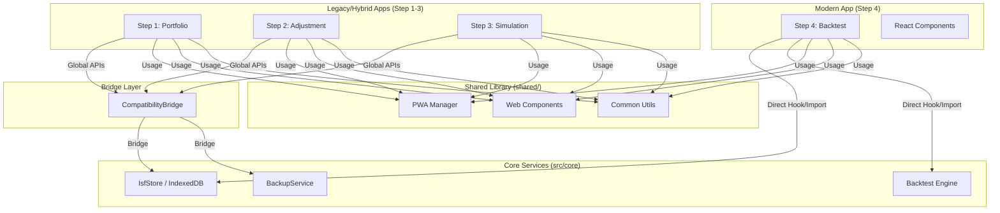

<!-- generated-by: gsd-doc-writer -->
# Architecture Map (시스템 아키텍처)

## System Overview (시스템 개요)
본 프로젝트는 **"Modern Hybrid"** 아키텍처를 채택하고 있습니다. 기존의 바닐라 자바스크립트(Vanilla JS) 기반 자산과 현대적인 리액트/타입스크립트(React/TS) 환경을 공존시키며, 점진적인 현대화를 지향합니다.

- **Step 1-3 (Legacy/Hybrid)**: 브라우저 표준 ES6+ 모듈 기반의 바닐라 JS로 구현되어 있으며, Vite 번들러를 통해 현대적인 빌드 파이프라인에 통합되어 있습니다.
- **Step 4 (Modern)**: React 19, TypeScript, Tailwind CSS를 활용한 현대적인 SPA(Single Page Application) 구조를 가집니다.
- **Core Strategy**: `CompatibilityBridge`를 통해 레거시 코드와 현대적 서비스를 연결하고, 공통 로직을 `shared/`와 `src/core/`로 집중화합니다.

## Component Diagram (컴포넌트 다이어그램)

## Data Flow (데이터 흐름)
1. **입력 및 산출 (Input & Calculation)**:
   - Step 1에서 사용자의 포트폴리오 정보를 입력받아 월간 현금 흐름을 계산합니다.
   - 각 단계는 자체 상태(State)를 가지며, 변경 시 즉시 계산 엔진을 트리거합니다.
2. **영속성 및 브릿지 (Persistence & Bridge)**:
   - 모든 데이터는 `IsfStore` (IndexedDB 기반)에 저장됩니다.
   - 레거시 단계(Step 1-3)는 `CompatibilityBridge`가 전역에 주입한 `IsfStorageHub`를 사용하여 데이터를 읽고 씁니다.
   - 이 데이터는 현대화된 서비스 계층으로 리다이렉트되어 처리됩니다.
3. **단계 간 전이 (Cross-step Transition)**:
   - Step 1(포트폴리오) → Step 2(조정) → Step 3(시뮬레이션) → Step 4(백테스트) 순으로 데이터가 흐릅니다.
   - `IsfStore`는 모든 단계의 스냅샷과 시뮬레이션 데이터를 통합 관리하여 일관성을 유지합니다.

## Key Abstractions (주요 추상화)
- **`CompatibilityBridge` (src/core/storage/CompatibilityBridge.ts)**: 레거시 전역 API(`IsfStorageHub`, `IsfBackupManager`)를 현대적 TS 서비스로 매핑하는 핵심 계층입니다.
- **`IsfStore` (src/core/storage/IsfStore.ts)**: IndexedDB를 추상화하여 각 단계별 데이터 스냅샷과 이력을 관리하는 중앙 저장소 서비스입니다.
- **`BackupService` (src/core/storage/BackupService.ts)**: 자동/수동 백업 로직을 담당하며, 데이터 유실 방지를 위한 무결성 검증을 포함합니다.
- **`PwaManager` (shared/pwa/pwa-manager.js)**: `vite-plugin-pwa`와 연동되어 오프라인 지원, 업데이트 알림, 설치(A2HS) 기능을 제공합니다.
- **`MoneyUtils` (src/core/types/money.ts)**: '원' 단위와 '만원' 단위 간의 변환 및 포맷팅을 처리하는 공용 유틸리티입니다.

## Directory Structure Rationale (디렉토리 구조 상세)
- **`apps/`**: 각 단계별(Step 1~4) UI 및 비즈니스 로직의 진입점(legacy/hybrid 소스)이 위치합니다.
- **`src/`**: 현대화된 소스 코드의 본거지입니다.
  - `entries/`: Vite의 멀티 페이지 진입점으로, 레거시 코드와 현대적 코드를 래핑합니다.
  - `core/`: 저장소, 엔진, 타입 정의 등 플랫폼 공통 비즈니스 로직이 위치합니다.
  - `components/`: Step 4 및 향후 재사용될 현대적 React 컴포넌트들을 포함합니다.
- **`shared/`**: 빌드 도구와 무관하게 모든 단계에서 재사용되는 바닐라 JS 유틸리티, 스타일, 웹 컴포넌트들이 위치합니다.
- **`public/`**: 매니페스트, 아이콘, 정적 데이터 파일들이 위치하며 PWA 기능을 지원합니다.

## PWA Integration (PWA 통합)
- **Strategy**: 'Service Worker first' 전략을 취하며, `vite-plugin-pwa`를 통해 빌드 타임에 `sw.js`를 생성합니다.
- **Update Flow**: 새로운 버전이 배포되면 `PwaManager`가 이를 감지하고 사용자에게 새로고침을 제안합니다.
- **Assets**: 모든 정적 자산 및 웹 폰트, 아이콘은 오프라인에서도 접근 가능하도록 캐싱 전략이 설정되어 있습니다.
