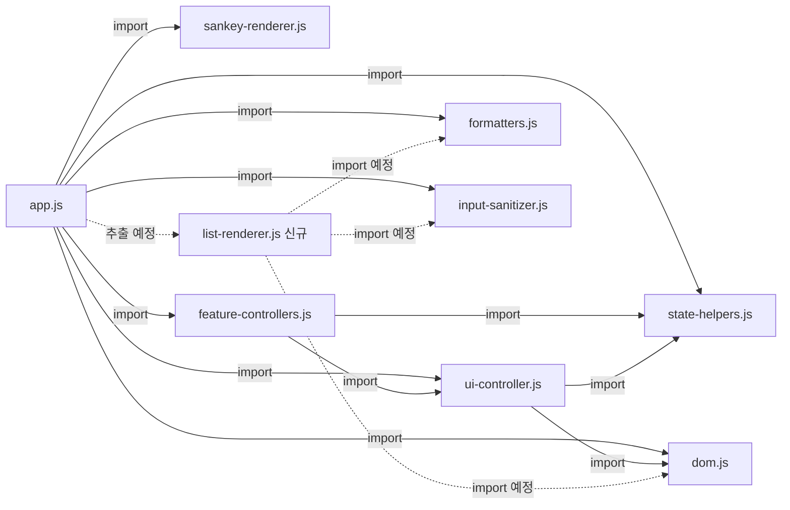

# Phase 13: Core Refactoring & Stability - RESEARCH

**연구일:** 2026-05-20
**상태:** 완료

---

## Phase Summary

Phase 13은 4가지 요구사항(REF-01, REF-02, STAB-01, STAB-02)을 다루며, 아래 작업을 달성해야 합니다:

1. **REF-01**: `app.js` 내 순수 UI 렌더 함수 7종을 `apps/step1/modules/list-renderer.js`로 추출하여 3계층 모듈화 완성
2. **REF-02**: step1 및 shared/ 폴더 전반에 걸친 미사용 코드(변수/임포트/함수) 정리
3. **STAB-01**: 단위 정합성(만원/원) 전면 점검 — 입력~정제~계산~저장 전 구간
4. **STAB-02**: 과세 경고 로직(`getFinancialIncomeStatus`) 임계값 상수화 점검

---

## Codebase Analysis

### 1. app.js 현재 상태 (868줄)

[app.js](file:///D:/jhkSandBox/CODE/IndividualSavingsFlowUI/apps/step1/app.js) — 현재 868줄이며, 리팩터링 대상 렌더 함수 7종 + 보조 힌트 함수 4종이 내부에 존재합니다.

#### 추출 대상 렌더 함수 (list-renderer.js로 이동 예정)

| 함수명 | 줄 범위 | 줄 수 | 의존성 |
|--------|---------|-------|--------|
| [renderCards](file:///D:/jhkSandBox/CODE/IndividualSavingsFlowUI/apps/step1/app.js#L713-L722) | L713~L722 | 10 | `dom.summaryCards` |
| [renderProjectionTable](file:///D:/jhkSandBox/CODE/IndividualSavingsFlowUI/apps/step1/app.js#L724-L752) | L724~L752 | 29 | `dom.projectionTableBody`, `state.projectionOptions`, `IsfUtils.getFinancialIncomeStatus`, `formatCurrency` |
| [renderItemList](file:///D:/jhkSandBox/CODE/IndividualSavingsFlowUI/apps/step1/app.js#L754-L757) | L754~L757 | 4 | `dom[group+'List']`, `renderIncomeItemHtml`, `renderAllocationItemHtml` |
| [renderIncomeItemHtml](file:///D:/jhkSandBox/CODE/IndividualSavingsFlowUI/apps/step1/app.js#L759-L773) | L759~L773 | 15 | `IsfUtils.escapeHtml`, `IsfUtils.toMan` |
| [renderAllocationItemHtml](file:///D:/jhkSandBox/CODE/IndividualSavingsFlowUI/apps/step1/app.js#L775-L823) | L775~L823 | 49 | `IsfUtils.escapeHtml`, `IsfUtils.toMan`, `buildAllocationMetaText`, `formatCurrency` |
| [renderInputHints](file:///D:/jhkSandBox/CODE/IndividualSavingsFlowUI/apps/step1/app.js#L831-L836) | L831~L836 | 6 | `getMonthlyIncomeTotalWon`, 각 힌트 함수 |
| [getPendingSummaryText](file:///D:/jhkSandBox/CODE/IndividualSavingsFlowUI/apps/step1/app.js#L825-L829) | L825~L829 | 5 | `getMonthlyIncomeTotalWon`, `formatCurrency` |

**보조 힌트 함수 (list-renderer.js와 함께 이동 후보):**

| 함수명 | 위치 |
|--------|------|
| [renderIncomeTotalHint](file:///D:/jhkSandBox/CODE/IndividualSavingsFlowUI/apps/step1/app.js#L838) | L838 |
| [renderExpenseTotalHint](file:///D:/jhkSandBox/CODE/IndividualSavingsFlowUI/apps/step1/app.js#L839) | L839 |
| [renderSavingsTotalHint](file:///D:/jhkSandBox/CODE/IndividualSavingsFlowUI/apps/step1/app.js#L840) | L840 |
| [renderInvestTotalHint](file:///D:/jhkSandBox/CODE/IndividualSavingsFlowUI/apps/step1/app.js#L841) | L841 |

**추출 규모:** 렌더 함수 7종 + 힌트 함수 4종 = 약 125~130줄. (13-CONTEXT.md의 "약 200줄" 추정은 과대 — 실측 기준 약 130줄)

#### renderAll() 호출 구조 분석

[renderAll()](file:///D:/jhkSandBox/CODE/IndividualSavingsFlowUI/apps/step1/app.js#L398-L408) (L398~L408)는 다음 함수를 순차 호출합니다:

```
renderAll()
├── buildMonthlySnapshot(state.inputs) → snapshot
├── simulateProjection(state.inputs, ...) → projection
├── buildSummaryCards(snapshot, projection, ...) → cards
├── renderCards(cards, horizonYears) ← 추출 대상
├── renderSankey(snapshot, buildSankeyData, ...) ← 이미 모듈화
├── renderProjectionTable(projection, ...) ← 추출 대상
├── renderInputHints(state.inputs) ← 추출 대상
└── refreshInputsPanel(state.inputs) ← 이미 ui-controller에 존재
```

**renderItemList() 호출 경로** (추출 대상이지만 renderAll에서 직접 호출되지 않음):
- `handleItemClick()` L598
- `cancelItemEditor()` L674
- `addItemToEditor()` L682
- `startItemEditor()` L658
- `setItemSortMode()` L641
- `handleApplySmartAdd()` L237 — 콜백으로 전달

### 2. 추출 함수들의 의존성 맵

```
list-renderer.js가 필요한 외부 의존성:
├── dom (./dom.js) — summaryCards, projectionTableBody, *List, *TotalHint
├── state (./state.js) — projectionOptions (mode, showFlow, showBalance, showDividend)
├── IsfUtils (../../shared/core/utils.js) — escapeHtml, toMan, getFinancialIncomeStatus
├── formatCurrency (./formatters.js)
├── buildAllocationMetaText (./input-sanitizer.js)
└── getMonthlyIncomeTotalWon (./input-sanitizer.js)
```

> [!IMPORTANT]
> `renderProjectionTable`은 `state.projectionOptions`에 직접 접근합니다(L726). 추출 시 이 상태를 파라미터로 전달할지, state 모듈을 직접 import할지 결정이 필요합니다. step2의 renderers.js 패턴에서는 `state`를 직접 import합니다.

---

## Existing Patterns

### state-helpers.js 패턴 (참조 모델)

[state-helpers.js](file:///D:/jhkSandBox/CODE/IndividualSavingsFlowUI/apps/step1/modules/state-helpers.js) (127줄):
- ES Module `export function` 패턴 사용
- 순수 함수 지향 — `state` 객체를 파라미터로 받음
- `import * as helpers from "./modules/state-helpers.js"` 방식으로 app.js에서 네임스페이스 임포트

### step2 renderers.js 패턴 (list-renderer.js 설계 참조)

[renderers.js](file:///D:/jhkSandBox/CODE/IndividualSavingsFlowUI/apps/step2/modules/renderers.js) (419줄):
- `state`와 `dom`을 직접 import하여 사용 (파라미터 주입 아닌 모듈 의존성)
- `export function renderDividendSimulation()` 형태로 내보냄
- app.js에서는 `import { renderDividendSimulation } from "./modules/renderers.js"` 개별 임포트 패턴 사용

### ui-controller.js 패턴 (경계 구분)

[ui-controller.js](file:///D:/jhkSandBox/CODE/IndividualSavingsFlowUI/apps/step1/modules/ui-controller.js) (129줄):
- UI 동기화(sync~) 함수 담당
- 렌더링(HTML 생성)이 아닌 기존 DOM 요소의 상태 토글 역할

> [!NOTE]
> 주의: `ui-controller.js`에 이미 `syncGroupOptionsAll()`과 `syncGroupOptionsFor()`가 존재하는데, **app.js L705~L711에 동일한 함수가 중복 정의**되어 있습니다. 또한 `setPendingBarVisible()`도 app.js L608과 ui-controller.js L81에 중복됩니다. `markPendingChanges()` 역시 app.js L613과 ui-controller.js L85에 중복 존재합니다.

### 임포트 컨벤션

```javascript
// 네임스페이스 임포트 (state-helpers)
import * as helpers from "./modules/state-helpers.js";

// 명명 임포트 (대부분의 모듈)
import { renderSankey, hideSankeyTooltip } from "./modules/sankey-renderer.js";

// 결정: list-renderer.js는 D-02에 따라 네임스페이스 임포트 방식 사용 예정
// import * as listRenderer from "./modules/list-renderer.js";
```

---

## 단위 정합성 분석 (STAB-01)

### 직접 산술 연산 (`* 10000` / `/ 10000`) 사용 현황

| 파일 | 위치 | 맥락 | 판정 |
|------|------|------|------|
| [input-sanitizer.js](file:///D:/jhkSandBox/CODE/IndividualSavingsFlowUI/apps/step1/modules/input-sanitizer.js#L30) | L30 | 레거시 마이그레이션 함수 `migrateFromManToWon` 내부 | 정당 (마이그레이션 전용) |
| [input-sanitizer.js](file:///D:/jhkSandBox/CODE/IndividualSavingsFlowUI/apps/step1/modules/input-sanitizer.js#L38) | L38 | 동일 마이그레이션 함수 내 `item.amount * 10000` | 정당 (마이그레이션 전용) |

**결론:** `apps/step1/` 내에서 직접 `* 10000` 또는 `/ 10000`을 사용하는 곳은 마이그레이션 유틸리티 함수 내부에만 존재합니다. 이는 레거시 데이터 변환 용도로 정당한 사용입니다.

`shared/` 폴더에서의 직접 산술 연산도 없습니다.

### IsfUtils 변환 함수 사용 패턴

[utils.js](file:///D:/jhkSandBox/CODE/IndividualSavingsFlowUI/shared/core/utils.js) 에 정의된 변환 함수:
- `toWon(amountInUnit)` (L132~L137): `Math.round(Number(amountInUnit) * 10000)` — 만원→원 변환
- `toMan(amountInWon)` (L138~L143): `Math.round(Number(amountInWon) / 10000)` — 원→만원 변환
- `formatMoney(value)` (L13~L31): 원 단위 입력 → "X 억 Y 만원" 형식 문자열

**정상 사용 경로:**
- `app.js` L184: `IsfUtils.toWon` — 폼 입력 읽기 시 만원→원 변환
- `app.js` L764, L802: `IsfUtils.toMan` — 렌더링 시 원→만원 표시
- `state-helpers.js` L83~L86: `toWon` 파라미터 주입 — 폼 필드 읽기
- `state-helpers.js` L100~L103: `toMan` 파라미터 주입 — 폼 필드 쓰기

### 데이터 영속화 단위 확인

- `persistPrimaryState()` (app.js L437~L455): `window.IsfStorageHub.saveLocal(STORAGE_KEY, inputs)` — `inputs`의 금액 필드는 모두 원 단위(sanitizeInputs를 거친 데이터)
- `DEFAULT_INPUTS` (constants.js L66~L88): 모든 금액이 원 단위(예: `startCash: 1000000`, `monthlyExpense: 1450000`)

> [!TIP]
> 단위 정합성은 현재 양호한 상태입니다. 마이그레이션 함수를 제외하면 직접 산술 연산이 없으며, `IsfUtils.toWon`/`toMan` 헬퍼를 일관되게 사용하고 있습니다. STAB-01 점검은 기존 패턴 확인 + 수동 시나리오 검증으로 충분할 것으로 판단됩니다.

---

## 과세 경고 로직 분석 (STAB-02)

### getFinancialIncomeStatus 함수 위치 및 상수

[utils.js L52~L57](file:///D:/jhkSandBox/CODE/IndividualSavingsFlowUI/shared/core/utils.js#L52-L57):

```javascript
const FINANCIAL_INCOME_WARN_THRESHOLD_WON = 19000000;  // L33
const FINANCIAL_INCOME_CRIT_THRESHOLD_WON = 34000000;  // L34

function getFinancialIncomeStatus(annualIncomeWon) {   // L52
  const income = Number(annualIncomeWon || 0);
  if (income > FINANCIAL_INCOME_CRIT_THRESHOLD_WON) return "crit";
  if (income > FINANCIAL_INCOME_WARN_THRESHOLD_WON) return "warn";
  return "normal";
}
```

> [!IMPORTANT]
> **핵심 발견:** 임계값은 이미 `shared/core/utils.js` L33~L34에 명명된 상수(`FINANCIAL_INCOME_WARN_THRESHOLD_WON`, `FINANCIAL_INCOME_CRIT_THRESHOLD_WON`)로 정의되어 있습니다. **하드코딩이 아닙니다.**
> 
> 그러나 이 상수들은 `utils.js`의 IIFE 클로저 내부 `const`로 선언되어 있어 **외부에서 접근이 불가능**합니다. 13-CONTEXT.md D-06의 "constants.js에 정의된 상수인지 확인" 요구와 관련하여:
> - 현재 위치: `shared/core/utils.js` (IIFE 내부 private)
> - 제안 위치: `apps/step1/modules/constants.js` (CONTEXT.md의 제안)
>
> **결론:** 이미 상수화되어 있으므로, `constants.js`로의 이동은 선택적입니다. 다만 접근성 향상을 위해 이동이 가치가 있습니다.

### 호출 경로

| 호출 위치 | 파일 | 줄 |
|-----------|------|----|
| app.js (step1) | `IsfUtils.getFinancialIncomeStatus(r.annualFinancialIncome)` | L741 |
| renderers.js (step2) | `utils.getFinancialIncomeStatus(d.dividendNominalTR)` | L62, L234, L236 |
| renderers.js (step2) | `window.IsfUtils.getFinancialIncomeStatus(divNominal)` | L295 |

---

## 미사용 코드 식별 (REF-02)

### app.js 내 미사용 항목

#### 미사용 함수 (정의되었으나 호출되지 않음)

| 함수명 | 위치 | 상태 |
|--------|------|------|
| `renderIncomeList` | L647 | 정의만 존재, 호출 없음 |
| `renderExpenseList` | L648 | 정의만 존재, 호출 없음 |
| `renderSavingsList` | L649 | 정의만 존재, 호출 없음 |
| `renderInvestList` | L650 | 정의만 존재, 호출 없음 |
| `refreshComparisonIfActive` | L422 | 정의만 존재, 호출 없음 |
| `ensureDraftInputs` (로컬) | L624 | `helpers.ensureDraftInputs`를 사용하므로 로컬 정의 미사용 |

#### 미사용 임포트

| 임포트명 | 위치 | 상태 |
|----------|------|------|
| `MONEY_UNIT` | L4 | 임포트만, 파일 내 사용 없음 |
| `formatSignedCurrency` | L24 | 임포트만, 파일 내 사용 없음 |
| `formatPercent` | L24 | 임포트만, 파일 내 사용 없음 |
| `formatMonthSpan` | L25 | 임포트만, 파일 내 사용 없음 |
| `formatSankeyDisplayValue` | L25 | 임포트만, 파일 내 사용 없음 |
| `hideSankeyTooltip` | L53 | 임포트만, 파일 내 사용 없음 |
| `getEffectiveSankeyZoom` | L53 | 임포트만, 파일 내 사용 없음 |
| `calculateComparison` | L37 | 임포트만, 파일 내 사용 없음 (feature-controllers.js에서 별도 임포트) |
| `PRESET_STYLES` | L50 | 임포트만, 파일 내 사용 없음 |

#### 중복 정의 (app.js vs ui-controller.js)

| 함수/코드 | app.js 위치 | ui-controller.js 위치 | 설명 |
|-----------|-------------|----------------------|------|
| `syncGroupOptionsAll` | L705 | L116 | 완전 중복 |
| `syncGroupOptionsFor` | L706~L711 | L120~L128 | 거의 동일 (약간의 구현 차이) |
| `renderComparison` | L255~L261 | - | feature-controllers.js L134~L139와 중복 |

#### 미정의 함수 (호출되나 정의를 찾을 수 없음)

| 함수명 | 호출 위치 | 상태 |
|--------|-----------|------|
| `hasShareState` | L120 | app.js 내 `function` 정의를 찾을 수 없음 |
| `dismissViewModeGuide` | L225 | app.js 내 `function` 정의를 찾을 수 없음 |
| `switchToNormalMode` | L226, L499 | app.js 내 `function` 정의를 찾을 수 없음 |
| `bindReadonlyAdvancedNavigation` | L190 | 전체 step1/ 내 정의를 찾을 수 없음 |

> [!WARNING]
> 위 4개 함수는 호출되지만 정의를 찾을 수 없습니다. 코드가 축약(minify)되었거나 다른 메커니즘으로 주입되었을 가능성이 있으나, 연구 범위 내에서는 정의를 확인하지 못했습니다. Phase 실행 전 반드시 실제 런타임에서 이 함수들의 존재를 확인해야 합니다.

### shared/ 폴더 미사용 코드

#### data-hub-modal.js AI 잔재 점검

[data-hub-modal.js](file:///D:/jhkSandBox/CODE/IndividualSavingsFlowUI/shared/components/data-hub-modal.js) (322줄):
- AI 관련 키워드(`ai`, `AI`, `gemini`, `openai`, `chat`, `prompt`) 검색 결과: **없음**
- Phase 10 AI 기능 잔재는 이미 완전히 제거된 상태로 확인됩니다.

> [!NOTE]
> `data-hub-modal.js`에서 AI 잔재는 발견되지 않았습니다. 다만 D-09에서 "우선 감사 대상"으로 지목되었으므로, PLAN.md에는 "감사 완료, 잔재 없음 확인" 체크리스트 항목으로 포함할 것을 권장합니다.

#### shared/ 폴더 구조

```
shared/
├── components/ (3 files: app-header.js, data-hub-modal.js, feedback-manager.js)
├── core/ (4 files: clipboard-parser.js, clipboard-parser.test.js, share-utils.js, utils.js)
├── legacy/ (1 file: sw.js)
├── pwa/
├── storage/
└── styles/
```

`shared/legacy/sw.js` — 레거시 서비스 워커. 현재 활성 서비스 워커(`sw.js`는 프로젝트 루트에도 존재)와의 관계를 확인할 필요가 있습니다.

---

## 6종 핵심 헬퍼 함수 현재 위치 (D-10 체크리스트)

| 함수명 | 정의 위치 | app.js 호출 방식 |
|--------|-----------|-----------------|
| `hasPendingChanges` | [state-helpers.js L35](file:///D:/jhkSandBox/CODE/IndividualSavingsFlowUI/apps/step1/modules/state-helpers.js#L35) | app.js L622에 **로컬 래퍼 존재** (별도 구현: `!!state.draftInputs && ...`) |
| `markPendingChanges` | app.js L613 (로컬), [ui-controller.js L85](file:///D:/jhkSandBox/CODE/IndividualSavingsFlowUI/apps/step1/modules/ui-controller.js#L85) (export) | 로컬 정의와 모듈 정의 **중복** |
| `commitImmediateInputs` | [app.js L428](file:///D:/jhkSandBox/CODE/IndividualSavingsFlowUI/apps/step1/app.js#L428) | 로컬 함수 (모듈화되지 않음) |
| `getVisibleInputs` | [state-helpers.js L19](file:///D:/jhkSandBox/CODE/IndividualSavingsFlowUI/apps/step1/modules/state-helpers.js#L19) | app.js L645에 **로컬 래퍼** `helpers.getVisibleInputs(state)` |
| `markDirty` | [state-helpers.js L24](file:///D:/jhkSandBox/CODE/IndividualSavingsFlowUI/apps/step1/modules/state-helpers.js#L24) | `helpers.markDirty(state)` 호출 |
| `markClean` | [state-helpers.js L30](file:///D:/jhkSandBox/CODE/IndividualSavingsFlowUI/apps/step1/modules/state-helpers.js#L30) | `helpers.markClean(state)` 호출 |

> [!IMPORTANT]
> `hasPendingChanges`와 `markPendingChanges`는 state-helpers.js/ui-controller.js에 이미 export되어 있음에도 app.js에 로컬 버전이 중복 존재합니다. 리팩터링 시 로컬 래퍼/중복을 제거하고 모듈 함수로 통합해야 합니다.

---

## Technical Risks

### 높은 위험

1. **미정의 함수 4종**: `hasShareState`, `dismissViewModeGuide`, `switchToNormalMode`, `bindReadonlyAdvancedNavigation` — 호출되지만 정의를 찾을 수 없습니다. 실행 전에 반드시 런타임에서 존재를 확인해야 합니다. 이 함수들이 실제로 누락된 것이라면 런타임 에러가 발생할 수 있습니다.

2. **중복 함수 통합 시 동작 불일치**: `syncGroupOptionsAll`이 app.js와 ui-controller.js에 모두 존재하며, `syncGroupOptionsFor`의 구현이 약간 다릅니다:
   - app.js L706~L711: `getVisibleInputs()`를 통해 items 접근
   - ui-controller.js L120~L128: `state.draftInputs || state.inputs`를 직접 접근
   
   통합 시 동작이 동일한지 반드시 확인해야 합니다.

### 중간 위험

3. **renderItemList 콜백 경로**: `handleApplySmartAdd(renderItemList)` (L237)처럼 `renderItemList`가 콜백으로 전달되는 경로가 존재합니다. list-renderer.js로 추출 후 이 콜백 패턴이 올바르게 작동하는지 확인이 필요합니다.

4. **renderProjectionTable의 state 직접 접근**: L726에서 `state.projectionOptions`에 직접 접근합니다. 추출 시 state 의존성을 어떻게 주입할지 결정해야 합니다.

### 낮은 위험

5. **물리적 무결성(파일 절삭)**: GEMINI.md에 명시된 대로, CSS 파일 하단의 `@media` 쿼리가 잘리지 않도록 주의해야 합니다. 이 Phase는 주로 JS 수정이므로 위험은 낮습니다.

---

## Dependencies

### 파일 간 의존성 (수정 영향도)



### 작업 순서 의존성

```
1. STAB-01 (단위 점검) → 독립 수행 가능
2. STAB-02 (과세 경고) → 독립 수행 가능
3. REF-01 (렌더 함수 추출) → STAB-01/02 완료 후 수행 권장 (정합성 확인 후 이동)
4. REF-02 (미사용 코드 정리) → REF-01 완료 후 수행 (추출로 인한 임포트 변경 반영 후)
```

---

## Implementation Recommendations

### 권장 작업 순서 (Wave 구조)

**Wave 1: 안정성 점검 (STAB-01 + STAB-02)**
- STAB-01: 입력→정제→계산→저장 전 구간 단위 정합성 수동 시나리오 검증
  - 현재 상태는 양호하므로 확인 위주
  - `input-sanitizer.js` L30, L38의 마이그레이션 함수를 "정당한 예외"로 문서화
- STAB-02: `getFinancialIncomeStatus` 상수 위치 확인 → 이미 `utils.js` 내 상수화 완료 → 체크리스트 기록

**Wave 2: 렌더 함수 추출 (REF-01)**
- `apps/step1/modules/list-renderer.js` 신규 파일 생성
- 7종 렌더 함수 + 4종 힌트 함수를 app.js에서 추출
- `import * as listRenderer from "./modules/list-renderer.js"` 패턴으로 app.js에서 사용
- renderProjectionTable의 state 접근 → step2 패턴을 따라 `state`를 직접 import하는 방식 권장

**Wave 3: 미사용 코드 정리 (REF-02)**
- 미사용 임포트 9종 제거
- 미사용 함수 6종 제거
- 중복 함수 3쌍 통합 (app.js 로컬 → 모듈 함수로 대체)
- data-hub-modal.js AI 잔재 감사 확인 (이미 클린)

### list-renderer.js 설계 제안

```javascript
// apps/step1/modules/list-renderer.js

import { dom } from "./dom.js";
import { state } from "./state.js";
import { IsfUtils } from "../../../shared/core/utils.js";
import { formatCurrency } from "./formatters.js";
import { buildAllocationMetaText, getMonthlyIncomeTotalWon } from "./input-sanitizer.js";

export function renderCards(cards, horizonYears) { ... }
export function renderProjectionTable(records, horizonYears, expenseGrowth) { ... }
export function renderItemList(group, items, options) { ... }
export function renderIncomeItemHtml(item, opts) { ... }
export function renderAllocationItemHtml(group, item, opts) { ... }
export function renderInputHints(inputs) { ... }
export function getPendingSummaryText(inputs) { ... }
export function renderIncomeTotalHint(won, count) { ... }
export function renderExpenseTotalHint(won, count) { ... }
export function renderSavingsTotalHint(won, count) { ... }
export function renderInvestTotalHint(won, count) { ... }
```

---

## Key Findings

1. **추출 규모 수정:** 13-CONTEXT.md에서 "약 200줄"로 추정했으나, 실측 결과 렌더 함수 7종 + 힌트 함수 4종 합계 약 130줄입니다. 여전히 유의미한 추출이며 app.js를 약 740줄 수준으로 경량화합니다.

2. **과세 임계값은 이미 상수화됨:** `FINANCIAL_INCOME_WARN_THRESHOLD_WON`과 `FINANCIAL_INCOME_CRIT_THRESHOLD_WON`이 `shared/core/utils.js` L33~L34에 명명된 상수로 존재합니다. `constants.js`로의 이동은 선택적입니다.

3. **미사용 코드가 예상보다 많음:** 미사용 임포트 9종, 미사용 함수 6종, 중복 정의 3쌍이 발견되어 REF-02의 작업량이 상당합니다.

4. **data-hub-modal.js는 이미 클린:** AI 잔재가 발견되지 않아 감사만 기록하면 됩니다.

5. **미정의 함수 4종 주의 필요:** `hasShareState`, `dismissViewModeGuide`, `switchToNormalMode`, `bindReadonlyAdvancedNavigation` — 실행 전 런타임 확인 필수.

6. **중복 함수 통합이 REF-02의 핵심:** `syncGroupOptionsAll/For`, `renderComparison`, `setPendingBarVisible`, `markPendingChanges`, `hasPendingChanges`, `ensureDraftInputs`가 app.js와 모듈 간에 중복되어 있어 통합 정리가 필요합니다.

---

## RESEARCH COMPLETE
