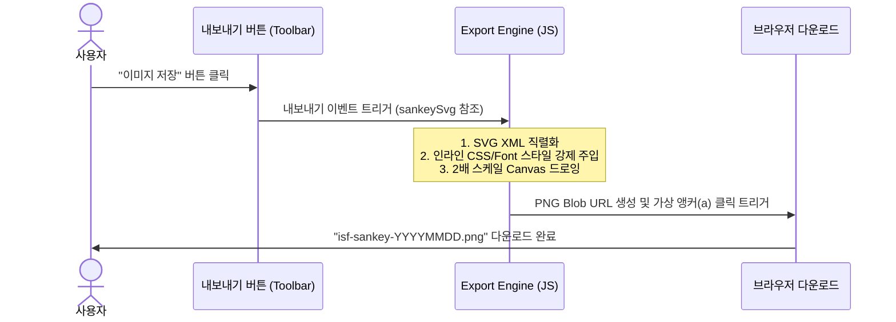

# Phase 16 Spec: Export Feature

- **Target Milestone:** v1.6 (코드 리팩터링, UX 개선 및 안정성 강화)
- **Phase:** 16 (Export Feature)
- **Status:** APPROVED (Socratic Interview Completed)
- **Created:** 2026-06-10
- **Last Updated:** 2026-06-10

---

## 🎯 1. Overview & Objective
사용자가 작성하고 설계한 가계 자산 흐름 결과물(Sankey Chart)을 직관적인 공유 및 기록 수단으로 활용할 수 있도록 **"이미지로 내보내기"** 기능을 제공합니다. 
웹 브라우저의 네이티브 API(SVG -> XML Serialization -> Canvas -> PNG)를 활용하여 추가적인 무거운 외부 라이브러리 의존성 없이 가볍고 고해상도(2x)의 이미지 내보내기를 지원합니다.

---

## 📋 2. Falsifiable Requirements (검증 가능한 요구사항)

### REQ-16-01: 내보내기 UI 진입점 구축
- **상세**: Sankey 차트 제어 도구(정렬, 줌 버튼 등)가 위치한 우측 상단 툴바 영역에 "이미지 저장" 버튼을 추가합니다.
- **UI 디자인**: 기존 툴바의 아이콘 버튼들과 조화를 이루는 Glassmorphism 스타일 및 호버 피드백을 적용하며, 카메라 혹은 다운로드 형태의 SVG 아이콘을 사용합니다.
- **검증**: 화면 로딩 시 해당 버튼이 정상 노출되며, 마우스 오버 및 클릭 시 반응해야 합니다.

### REQ-16-02: 네이티브 고해상도 이미지 생성 및 다운로드
- **상세**: SVG로 그려진 Sankey Chart 영역을 캡처하여 고해상도(`devicePixelRatio` 또는 고정 `2배` 스케일) PNG 파일로 변환하여 다운로드합니다.
- **포맷**: 파일 다운로드 포맷은 `image/png`여야 합니다.
- **파일명 규칙**: `isf-sankey-YYYYMMDD.png` (예: `isf-sankey-20260610.png` 오늘 날짜 동적 반영)
- **검증**: 버튼 클릭 시 브라우저 다운로드 창이 뜨며 파일이 즉시 로드되고, 내려받은 이미지가 손상되지 않고 열려야 합니다.

---

## 🚫 3. Scope & Boundaries (범위 및 경계)

### In-Scope (범위 내)
- **Step 1 및 Step 2의 Sankey Chart 영역**: 각 단계에 존재하는 Sankey SVG 캔버스의 이미지를 저장합니다.
- **고해상도 렌더링**: 모바일 및 레티나 디스플레이에서도 글자가 흐릿해지지 않도록 가상 캔버스의 너비와 높이를 2배로 확장하여 정밀하게 드로잉합니다.
- **CSS 스타일 및 웹폰트 보존**: 외부 폰트("Gowun Dodum" 등) 및 색상 테마(Sunset/Deep Sea 그라데이션, 노드 색상 등)가 이미지 내보내기 결과물에서도 동일하게 적용될 수 있도록 SVG 내부 인라인 스타일 주입 처리를 수행합니다.

### Out-of-Scope (범위 외)
- **전체 대시보드 캡처**: 요약 카드 및 폼 입력 항목, 상세 목록 패널 등은 이미지 캡처 영역에서 제외합니다. (Sankey Chart의 시각적 흐름 자체에만 집중)
- **외부 캡처 라이브러리 연동**: `html2canvas`, `dom-to-image` 등의 타사 패키지는 사용하지 않고 오직 네이티브 웹 API만 활용하여 앱 용량 및 오프라인 구동 성능을 최적화합니다.

---

## 👤 4. User Scenario (사용자 가상 시나리오)

---

## 🧪 5. Technical Specifications (기술적 세부 설계)

### 5.1 SVG to PNG 변환 아키텍처
1. **SVG 복제 및 인라인화**: 
   현재 화면에 렌더링된 SVG 요소를 복제(`cloneNode(true)`)합니다. 렌더링에 사용되는 CSS 정의(색상, 테마 변수, 웹폰트 설정)가 브라우저 외부의 가상 이미지 콘텍스트에서도 해석될 수 있도록, SVG 요소 내부에 `<style>` 태그를 신설하고 필요한 CSS 룰셋을 문자열로 주입합니다.
2. **XML Serializer 호출**:
   `new XMLSerializer().serializeToString(svgClone)`을 호출하여 SVG 소스를 XML 텍스트로 변환합니다.
3. **Blob 이미지 로드**:
   `new Blob([svgXml], {type: 'image/svg+xml;charset=utf-8'})`를 만들고 `URL.createObjectURL(blob)`로 URI를 얻은 뒤 임시 `Image` 객체의 `src`에 바인딩합니다.
4. **Canvas 배수 드로잉**:
   이미지 로드가 끝나면 (`img.onload`), SVG 원본 해상도의 **2배 크기**로 설정된 임시 `<canvas>` 엘리먼트를 동적으로 생성합니다. `canvasContext.scale(2, 2)` 후 `drawImage(img, 0, 0)`로 그려 품질 손실이 없는 초고화질 이미지를 구현합니다.
5. **트리거 다운로드**:
   `canvas.toDataURL('image/png')`를 추출하고, 가상 `<a>` 링크를 동적으로 생성하여 `download` 속성과 함께 프로그램적으로 `click()` 이벤트를 호출합니다. 사용한 ObjectURL은 메모리 누수 방지를 위해 즉시 해제(`URL.revokeObjectURL`)합니다.

---

## ✅ 6. Acceptance Criteria (인수 테스트 기준)

| ID | 시나리오 | 기대 결과 (Expected) | 판정 (Pass/Fail) |
|---|---|---|---|
| **TC-16-01** | Step 1 페이지 진입 및 차트 툴바 점검 | 정렬, 줌 버튼 옆에 Glassmorphism 스타일의 "이미지 저장(카메라)" 버튼이 나타나야 함. | [ ] |
| **TC-16-02** | "이미지 저장" 버튼 클릭 | 오늘 날짜가 적용된 `isf-sankey-YYYYMMDD.png` 파일이 정상 다운로드되어야 함. | [ ] |
| **TC-16-03** | 다운로드된 PNG 이미지 파일 확인 | SVG에 로드되었던 Gowun Dodum 글꼴 및 Sunset/Deep Sea 그라데이션 선이 깨짐 없이 2배 선명한 해상도로 출력되어야 함. | [ ] |

---

## 🧠 지식 결합 및 무결성 제약 (LLM Wiki Binding)
- **물리적 무결성**: 다운로드 기능을 추가할 때 `apps/step1/app.js` 및 `apps/step2/app.js` 파일 하단의 모바일 `@media` 반응형 스타일 및 UI 핸들러가 덮어써지거나 손실되지 않도록 철저히 검증해야 합니다. ([Operating_Principles](file:///D:/jhkSandBox/CODE/IndividualSavingsFlowUI/.gemini/knowledge/wiki/Operating_Principles.md))
- **No-Build Modern Hybrid**: 이미지 저장 기능은 가볍게 네이티브로 구성하여 Vite 인프라 빌드 시 외부 번들 종속성 문제나 빌드 타임 오버헤드가 발생하지 않도록 합니다.
