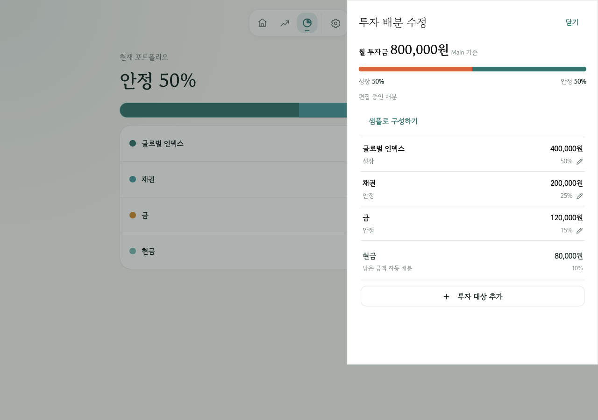
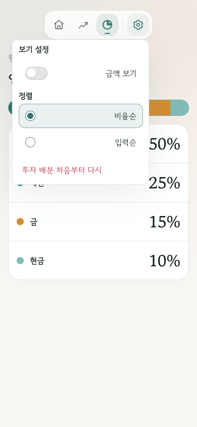
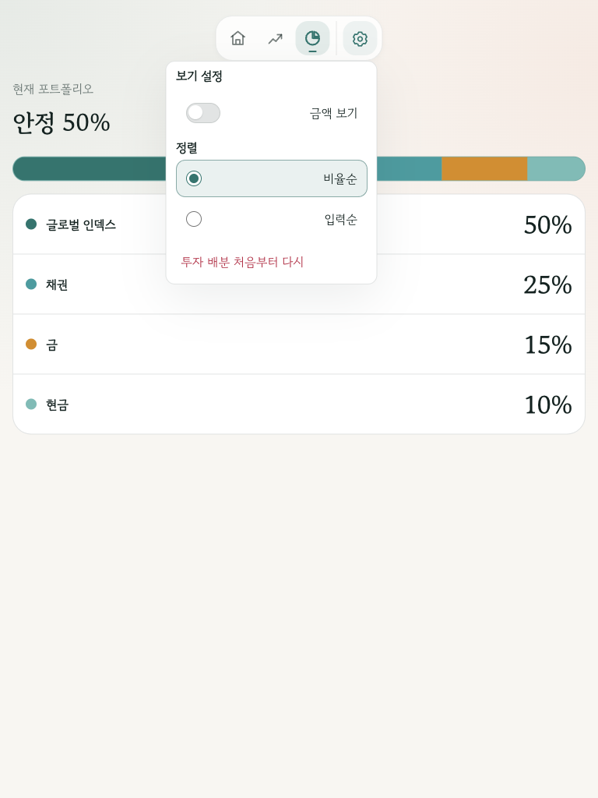
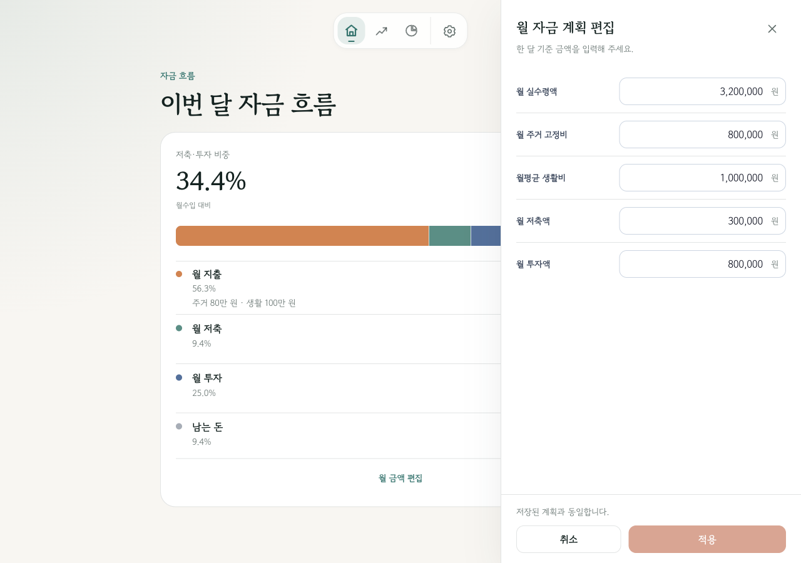
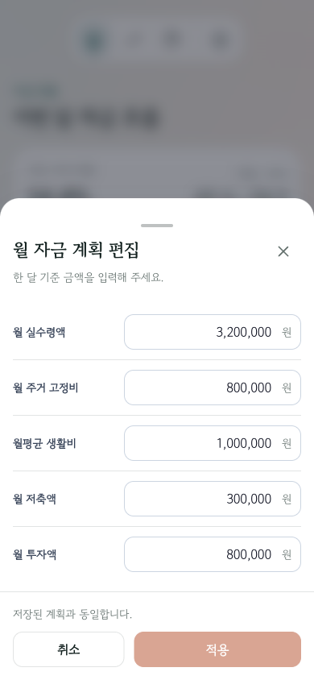

# 2026-09-21 공통 편집 경험 — 계획 수립 관찰

**기준:** `main` / `7c22487d`. 현재 제품 구현의 화면과 제안 이미지 구상을 구분한다.
**환경:** Orca 내장 브라우저의 기존 `http://127.0.0.1:5199/IndividualSavingsFlowUI/` 테스트용 로컬 entry. 월 수입 320만, 주거 80만, 생활 100만, 저축 30만, 투자 80만의 기존 합성 fixture. 계정 로그인/서버 저장/실제 고객 데이터 검증이 아니다.
**방법:** 최신 snapshot으로 진입점 확인 → 클릭/viewport 변경 → PNG 저장 → 저장 PNG 직접 확인. 390/768/1280 CSS viewport에서 관찰했으며 실물 스마트폰의 키보드/엄지 도달성은 확인하지 않았다.

## 1. Portfolio 배분 편집 — 형태 개선 필요

1280×900에서 결과 행을 누르면 오른쪽 native dialog panel이 열린다. 배경을 비활성화하고 작업을 묶는 장점은 있으나, desktop 중심 결과에서 편집 시 시선이 오른쪽으로 이동한다. 최근 항목 인라인 수정에도 부모 표면은 남아 있다. 중앙 modal로 변경할 직접 근거다.

## 2. Portfolio 설정 — 위치·행 내부 순서 개선 필요

390×844에서 중앙 launcher 끝의 gear에 메뉴 오른쪽을 맞춰 화면 왼쪽에 크게 펼쳐진다. 메뉴 자체의 화면 밖 overflow는 이 캡처에서 보이지 않지만 오른쪽 공간이 비어 있다. `금액 보기` switch와 정렬 radio는 왼쪽, 텍스트는 오른쪽이다. 행 전체 label을 누를 수 있는 구조는 유지할 장점이다.

## 3. 768px 설정 — 같은 anchor 문제 지속

768×1024에서도 메뉴가 launcher 기준으로 열리며 화면 오른쪽의 일관된 설정 영역이나 중앙 작업 표면이 아니다. 새 설계는 768px부터 중앙 modal을 선택한다.

## 4. Main desktop 월 금액 — 모바일과 다른 구조

1280×900에서 Main은 결과 옆 우측 panel이다. footer의 취소 왼쪽/적용 오른쪽은 이미 원하는 방향이므로 재사용한다. Portfolio와 달리 Main의 desktop은 코드상 aside 경로이며 접근성/배경 제어도 함께 이관해야 한다.

## 5. Main mobile 월 금액 — 공통 경험의 출발점

390×844로 변경하면 하단 sheet, 제목 오른쪽 close, 하단 취소/적용을 확인할 수 있다. 이 형태를 Simulation에도 적용한다. 캡처상 footer는 보이지만 실기기 가상 키보드와 화면 읽기 프로그램에 대한 합격 증거는 아니다.

## 6. Simulation — DOM·코드 확인, PNG 확보 실패

현재 AX에서 결과 제목, 그래프, 기간 slider, 5/9/13%와 직접 입력 버튼, `9% 샘플 포트폴리오 보기` 링크, 접힌 `목표와 가정`을 확인했다. `SimulationApp.tsx`, `SimulationControls.tsx` 및 `AdvancedSettings.tsx`의 연결과 일치한다.

현재 브라우저는 `CDP error (Page.captureScreenshot): Screenshot timed out — the browser tab may not be visible or the window may not have focus.`를 반환했다. tab switch 후에도 같아 PNG 기반 시각 평가는 하지 않는다. 이전 대화의 캡처로 이번 확인을 대체하지 않았다. 구현 전 Simulation의 390/768/1280 화면은 다시 캡처해야 한다.

## 7. 3:4 결과 이미지 — 신규 정보 배치 구상

[편집 가능한 SVG](07-result-card-concept.svg). 1080×1440, 합성 수치로 작성한 계획용 정적 자료다. 실제 제품의 export 기능이나 완성 디자인이 아니다. 월 자금 → 예상 자산 → 투자 배분의 정보 우선순위를 검토하기 위한 것이다.

예시 미래 그래프는 기존 `projectCompoundGrowth`에 시작 자산 1,500만, 저축 월 30만, 투자 월 80만, 5년, 기대 연 9%, 기준금리 3%, 물가 차이 -0.25%p, 명목을 넣어 생성했다. 계산 결과는 현재 계획 102,239,944원, 전부 저축 88,428,169원이다. 금융 공식을 별도 재작성하지 않았다. 실제 출력은 기존 한국식 정수 원화 표현과 서체를 적용하고 금액 포함 옵션/최대 대상/긴 이름을 구현 단계에서 검증한다.

## 확인 한계와 다음 작업

- 스크린샷 관찰은 완전한 접근성·키보드·save/recovery 검증이 아니다.
- 합성 로컬 entry에는 account 메뉴 하단이 없으므로 긴 계정 정보·로그아웃·오프라인 회귀는 향후 cloud 테스트로 확인한다.
- 신규 모달·Simulation sheet·하단 CTA·실제 PNG 저장·share는 아직 구현하지 않았다.
- 이번 문서/자료는 [설계](../../specs/2026-09-21-responsive-overlays-and-result-card-design.md)와 [총괄 계획](../../plans/2026-09-21-responsive-experience.md)의 조사 근거다.
