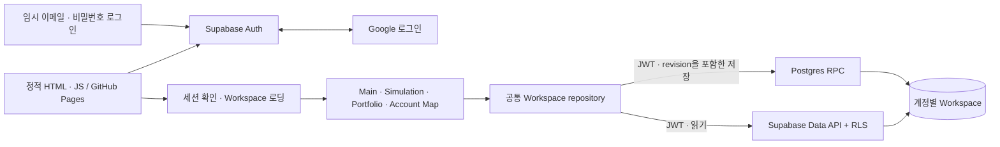

# Supabase 계정별 Workspace 저장 설계

상태: 구현 승인 및 로컬 구현 — 2026-09-07 사용자가 이 설계에 따른 개발과 커밋을 요청했다. 운영 DB 적용·Google 실제 왕복·배포는 아직 미수행이며 [운영 안내](../../supabase-account-setup.md)의 rollout gate로 구분한다.
작성일: 2026-09-07
추가 승인: 2026-09-08 — Google 설정을 기다리는 동안 사용할 임시 이메일·비밀번호 로그인. 기존 계정별 저장·권한 계약을 유지하며 실제 계정 준비는 운영 작업으로 구분한다.

## 1. 목표와 범위

Google로 로그인한 사용자가 어느 브라우저·기기에서도 같은 재무 계획과 저장된 초안을 읽고 수정한다. 2026-09-08 추가 승인으로 Google 설정 전에는 3.1절의 임시 이메일·비밀번호 경로를 사용할 수 있다. Vite의 정적 다중 페이지 웹과 GitHub Pages 배포를 유지하고 Supabase Auth, Data API와 PostgreSQL을 사용한다. 별도 애플리케이션 서버나 Edge Function은 초기 범위에 필요하지 않다.

기본 제안은 **로그인 후 편집·저장, 계정당 workspace 하나, 서버 저장 확정 후 성공 표시**다. 비로그인 로컬 편집의 상시 지원, 여러 독립 계획, 공동 편집, 금융기관 연동은 범위 밖이다. 네트워크가 끊기면 마지막 확인 데이터를 읽고 작성 중 입력을 복구할 수 있지만, 오프라인 편집을 자동 병합하는 기능은 제공하지 않는다.

이 문서는 [PRD](../../ways-of-work/plan/isf-rebuild/connected-financial-planning-workspace/prd.md)의 로컬 저장 기준선에서 계정 저장으로 전환하는 승인 계약이다. 이 브랜치의 구현과 실제 운영 rollout을 구분한다. 앱별 데이터 소유권과 [DESIGN](../../../DESIGN.md)의 적용·초안·오류·접근성 계약은 유지한다.

## 2. 현재 구현에서 출발하는 결정

- [WorkspaceDocument](../../../src/workspace/domain/model.ts)는 schema v3이며 Main applied/setup progress, Simulation draft, Portfolio plans/draft, locations, Account Map applied/draft를 하나로 보관한다.
- [BrowserWorkspaceRepository](../../../src/workspace/infrastructure/workspaceRepository.ts)는 동기식 `load()`, 비동기 write, revision 검사, 같은 페이지 알림과 storage event를 제공한다. 브라우저 잠금은 기기 사이의 동시 쓰기를 보호할 수 없다.
- [Workspace backup](../../../src/workspace/infrastructure/workspaceBackup.ts)은 format v2를 내보내고 format v1을 기존 converter로 가져온다. 모든 slice와 참조를 검증한 뒤 한 번에 교체한다.
- [Vite 설정](../../../vite.config.ts)은 `/IndividualSavingsFlowUI/` base와 네 앱의 HTML entry를 사용한다. [서비스워커 경로](../../../src/main/infrastructure/pwaRoutes.ts)는 SPA fallback이 없는 MPA다.
- 각 앱과 Main 읽기 adapter가 기본 브라우저 repository를 직접 생성하는 곳이 있으므로, SDK 추가만으로 전환이 끝나지 않는다. 모든 제품 entry의 repository 주입을 교체해야 한다.

| 저장 접근 | 장점 | 비용 / 판단 |
| --- | --- | --- |
| 계정별 JSONB workspace 한 행 | 기존 전체 검증·백업·원자적 교체와 잘 맞음 | 문서 단위 충돌 발생. 현재 개인용 규모에 권장 |
| Main·Simulation·Portfolio·계좌별 정규화 테이블 | 개별 SQL 조회·분석에 유리 | 여러 테이블 트랜잭션·마이그레이션과 백업 재조립 필요. 현재 요구에 과도함 |
| 로컬 DB와 서버를 모두 편집 가능한 원본으로 운영 | 장기간 오프라인 편집 가능 | 변경 로그·병합·삭제 전파·충돌 해결 복잡도 증가. 후속 요구가 있을 때 검토 |

## 3. 아키텍처와 로그인

로그인은 `@supabase/supabase-js`의 Google OAuth를 사용한다. 사용자 식별자는 이메일 대신 Supabase `auth.users.id` UUID이며, 이메일과 이름은 계정 표시용으로만 사용한다. 별도 profile 테이블은 초기 기능에 필요하지 않다. 정적 브라우저 앱에서 직접 SDK를 사용할 수 있다. [공식 Google 로그인 문서](https://supabase.com/docs/guides/auth/social-login/auth-google)

권장 흐름은 PKCE다. 로그인 시작 브라우저가 verifier를 보관하고, callback entry에서 `exchangeCodeForSession`을 한 번 수행한다. 자동 URL 세션 처리와 명시적 교환을 동시에 실행하지 않는다. 동일 origin과 브라우저 저장 문맥에서 왕복하며, verifier 유실·만료·사용된 code는 로그인 재시도로 안내한다. [공식 PKCE 문서](https://supabase.com/docs/guides/auth/sessions/pkce-flow)

1. 공통 gate에서 세션 복원 완료 전에는 금융 화면과 writable repository를 mount하지 않는다.
2. 비로그인이면 Google 로그인, 임시 이메일·비밀번호 로그인과 기존 데이터 이전 안내를 표시한다.
3. 실제 정적 파일 `apps/auth/callback/index.html`을 Vite entry로 추가한다. 배포 base를 포함한 `/IndividualSavingsFlowUI/apps/auth/callback/`에서 새로고침도 동작해야 한다.
4. code 교환 후 URL의 code/error를 제거하고, 허용된 네 앱 중 로그인 전 목적지로 돌아간다. return path는 allowlist로 제한한다.
5. 원격 workspace를 읽고 검증한다. 데이터가 없음과 읽기 실패를 구분하며, 실패를 빈 계획으로 처리하지 않는다.
6. 유효한 서버 snapshot을 주입한 다음 제품 UI를 mount한다.

Google Console의 authorized redirect URI는 `https://fqongmuyfmxjqmefekbg.supabase.co/auth/v1/callback`이다. Supabase의 Site URL 및 redirect allowlist에는 실제 배포 origin/base와 앱 callback URL을 등록한다. 이 두 callback은 역할이 다르다. 운영 origin은 현재 배포 설정을 확인해 확정하고 localhost는 개발용 URL로 명시한다. 운영 URL에 광범위 wildcard를 사용하지 않는다. [Redirect URL 문서](https://supabase.com/docs/guides/auth/redirect-urls)

### 3.1. 임시 이메일·비밀번호 로그인 — 2026-09-08 추가 승인

사용자는 Google 설정·동의 절차가 준비되기 전 `okho04@gmail.com`으로 계정 저장을 사용할 수 있도록 요청했다. 로그인 화면과 세션 만료 후 재인증 화면에 이메일·비밀번호 폼을 Google 로그인과 함께 제공한다. 폼은 `supabase.auth.signInWithPassword({ email, password })`로 실제 Supabase 세션을 발급받는다. Google callback을 흉내 내거나 가짜 JWT·로컬 로그인 표시를 만들지 않으며, 기존 세션 복원·workspace 검증·사용자 전환·RLS를 그대로 거친다. [공식 비밀번호 로그인 문서](https://supabase.com/docs/guides/auth/passwords)

앱은 회원가입 UI나 계정 자동 생성을 제공하지 않는다. 운영자가 대상 이메일의 기존 사용자 유무를 확인하고, 신규 사용자라면 관리자 API의 `createUser`에 `email_confirm: true`를 지정해 준비한다. 기존 사용자라면 `auth.users.id`를 보존해 비밀번호를 설정하며 삭제·재생성하지 않는다. 관리자 권한은 이 사전 준비에만 사용하고 정적 앱에는 공개 publishable key만 제공한다. 실제 비밀번호는 사용자가 입력하며 소스·문서·브라우저 저장소·빌드 환경변수에 저장하지 않는다. [관리자 계정 생성 문서](https://supabase.com/docs/reference/javascript/auth-admin-createuser)

임시 비밀번호로 발급된 세션도 같은 `auth.users.id`와 workspace 한 행을 사용한다. Google 전환은 동일한 확인된 이메일의 자동 identity linking을 사용하되 실제 로그인 전후 UID와 기존 workspace 유지 여부를 확인한다. Google 전환 검증 후에는 임시 비밀번호를 교체한다. 폼을 숨기는 것만으로 서버의 비밀번호 인증이 폐기되었다고 간주하지 않는다. [Identity linking 문서](https://supabase.com/docs/guides/auth/auth-identity-linking)

## 4. 데이터 모델

업무 데이터는 `public.user_workspaces` 한 테이블에 저장한다. 계정 생성 trigger로 빈 행을 미리 만들지 않고, 최초 로그인에서 이전/새 시작 선택 후 생성한다.

| 컬럼 | 타입 / 제약 | 의미 |
| --- | --- | --- |
| `user_id` | uuid PK, FK → auth.users(id), ON DELETE CASCADE | 계정당 한 workspace |
| `schema_version` | integer NOT NULL, 초기 지원값 3 | 문서 schema 버전 |
| `revision` | bigint NOT NULL, 0 이상·JS safe integer 범위 | 서버가 증가시키는 변경 번호 |
| `payload` | jsonb NOT NULL | main, simulation, portfolio, locations, accountMap 다섯 key |
| `created_at` | timestamptz NOT NULL | 서버 생성 시간 |
| `updated_at` | timestamptz NOT NULL | 서버 마지막 저장 시간 |

`payload`에는 `schemaVersion`, `revision`, `updatedAt`, user ID를 중복 저장하지 않는다. adapter가 row metadata와 payload를 합쳐 기존 WorkspaceDocument를 만들고 `updatedAt`은 epoch milliseconds로 변환한다. 앱 내부 slice의 기존 시간 필드는 현재 도메인 의미대로 유지하되 동시성 판정에 쓰지 않는다. JSONB 초기 크기 상한은 UTF-8 표현 기준 1 MiB로 제안하며 기존 최대 허용 fixture가 통과하는지 구현 때 확인한다.

DB 저장 위치만 바뀌므로 workspace schema v3와 backup format v2를 유지한다. export에는 사용자 ID, 세션, 동기화 메타데이터를 넣지 않는다. 추후 payload 의미가 바뀔 때만 schema를 올린다.

통신 실패 후 재시도 중복 방지를 위해 보조 테이블 `private.workspace_mutations`를 둔다. `(user_id, mutation_id)`가 PK이고 request hash, committed revision, 처리 시간을 기록한다. 계정 FK로 함께 삭제한다. 브라우저 직접 접근은 허용하지 않는다. 성공 receipt는 최소 7일 보관하며 정기 정리는 운영 작업으로 둔다. 삭제 전까지 재시도는 같은 결과를 반환한다. receipt 만료 후의 오래된 요청은 revision 불일치로 충돌 처리하므로 재적용하지 않는다.

## 5. 권한과 서버 저장 계약

`user_workspaces`에 RLS를 활성화하고 authenticated 사용자의 SELECT만 `(select auth.uid()) = user_id` 조건으로 허용한다. anon에게 행 접근이나 RPC 실행 권한을 주지 않는다. authenticated의 직접 INSERT/UPDATE/DELETE도 회수한다. 이 설계의 계정 격리는 클라이언트 filter가 아닌 DB에서 강제한다. [RLS 문서](https://supabase.com/docs/guides/database/postgres/row-level-security)

write는 아래 좁은 RPC로만 노출한다. 일반 DML을 회수했으므로 write RPC는 `SECURITY DEFINER`가 필요하다. 전용 NOLOGIN 역할에 필요한 테이블 권한만 주고 함수 소유자로 사용하며, RLS가 적용되는 소유 역할의 정책도 명시한다. 함수는 빈 `search_path`, fully qualified 객체명, NULL이 아닌 `auth.uid()` 검사와 해당 UID 조건을 모두 적용한다. PUBLIC/anon의 EXECUTE를 회수하고 허용 함수만 authenticated에 부여한다. validator/helper는 private schema에 둔다. definer 함수의 명시적 소유권 검사는 RLS 우회 여부와 관계없이 필수다. [함수 보안 문서](https://supabase.com/docs/guides/database/functions)

| RPC | 입력 | 허용 변화 |
| --- | --- | --- |
| `initialize_workspace` | 초기 v3 payload, mutation ID | 현재 사용자 행이 없을 때만 revision 0 생성 |
| `save_main` | expected revision, main, mutation ID | main만 교체 |
| `save_simulation` | expected revision, simulation, mutation ID | simulation만 교체 |
| `save_portfolio` | expected revision, portfolio, mutation ID | portfolio만 교체 |
| `save_account_map` | expected revision, locations + accountMap, mutation ID | 두 slice를 한 transaction으로 교체 |
| `restore_workspace` | expected revision, 검증된 v3 payload, mutation ID | 명시적 whole-workspace import만 전체 교체 |

호출자가 user ID, 다음 revision, 서버 timestamp를 지정할 수 없다. 같은 사용자에게 모든 앱 권한이 있으므로 RPC 이름은 사용자 간 보안 경계가 아니다. 각 앱 adapter에서 올바른 함수를 호출하도록 하고, 전체 복원은 명시적 백업 복원 경로에만 연결한다.

일반 저장은 한 transaction에서 다음을 수행한다.

1. 세션 UID를 확인하고 해당 workspace 행을 `SELECT ... FOR UPDATE`로 잠근다.
2. 동일 mutation ID receipt가 있으면 request hash를 비교한다. 동일 요청이면 기존 committed revision을 반환하고 다른 내용이면 거부한다.
3. expected revision과 서버 revision이 다르면 `conflict`를 반환하고 아무것도 쓰지 않는다.
4. 현재 행에서 허용 slice만 바꿔 candidate를 만든다. 전체 workspace 구조·값·상호 참조를 검증한다.
5. revision을 정확히 1 증가시키고 서버 시간을 설정하며 receipt를 같은 transaction에 기록한다.
6. committed snapshot을 반환한다. 재시도 receipt 반환 시에는 최신 행을 별도로 읽어 그 snapshot을 채택하고, 과거 snapshot으로 되돌리지 않는다.

최초 생성은 PK uniqueness와 transaction으로 경쟁을 처리한다. 먼저 성공한 생성 이후 두 번째 기기의 초기화는 `exists`로 반환하고 현재 서버 상태를 읽는다. 일반 reset은 행 삭제/재생성으로 구현하지 않고 해당 slice를 비우는 정상 write로 수행한다. revision 재사용에 따른 오래된 요청의 오인 수락을 막는다.

서버 validator는 [현재 전체 검증기](../../../src/workspace/domain/validation.ts)의 exact keys, 숫자 범위, draft/applied 차이, ID 유일성, location/link 참조와 Main 변경 이후 허용되는 초과 상태를 따른다. JSON shape 검사만으로 대체하지 않는다. TypeScript와 SQL에 동일한 valid/invalid fixture를 적용해 판정 일치를 검증한다. import format v1 변환은 기존 TS converter에서 수행하되, 변환 결과 v3를 서버가 다시 전체 검증한다. validation/receipt 기록 실패는 transaction 전체를 rollback한다.

## 6. 프런트엔드 repository와 저장 UX

공통 `AccountWorkspaceSession`이 세션, 현재 사용자, 마지막 서버 snapshot, loading/error 상태와 요청 수명을 소유한다. 원격 load는 비동기지만 기존 앱의 `load()`는 초기 hydration 이후의 메모리 snapshot을 동기식으로 읽도록 유지한다. 원격 저장 전에 로컬 snapshot을 확정 저장으로 바꾸지 않는다.

Main·Simulation·Portfolio·Account Map의 typed adapter와 Main read adapter에는 같은 세션의 repository를 명시적으로 주입한다. 기본 `new Browser...Repository()` 경로가 클라우드 runtime에서 실행되지 않도록 entry composition을 정리한다. 일반 앱의 closure 기반 update는 허용 slice diff를 계산해 해당 RPC로 매핑한다. Account Map의 기존 일반 `replace()`도 `save_account_map`으로 이동하고 whole-workspace replace는 복원 전용으로 분리한다.

결과 타입은 `saved`, `conflict`, `invalid`, `unavailable`에 세션 만료, 미확정 응답, 지원하지 않는 schema 상태를 표현하도록 확장한다. 모든 소비자가 이를 처리해야 한다. 클라우드 모드의 `resetInvalid(expectedRaw)`로 서버 데이터를 자동 초기화하지 않는다. 손상되었거나 읽을 수 없는 데이터는 raw export/복구 안내를 제공하고, 검증된 백업으로 revision을 확인한 명시적 복원만 허용한다.

- UI 입력은 즉시 반영하되 기존 적용/초안 의미를 유지한다. 명시적 적용은 서버 응답 후 성공 처리한다.
- 자동 저장되는 초안은 변경을 약 500ms 묶고 한 요청만 진행한다. 다음 입력은 별도 버퍼에 두며 동일 요청의 retry payload는 바꾸지 않는다.
- 새 revision을 받은 뒤에도 편집의 기준 revision이 바뀌었다면 예전 전체 draft를 자동 재전송하지 않는다. 최신 상태와 입력을 비교해 명시적으로 재적용한다.
- 정상 자동 저장 성공은 상시 배너로 반복하지 않는다. 저장 지연·오류·미전송 입력은 해당 편집 맥락에서 표시하고 계정 메뉴에서 마지막 확인 시각을 볼 수 있다.
- 오프라인 또는 만료 세션은 새 서버 적용을 막는다. 현재 입력과 사용자별 복구 draft를 보존하고 재연결/로그인 후 최신 revision을 읽은 다음 재적용한다. 이를 다른 기기에서도 저장된 상태라고 표시하지 않는다.
- 페이지 이동·닫기 때 미확정 입력이 있으면 계정별 복구 기록을 먼저 남기고 이탈 안내를 제공한다. `beforeunload`나 `sendBeacon`을 저장 보장의 수단으로 삼지 않는다.

## 7. 기기 간 최신화와 충돌

초기 진입, 앱 이동, 탭 focus 복귀, online 복귀에 서버를 다시 읽는다. 열린 화면도 갱신되도록 visible 상태에서는 30초 주기로 확인한다. 초기 버전은 이 polling으로 충분하며 Realtime은 필수가 아니다. 따라서 다른 기기의 저장은 새 진입/복귀 시 또는 열린 화면에서 정상 네트워크 기준 다음 polling 시점에 보인다. 매 요청 성공·실패로 갱신 상태를 판단하고 영구적인 즉시 동기화를 약속하지 않는다.

같은 origin의 탭에는 BroadcastChannel로 user ID와 revision만 알려 재조회를 촉진한다. 이는 힌트일 뿐이며 서버 조회와 revision 검사가 최종 판정이다. 중복/역순 응답은 더 낮은 revision을 채택하지 않는다. 추후 Realtime을 붙여도 이 재조회 경로는 유지한다.

다른 기기가 먼저 저장한 경우 입력을 유지한 채 최신 원본을 읽고 `다른 기기에서 변경되었습니다`와 재적용 동작을 제공한다. 현재 버전에서는 앱이 서로 달라도 workspace revision이 다르면 충돌이다. 자동 last-write-wins, timestamp 비교, 깊은 JSON merge는 하지 않는다. Account Map에서 최신 `main.applied`가 null이면 기존 PRD 예외대로 입력 replay를 폐기하고 Main-required로 전환하며 쓰지 않는다.

같은 브라우저 계정 전환 시 세션 generation을 올리고 이전 요청 결과·polling·구독을 폐기한다. 이미 서버에 도달한 쓰기는 취소된다고 보장하지 않으며 늦은 결과만 버린다. 요청마다 확인한 계정의 Authorization을 고정해 SDK의 뒤늦은 새 계정 토큰 조회로 바뀌지 않게 한다. 모든 draft와 snapshot은 `{projectRef}:{userId}:{tabId}` namespace로 격리하며, 메모리와 제품 UI를 비운 뒤 다음 계정을 초기화한다. 탭별 구분은 다른 탭의 조회가 미전송 기록을 덮어쓰지 않도록 하는 구현 보강이다.

## 8. 기존 브라우저 데이터 이전

로그인이 로컬 데이터를 자동 업로드하거나 덮어쓰는 계기가 되어서는 안 된다. 각 브라우저의 기존 데이터는 그 브라우저에서만 발견할 수 있다.

| 서버 상태 | 현재 브라우저 데이터 | 처음 로그인한 뒤 동작 |
| --- | --- | --- |
| 없음 | 유효한 기존 workspace | `이 브라우저 계획 가져오기` / `새로 시작` 선택, 계정과 요약 표시 |
| 없음 | 없음 | 사용자 새 시작 action에서 빈 workspace 생성 |
| 있음 | 없음 또는 기존 데이터 있음 | 서버 계획 사용. 기존 로컬 계획은 별도 가져오기 후보로만 안내 |
| 조회 실패 | 어떤 상태든 | 재시도 표시. 빈 서버로 간주하거나 초기화하지 않음 |
| 없음 | 손상된 로컬 데이터 | 원본 다운로드와 복구 안내. 자동 변환/삭제/업로드 금지 |

이전 후보는 현재 `isf-workspace-v3`를 먼저 검사한다. 이것이 없을 때만 `isf-workspace-v1`의 유효한 retired v1/v2를 기존 converter로 읽는다. invalid v3가 있으면 retired fallback을 금지한다. standalone 구 앱 키와 journey snapshot은 읽거나 변경하지 않는다.

사용자가 이전을 선택하면 기존 whole-workspace backup을 다운로드할 수 있게 제공하고 원본 raw는 그대로 둔다. 전체 검증 후 initialize RPC로 생성하며 기존 로컬 revision 대신 새 서버 revision 0을 부여한다. 성공을 확인한 뒤에만 `{projectRef, userId, sourceHash}` 이전 완료 기록을 남긴다. 다른 계정에는 이전 완료 표시를 재사용하지 않는다.

서버 계획이 있는데 다른 브라우저의 로컬 계획을 가져오는 경우 자동 병합하지 않는다. 대상 계정·현재 서버 요약·가져올 요약과 전체 교체임을 표시하고, 현재 서버 백업을 먼저 다운로드하도록 제공한 뒤 명시적 확인으로 restore RPC를 실행한다. 확인 시의 revision이 달라지면 다시 비교·확인한다. 기존 브라우저 원본 및 foreign record는 전환 후에도 삭제하지 않는다.

## 9. 캐시, 백업, 로그아웃과 복구

클라우드 금융 데이터의 원본은 서버다. 로컬의 마지막 서버 snapshot과 미전송 복구 draft는 사용자별 캐시 envelope에 보관하며 기존 `isf-workspace-v3` 키에 덮어쓰지 않는다. envelope는 server revision, 저장 시각, pending mutation ID/base revision, 동기화 여부를 구분한다. 저장 공간 부족은 캐시 실패로 알리되 성공한 서버 commit을 실패로 바꾸지 않는다. pending 복구 기록까지 실패하면 이탈 전에 손실 위험과 입력 백업 행동을 안내한다.

새 로그인에는 네트워크가 필요하다. 기존 로그인 문맥에서 오프라인 재방문한 경우에만 그 사용자 캐시를 마지막 확인 시각과 함께 읽기 전용으로 보여준다. 세션 만료가 확인되면 금융 화면을 잠그고 재인증한다. 비로그인/다른 사용자에게 캐시를 보여주지 않는다.

로그아웃은 기본적으로 현재 브라우저 세션을 종료한다. 미전송 입력이 있으면 저장 재시도·복구용 파일 다운로드·폐기 선택을 제공하고 자동 폐기하지 않는다. 로그아웃 완료 시 해당 사용자의 클라우드 캐시·복구 draft와 메모리 상태를 삭제하고 다른 탭도 비운다. 원래의 비계정 로컬 이전 원본은 별개이며 삭제하지 않는다. 다른 기기 세션 전체 종료와 회원 탈퇴 UI는 초기 범위 밖이다.

정상 export는 마지막 서버 확정 snapshot의 기존 format v2다. 미전송 입력이 있으면 서버 백업에 포함되지 않음을 알리고 별도 복구 파일로 제공한다. 복구 파일은 일반 workspace 백업인 것처럼 자동 import하지 않는다. restore는 모든 검증 후 한 transaction으로 적용하고 현재 서버 revision을 1 올리며 백업 파일의 revision으로 되돌리지 않는다.

Supabase 장애 중에도 기존 브라우저 원본과 다운로드한 백업은 유지된다. 클라우드 rollout 실패 시 이전 로컬 writable 앱으로 무조건 되돌리면 데이터가 분기되므로, 계정 기능의 편집을 일시 중지하고 서버 snapshot export와 복구 안내를 제공한다. DB migration은 먼저 추가적으로 배포하고 이전 클라이언트가 지원하지 않는 schema에는 write를 거부한다.

## 10. 정적 배포 설정과 비밀정보

브라우저 빌드에는 `VITE_SUPABASE_URL`과 `VITE_SUPABASE_PUBLISHABLE_KEY`만 주입한다. 대상 URL은 `https://fqongmuyfmxjqmefekbg.supabase.co`이다. publishable key는 공개 클라이언트용이며 데이터 권한은 JWT와 RLS/RPC로 제한한다. DB 비밀번호, postgres 연결 문자열의 인증정보, service-role/secret key는 정적 산출물에 포함하지 않는다. [API key 문서](https://supabase.com/docs/guides/getting-started/api-keys)

Google Client ID/Secret은 Supabase provider 설정에 등록한다. DB 연결 정보는 운영자의 migration 실행에만 사용한다. 대화로 전달된 비밀번호 후보를 문서·소스·로그에 복사하지 않는다. 실제 DB 비밀번호였다면 적용 전에 교체한다.

[Pages workflow](../../../.github/workflows/deploy.yml)의 build 단계에 공개 환경변수를 연결한다. 누락/오타 시 로컬 모드로 조용히 fallback하지 않고 설정 오류로 실패시킨다. 운영 프로젝트와 별도의 테스트 프로젝트 또는 로컬 Supabase를 사용해 fixture가 운영 데이터를 변경하지 않도록 한다.

서비스워커는 HTML/JS/CSS 등 정적 shell만 캐시한다. Supabase Auth/Data API 요청·응답과 code가 포함된 callback navigation은 runtime cache에서 제외한다. callback HTML의 정적 shell precache 여부와 무관하게 인증 URL/토큰 응답을 저장하지 않도록 네트워크 검증한다. callback에서 code를 제거하기 전 분석·오류 도구에 전체 URL을 전달하지 않는다. 인증 토큰과 금융 payload는 console/원격 로그에 기록하지 않는다.

## 11. 구현 순서와 검증 인수 조건

1. 이 제안을 확정하고 PRD의 전환 요구사항, README의 계정/환경변수 안내, DESIGN의 로그인·충돌·복구 UI 계약을 구현과 함께 갱신한다.
2. migration으로 테이블·권한·validator·RPC·receipt를 추가하고 로컬 Supabase에서 두 사용자 권한/동시성 검증을 먼저 수행한다.
3. SDK 세션과 정적 callback, 공통 hydration gate, 원격 repository를 만든다.
4. 네 앱의 모든 read/write adapter를 연결하고 초안 저장·Main-null 예외·import/export를 검증한다.
5. 로컬 이전과 계정 격리·오류 복구를 붙인다.
6. 테스트 환경에서 실제 Google 왕복, 두 브라우저 동기화, Pages base/새로고침/PWA를 확인한 후 운영에 적용한다.

필수 인수 시나리오:

- 사용자 A/B와 anon으로 직접 REST/RPC를 호출해 타인 행 조회/쓰기, 직접 DML, UID 위조와 미인증 호출이 거부된다.
- 같은 revision에서 두 독립 클라이언트가 쓰면 하나만 commit한다. mutation 중복/응답 유실/동시 재시도는 revision을 두 번 올리지 않는다.
- 첫 로그인 두 기기 동시 생성, 계정 전환 중 지연 응답, 다중 탭 로그아웃, 세션 만료/재로그인 후 A 데이터가 B 화면·캐시에 노출되지 않는다.
- 임시 이메일·비밀번호 로그인과 만료 세션 재인증은 실제 SDK의 비밀번호 인증 경로를 사용한다. 실패·요청 중 중복 제출·비밀번호 미보관과 390px·768px·desktop 접근성을 검증한다. 실제 대상 계정 로그인과 이후 Google 전환 전후 UID·workspace 유지 확인은 운영 검증으로 남긴다.
- 유효/손상 v3, retired v1/v2, foreign keys 보존, format v1/v2, invalid reference, 부분 import 실패가 기존 원본/서버를 변경하지 않는다.
- Main·Simulation·Portfolio·Account Map 각각 소유 slice 외에는 변경하지 않는다. Account Map 두 slice는 함께 commit하며 최신 Main-null 안전 예외를 유지한다.
- 네트워크 차단/timeout/commit 이후 응답 유실/캐시 quota 실패에서 저장 성공을 오표시하지 않고 입력을 복구한다.
- 다른 기기에서 저장 후 진입·focus·최대 다음 30초 polling에 갱신된다. 편집 중이면 충돌을 알리고 입력을 보존한다.
- 390px, 768px, desktop의 로그인·이전·충돌·복원 dialog에서 overflow, overlay containment, focus 복귀, accessible name, 44px touch target과 기존 시각화 가시성을 확인한다.

구현 후 `npm run check`, `npm run test:unit`, `npm run test:e2e -- --reporter=list` 전체를 수행한다. 새 DB integration suite에는 별도 재현 가능한 실행 명령을 제공하고 실제 PostgreSQL에서 위 권한/transaction 시나리오를 검증한다. 테스트용 인증 우회는 production entry에 넣지 않는다. production bundle은 `npx vite build`로 확인할 수 있으며, 배포 정식 `npm run build`는 버전 파일을 변경하므로 그 diff도 검토한다. OAuth 실제 provider 왕복은 mock E2E와 별도로 확인한다.

## 12. 현재 설계의 검증 범위와 남은 설정

현재 코드·PRD·README·DESIGN 및 Supabase 공식 문서를 대조한 계약이다. 2026-09-07 로컬 검증 기록은 당시 범위의 증거로 유지한다. 2026-09-08에는 공개 Auth 설정만 읽기 전용으로 확인했으며 Email은 활성화, Google은 비활성화 상태였다. 실제 임시 계정은 아직 생성하지 않았고 운영 DB migration·RLS·테이블 상태도 확인하지 않았다. SQL 권한·validator parity는 일회용 PostgreSQL 17 컨테이너에서 검증하고, Auth/Data HTTP 경계를 mock한 E2E와 구분한다.

운영자가 완료할 작업은 DB 사전 확인/migration, 임시 계정 사전 준비·실제 비밀번호 로그인 확인, 공개 build 변수 설정이며 Google 전환 시 OAuth Client ID/Secret 등록·실제 provider 왕복과 UID 유지 검증을 수행한다. 정확한 URL과 순서는 [운영 안내](../../supabase-account-setup.md)를 따른다. 제품은 로그인 필수이며 비로그인 상시 편집을 선택하면 guest/cloud 전환 규칙을 별도 승인해야 한다.
