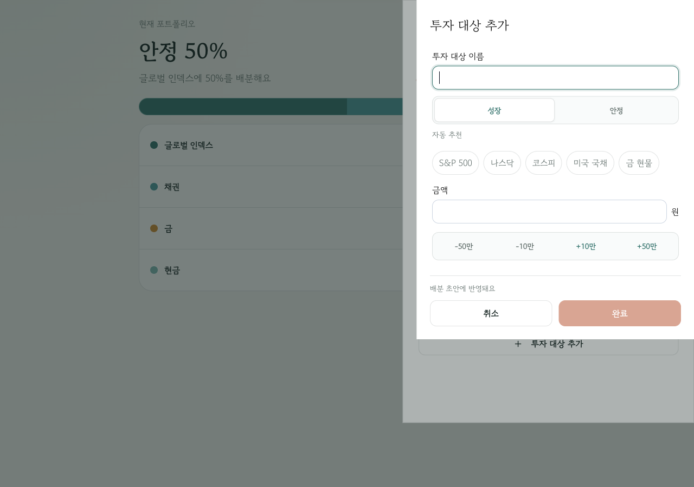
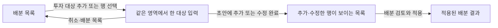

# Portfolio 입력 위치와 Simulation 샘플 연결 — 설계 및 구현 기준

**상태:** 2026-09-19 사용자 승인 후 구현 기준으로 채택. 배포 완료를 의미하지 않으며, 실제 동작은 plan의 검증 기록을 따른다.
**검토 기준:** `0e08c2554cb6ad7f2e265da6c34bdcc166da7695`, 현재 로컬 checkout.
**실행 계획:** [Portfolio VOC plan](../plans/2026-09-19-portfolio-voc.md).

## 1. 확인한 사용자 의도

- 첫 VOC는 **추가 버튼 자체의 위치가 아니라, 누른 뒤 입력 폼이 갑자기 오른쪽 위로 열리는 경험**이다. 사용자가 2026-09-19 대화에서 명확히 확인했다. 버튼을 아래로 옮기는 일로 해결했다고 주장하지 않는다.
- Simulation에서 선택하는 기존 5%·9%·13%에 따라 Portfolio 샘플을 먼저 골라준다. 사용자는 빈 목록에서 다시 출발하지 않고 구성을 확인·조정할 수 있어야 한다.
- 백테스트 데이터 구성, 시세 처리, Supabase 데이터 파이프라인은 이번 범위 밖이다. 매핑은 정적 제품 기본값이며 수익률을 검증한 추천 알고리즘이 아니다.
- 추가 VOC: 화면에서 이미 보이는 내용을 반복하는 설명 문장을 제거하고, 금액·비율·그래프·선택 상태로 의미를 전달한다. 아래 C 범위에 포함한다.
- 5%의 시작 구성은 사용자 정정에 따라 SCHD 50 · 금 50으로 확정한다. 9%·13% 매핑과 세부 화면 전환은 이 문서의 구현 기준으로 적용한다.

## 2. 현재 화면에서 관찰한 사실

Orca 내장 브라우저에서 `tests/support/legacy.vite.config.ts`로 실행한 로컬 호환성 테스트 entry를 확인했다. 화면 값은 월 투자금 800,000원, 글로벌 인덱스 50%·채권 25%·금 15%·현금 10%다. 운영 로그인·실계정 UI 검증과 구분한다. 모든 아래 PNG는 이번 조사에서 저장한 뒤 직접 열어 확인했다.

| 단계 | 관찰 | 증거 |
| --- | --- | --- |
| 1. 배분 수정 진입 | 390px에서 목록 아래 추가 버튼이 초기 본문 viewport 밖에 걸친다. 버튼은 오른쪽 위에 있지 않다 | [390px 초기](../evidence/2026-09-19-portfolio-voc/01-edit-390.png), [본문 스크롤 후](../evidence/2026-09-19-portfolio-voc/02-edit-390-scrolled.png) |
| 2. 넓은 목록 | 768px와 1280px에서 추가 버튼은 현금 다음에 있다 | [768px](../evidence/2026-09-19-portfolio-voc/03-edit-768.png), [1280px](../evidence/2026-09-19-portfolio-voc/04-edit-1280.png) |
| 3. 추가 폼 열기 | 1280px에서는 편집 패널 위에 폭이 다른 입력 패널이 오른쪽 상단에 열린다. 목록 아래에서 시작한 행동의 시선이 위로 이동한다 | [데스크톱 추가](../evidence/2026-09-19-portfolio-voc/05-add-1280.png) |
| 4. 모바일 추가 | 기존 편집 sheet 위에 별도 sheet가 겹친다. 제목과 배경 차단 층이 하나 더 생긴다 | [390px 추가](../evidence/2026-09-19-portfolio-voc/07-add-390.png) |
| 5. 샘플 상세 | 기존 QQQM/SCHD 상세에 비율·금액·조정·초안 반영이 이미 있다. 이 화면을 연결 대상으로 재사용할 수 있다 | [390px 샘플 상세](../evidence/2026-09-19-portfolio-voc/08-sample-detail-390.png) |

코드 근거:

- `AllocationEditor.tsx`의 추가와 수정은 모두 `PortfolioItemSheet`를 연다.
- `PortfolioItemSheet.tsx`는 768px 이하 `sheet`, 그 이상 `panel`을 선택한다.
- `portfolio.css`의 `.portfolio-item-sheet[data-presentation='panel']`은 `inset: 0 0 0 auto`, `width: min(32rem, 42vw)`다. `.portfolio-edit-surface`는 최대 34rem이므로 부모와 자식의 폭도 다르다.
- `SimulationControls.tsx`에 `[5, 9, 13]`이 있고, `portfolioExamples.ts`에 세 구간의 7개 샘플이 있다.
- `PortfolioExamplePicker.tsx`의 초기 선택은 `null`이다. 현재 `hasChanges`는 선택 ID가 있으면 true여서 자동 미리선택을 추가할 때 반드시 구분해야 한다.

**관찰의 한계:** 최초 설정 화면에서의 추가, 입력 완료·오류, 실제 모바일 키보드·스크린리더, 운영 배포 버전은 이번 브라우저 조사에서 검증하지 않았다. 모바일 버튼 발견성은 부수 관찰이며 이번 VOC의 원인으로 바꿔 쓰지 않는다. 사용자 사용성 개선은 아직 가설이다.

## 3. 레퍼런스와 채택 근거

2026-09-19 확인. 외부 패턴의 설명과 이 제품에 대한 설계 판단을 구분한다.

| 자료 | 확인한 내용 | 이 제품에 적용하는 판단 |
| --- | --- | --- |
| [DWP — Add another thing](https://design-system.dwp.gov.uk/patterns/add-another-thing/how-it-works) | 항목 하나 입력 → 요약 목록 → 추가·수정·계속의 반복. 항목별 검증과 개수 제한 안내 | 한 대상 입력 뒤 반드시 배분 목록으로 복귀하고, 추가 완료와 전체 적용을 구분 |
| [Carbon — Modal usage](https://carbondesignsystem.com/components/modal/usage/) | 반복 작업에는 본문에서 완료하는 방식을 고려. 제목·본문·footer, 본문 스크롤, 입력 오류의 해당 위치 표시 | 반복 추가 때 새 패널을 계속 겹치기보다 현재 편집 영역 안에서 한 대상 입력 |
| [M1 — Edit your portfolio](https://help.m1.com/en/articles/9332119-edit-your-m1-portfolio) | 편집 → 대상 추가 → 구성 비율 조정 → 저장의 순서 | 추가는 배분 편집의 하위 작업. 항목 완료가 전체 배분 적용을 뜻하지 않도록 표현 |
| [MOJ — Add to a list](https://design-patterns.service.justice.gov.uk/patterns/add-to-a-list/) | 입력·요약·추가 반복 패턴. 현재 상태는 `To be reviewed` | 보조 시각 레퍼런스로만 사용. 최신 검증된 보편 규칙으로 주장하지 않음 |

[MOJ 페이지 캡처](../evidence/2026-09-19-portfolio-voc/06-reference-moj-list.png). M1은 공식 도움말의 작업 순서를 참고했으며 로그인한 제품 UI를 직접 감사한 것은 아니다. 외부 색상·글꼴·버튼 규격은 복제하지 않고 기존 ISF 토큰을 사용한다.

[Stock Snowball](https://github.com/jinhoOps/stock-snowball)은 실제 데이터·가정 시나리오를 구분하는 후속 참고다. README는 현재 정적 CSV/JSON과 수동 데이터 갱신을 설명한다. 이번 앱에 도입하는 방식이나 Supabase 이전은 조사·구현 범위에 넣지 않는다.

## 4. A — 같은 편집 영역에서 대상 입력

### 대안 비교

| 대안 | 장점 | 비용·한계 | 결정 |
| --- | --- | --- | --- |
| 데스크톱 중앙 모달로 위치만 변경 | 변경량이 작고 폼이 중앙에 나타남 | 재편집의 기존 우측 패널에서 다시 중앙으로 이동. 겹친 입력 층이 남음 | 제외 |
| 목록에서 선택한 행만 펼치기 | 대상과 폼을 바로 연결 | 금액·분류·빠른 선택·오류까지 펼치면 모바일 목록이 크게 밀리고 적용 행동과 혼재 | 제외 |
| **현재 편집 영역의 본문 전환** | 위치와 작업 맥락을 유지하고 한 항목에 집중. 기존 샘플 하위 화면 방식과 일관됨 | 목록 복귀 시 초점·스크롤을 명시적으로 복원해야 함 | **권장** |

### 화면 전환

- 최초 설정: 현재 중앙 본문에서 목록을 입력 폼으로 교체한다. 새 우측 panel을 열지 않는다. 기존 설정 단계는 여전히 배분 단계다.
- 재편집: 이미 열린 sheet/panel 하나 안에서 목록과 입력 폼을 전환한다. 배경 차단과 modal focus 경계를 추가하지 않는다.
- 부모의 좌우 위치·너비·상단 기준선을 유지한다. 재편집은 목록/입력 간 동일한 높이 틀을 사용한다. 최초 설정 본문은 내용에 따라 높이가 늘어나되 새 화면 가장자리로 이동하지 않는다.
- 제목 영역은 `배분 목록` 뒤로가기 + `투자 대상 추가` 또는 `투자 대상 수정`으로 전환한다. 부모의 이전 제목과 전체 적용 footer를 동시에 반복 노출하지 않는다.
- 폼의 맥락은 `월 투자금 80만 원 · 현금으로 남은 금액 8만 원`처럼 작은 한 줄로 유지한다. 별도 결과 시각화 전체를 폼 위에 반복하지 않는다. 이 금액은 편집 화면의 기존 노출 계약을 따른다.
- 입력 순서는 이름 → 신규 추가의 빠른 이름 선택 → 금액·빠른 조정·계산 비율 → 성장/안정과 분류 출처다. 필드 검증·이름 기반 자동 분류·사용자 지정 우선순위는 유지한다.
- 항목 footer는 `취소 / 초안에 추가`, 수정은 `취소 / 수정 완료`. `전체 배분은 목록에서 적용해요`로 범위를 알린다.
- 버튼 자체는 현금 다음의 기존 위치를 유지한다. 이번 작업에 결과 대시보드 재설계나 floating 추가 버튼을 끼워 넣지 않는다.

### 복귀·오류·입력 보존

- 입력 중인 항목은 임시 폼 상태다. 완료 전에 빈 항목을 aggregate draft에 만들지 않는다.
- 완료 시 기존 `draft-item-committed`를 한 번 호출한다. 검증 실패는 입력과 focus를 유지하고 관련 필드에 표시한다.
- 새 항목 완료: 목록의 해당 행을 보이게 하고 그 행에 focus. 기존 항목 완료·취소: 같은 행과 이전 목록 스크롤로 복귀. 신규 취소: 추가 버튼으로 복귀.
- 이름·금액을 바꾼 뒤 `배분 목록`, 취소, Escape를 누르면 기존 폐기 확인을 재사용한다. 한 번의 Escape가 항목과 부모 편집기를 함께 닫지 않는다.
- 항목 입력 중에는 부모 sheet의 드래그 종료를 비활성화하고 명시적 뒤로가기·취소를 제공한다. 목록으로 돌아오면 기존 sheet dismiss를 복원한다. 이는 기존 항목 sheet의 drag 계약을 대체하는 명시적 변경이다.
- 현재 `portfolio-item:add`, `portfolio-item:edit:<name>` 미전송 입력 복구와 계정 잠금·오류 처리 의미를 보존한다. UI를 옮겼다는 이유로 복구 state를 삭제하지 않는다.
- 항목 입력 중에는 샘플 탐색이나 전체 배분 적용을 동시에 실행할 수 없다. 추가·수정·샘플은 같은 편집 세션의 배타적인 화면이다.

### 반응형·접근성 기준

- 390px·768px·1280px 및 높이 600px에서 목록 → 입력 → 복귀를 확인한다. 768px 이하 sheet, 769px 이상 panel의 부모 계약은 유지한다.
- 모바일 sheet는 88dvh 안에서 헤더와 현재 작업 footer 사이 본문만 스크롤한다. 키보드가 열려도 활성 입력·오류·완료에 접근할 수 있어야 한다.
- 재편집에 열린 modal은 하나다. 폐기 확인이 뜨는 동안만 기존 확인 dialog가 focus를 맡는다. 초기 설정 본문은 modal focus trap을 새로 만들지 않는다.
- 화면 전환 시 제목 또는 이름 입력으로 focus를 이동한다. 키보드 진입은 이름 입력, touch 진입은 제목에 focus하여 키보드를 강제로 열지 않는다. 빠른 이름 선택은 기존대로 금액 입력에 focus한다.
- 기존 44px 이상 터치 영역·accessible name·DOM 읽기 순서를 유지한다. 모션은 기존 Anime.js 경계를 사용하고 짧은 본문 전환만 허용한다. reduced motion에서는 즉시 최종 상태를 보여준다.

## 5. B — 5%·9%·13%에서 샘플 미리선택

### 대표 샘플 제안

| 현재 기대 연 수익률 값 | 탐색 구간 | 처음 여는 기존 샘플 ID | 초기 구성 |
| --- | --- | --- | --- |
| 5 | 방어 지향 | `schd-gold` | SCHD 50 · 금 50 |
| 9 | 성장 지향 | `qqqm-schd` | QQQM 70 · SCHD 30 |
| 13 | 공격 지향 | `qld-schd-gold` | QLD 50 · SCHD 30 · 금 20 |

이 표는 사용자 요청의 세 단계에 대응하는 **편집 가능한 시작점**이다. 5%에는 사용자가 지정한 SCHD 50 · 금 50, 9%에는 해당 구간의 단일 샘플, 13%에는 기존 공격 구간의 첫 구성을 정적으로 지정한다. 특정 수익률 달성 가능성·안전성·최적성을 입증한 선택이 아니다. 실제 수익률 산출, 손실률 추정, 구간별 수익률 보간을 만들지 않는다.

- 기존 `schd-gold` 카탈로그의 기본 비율은 70/30이다. 5% 연결에서는 해당 샘플의 주력 비율을 50%로 초기화해 **상세 제목·막대·금액·조절값·초안 반영 모두 50/50**을 사용한다. 카탈로그 원본과 일반 샘플 탐색의 70/30 기본값은 유지한다. 이 초기 비율 조정도 사용자 편집 dirty로 취급하지 않으며, 기존 조정 구성 안내는 유지한다.
- 정확히 5·9·13인 값만 연결한다. 직접 입력으로 9를 입력해도 같은 값이면 9에 연결한다.
- 8.75·10·0·30 등 다른 유효한 값은 `포트폴리오 샘플 둘러보기`로 전체 목록을 연다. 가장 가까운 구간으로 반올림하지 않는다.
- Simulation 결과의 자산 변화 패널 뒤, `목표와 가정` 앞에 낮은 강조의 연결 영역을 둔다. 최초 설정 중이나 계산 불가·Main 복구 화면에는 노출하지 않는다.
- CTA는 선택한 값에 따라 `5% 샘플 포트폴리오 보기`처럼 다음 행동을 직접 표시한다. `9%를 달성하는 포트폴리오`나 수익률을 보장하는 문구는 표시하지 않는다.
- 상세 화면은 기존 위험 구간·구성 유의사항 UI로 맥락을 제공하며, Simulation의 수익률을 반복하는 별도 안내 문단은 추가하지 않는다.
- 1100px 이상에서는 구간 목록과 선택된 상세를 같이 연다. 좁은 화면에서는 선택된 상세부터 열고 `샘플 목록`으로 다른 구성을 고를 수 있다.
- 같은 구간의 다른 샘플·전체 구간·직접 조합은 기존 기능으로 접근 가능하다. 자동 선택을 사용자 성향 진단으로 표시하지 않는다.
- 비율을 수정하면 기존 `샘플에서 조정한 구성 · 위험 구간 미평가`를 유지한다.

### URL과 저장 경계

별도 공유 상태를 만들지 않는 URL 의도를 사용한다. 제안 형식은 `appPath('portfolio') + '?samplePreset=9'`; 일반 탐색은 `?samples=all`이다. URL에는 계정·금액·목표·자산 목록을 싣지 않는다.

- Simulation의 현재 유효한 값으로 CTA를 계산한다. 저장 중에는 링크 이동을 잠시 막고 `설정을 저장하는 중이에요`를 알린다. 저장 실패에는 현재 설정 재저장 행동을 제공하고 실패한 값을 저장됐다고 표현하지 않는다. 서버 확정 후 이동하며 Main·Portfolio를 쓰지 않는다.
- Portfolio는 인증과 최신 Main 조회·기존 bootstrap이 준비된 뒤 intent를 한 번 소비한다. `URLSearchParams`로 명시적으로 허용한 값만 파싱한다. 중복·빈 값·잘못된 preset은 일반 Portfolio 진입으로 처리한다.
- 최초 Portfolio는 기존 cash-only 초안을 유지한 채 배분 단계의 샘플 상세를 연다. 기존 plan 또는 저장된 draft가 있으면 그것을 배경 편집 상태로 보존한다.
- 샘플을 여는 것·자동 미리선택·다른 샘플 열람은 `draft-replaced`나 저장 명령을 발생시키지 않는다. 기존 bootstrap의 Main 투자금 동기화 write는 별도 기존 동작으로 유지하고, 샘플 의도가 추가 write를 만들지 않는지 비교한다.
- 초안 반영은 기존 `이 구성으로 초안 채우기`를 누른 뒤에만 한다. 기존 대상·수동 현금이 있으면 기존 교체 확인을 거친다. 실제 plan 적용은 그 다음 기존 적용 절차다.
- 자동 미리선택 자체는 dirty가 아니다. 처음 본 뒤 닫았다는 이유만으로 폐기 확인을 띄우지 않는다. 사용자가 샘플을 바꾸거나 비율·직접 조합을 수정했으면 기존 탐색 변경 확인을 유지한다.
- intent 소비 후 `history.replaceState`로 해당 query만 제거해 같은 mount의 effect·재렌더가 반복 실행되지 않게 한다. 다른 query·hash는 보존한다. 새로고침은 통상 Portfolio 재진입이며 최초 선택을 영구 저장하지 않는다. 브라우저 Back은 Simulation으로 돌아갈 수 있다.
- 직접 런처·일반 URL 진입은 기존 결과 우선/설정 흐름을 유지하고 자동 샘플을 열지 않는다.
- Main 미설정·투자 0원·stale·오프라인 잠금은 기존 gate가 우선이다. intent는 gate를 우회하지 않는다. 최신화나 재인증 과정에서 사용자가 이미 바꾼 후보를 초기값으로 덮어쓰지 않는다.

## 6. C — 중복 설명을 제거하고 UI로 의미 전달

사용자가 지목한 세 문구와 같은 역할의 반복 문장을 현재 Main·Simulation·Portfolio 결과 화면에서 정리한다. 새로운 설명 문장이나 장식 카드로 빈자리를 채우지 않는다. 원래 정보가 시각 요소에서 읽히도록 구조·간격·선택 상태를 함께 확인한다.

| 화면 | 제거할 설명 | 의미를 전달할 UI |
| --- | --- | --- |
| Main | `수입과 지출, 저축, 투자 뒤에 남는 돈을 확인하세요.` | 기존 지출·저축·투자·남는 돈/적자 목록의 라벨·금액·비율과 수입 기준 배분 막대. 적자 부호·기준선은 유지 |
| Simulation | `미래에 모일 금액 그대로 보여줘요.` 및 같은 자리의 `물가 상승을 반영해 오늘의 가치로 보여줘요.` | 명목/실질 선택의 활성 상태, 기간별 그래프·축 단위·표시 금액의 일치. 필요하면 선택 라벨을 `명목 금액 / 물가 반영`처럼 짧고 직접적으로 바꾸고 설명 문단은 만들지 않음 |
| Portfolio | `{최대 배분 대상}에 {비율}를 배분해요` 전체 동적 문장 | 기존 100% 배분 막대와 대상별 이름·비율 목록의 대응. `글로벌 인덱스 50%`뿐 아니라 모든 대상·비율에서 같은 중복 문장 제거 |

- 제거되는 문단의 margin·빈 wrapper도 정리한다. 결과 제목 다음에 핵심 숫자·시각화가 이어지고 불필요한 공백이 남지 않아야 한다.
- 정보 전달을 색상 하나에 맡기지 않는다. 이름·수치·단위·선택 상태·focus 표현은 읽을 수 있어야 한다. 금액 숨김 설정도 유지한다.
- 접근성 이름·폼 라벨·오류·저장 실패·초안과 적용 구분·샘플의 수익률 미검증 의미처럼 행동이나 해석에 필요한 정보는 유지한다. 단순 설명 문장을 통째로 sr-only로 옮겨 중복 낭독을 만들지 않는다.
- 기존 결과 화면의 인접 문장도 같은 기준으로 점검하되, 설정 도움말이나 오류 메시지까지 일괄 삭제하지 않는다. 제거/유지 판단을 실제 시각 정보와 연결해 기록한다.
- 이번 A/B 설계에도 같은 기준을 적용한다. 다음 행동은 구체적인 버튼명으로 표현하고, 이미 보이는 수익률·배분을 되풀이하는 환영 문장이나 안내 카드를 추가하지 않는다. Simulation 출처·샘플 한계는 상세 진입에서 필요한 최소 표현만 둔다.
- 검증은 문구가 사라졌다는 확인에 더해, 남는 돈/적자·명목/실질·대상별 비율을 문장 없이 읽고 조작할 수 있는지 확인한다. 390px·768px·desktop 및 키보드·스크린리더 이름/상태를 점검한다.

## 7. 기존 계약과의 관계

- 현재 [PRD](../../ways-of-work/plan/isf-rebuild/connected-financial-planning-workspace/prd.md)와 [DESIGN](../../../DESIGN.md)은 현재 구현의 기준이다. 이 문서가 자동으로 승인된 제품 경계를 대체하지 않는다.
- 실행 승인 후 PRD의 Simulation/Portfolio journey와 DESIGN의 항목 sheet·panel 계약을 갱신한다. [편집 위계 설계](2026-09-16-portfolio-editor-hierarchy-design.md) 및 [샘플 탐색 설계](2026-09-16-portfolio-overview-and-sample-navigation-design.md)에 새 계약으로 대체되는 범위를 명시한다. 일반 샘플 진입의 미선택 원칙은 유지하고, 명시적 Simulation CTA 진입만 미리선택 예외로 추가한다.
- Main 소유 다섯 월간 값, Portfolio의 aggregate-only plan/draft, 최대 10개 대상, schema v5·protocol 5·보존 accountMap/locations·원자적 복원 계약을 유지한다.
- 새 DB 테이블·RPC·migration·localStorage key·추천 API·시세 수집·수익률별 새로운 포트폴리오를 만들지 않는다.

## 8. 사용자 경험의 인수 기준

1. 최초 설정과 재편집에서 추가·수정을 열어도 새로운 오른쪽 위 입력 패널이 생기지 않는다.
2. 새 항목을 완료하면 사용자가 이름·금액·비율과 남은 현금 변화를 목록에서 즉시 확인한다. 전체 계획은 적용 전 그대로다.
3. 취소·오류·삭제·10개 제한·키보드·좁은 화면에서도 입력과 복귀 위치가 예측 가능하다.
4. 5·9·13의 각 CTA는 표에 지정한 상세를 열고, 다른 샘플 탐색과 직접 조합을 막지 않는다.
5. 미리선택만 하고 돌아오면 기존 plan/draft를 바꾸지 않는다. 교체·최종 적용은 사용자 행동으로만 진행한다.
6. 화면에는 정적 시작점과 검증된 기대수익률을 혼동시키는 문구가 없다.
7. 지목된 세 종류의 반복 설명은 제거되고, 각 앱의 핵심 의미는 라벨·수치·시각화·선택 상태로 읽힌다. 불필요한 공백과 대체 설명 문단이 생기지 않는다.

구현 후 짧은 VOC 재확인 과제: 설명 없이 대상 하나를 추가하고 취소/재추가한 뒤 목록에서 결과 찾기; 9% 결과에서 샘플 열고 다른 구성을 살펴본 뒤 적용 없이 돌아오기. 관찰은 화면 찾기·복귀 실수·저장 의미 혼동으로 기록하고, 사용자 검증 전 개선 효과를 확정하지 않는다.
