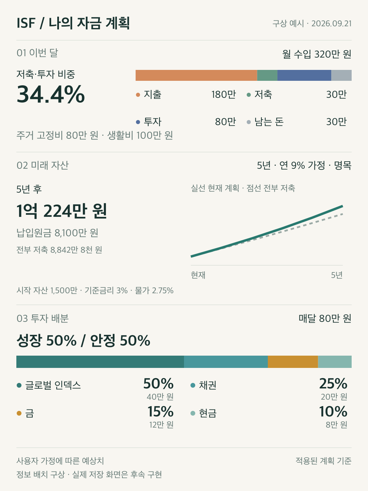

# 세 앱의 모달·하단 시트·다음 단계·결과 이미지 설계

**상태:** 2026-09-21 계획 제안. 사용자가 요구한 방향을 구체화한 문서이며 제품 구현·배포 완료를 뜻하지 않는다.
**기준:** `main` / `7c22487d`. 기존 미추적 `2026-09-16-portfolio-editor-hierarchy.md`는 이번 범위 밖이다.
**총괄 실행 계획:** [단계·의존성·검증](../plans/2026-09-21-responsive-experience.md).
**관찰 자료:** [현재 화면과 확인 한계](../evidence/2026-09-21-responsive-overlays/README.md).

## 1. 사용자 요구와 설계 결정

| 구분 | 확정된 사용자 요구 | 이 계획의 구체안 |
| --- | --- | --- |
| 웹 편집 | 사이드바를 모달로 바꾼다 | Main 월 금액·지출·남는 돈, Portfolio 배분을 중앙 모달로 통일 |
| 모바일 편집 | Main 월 금액처럼 Simulation도 아래에서 올라온다 | 그래프 카드 하단 중앙 `조건 편집` → 하단 시트; 웹에서는 같은 내용의 중앙 모달 |
| 행동 위치 | 버튼·토글을 누르기 편하게 오른쪽에 둔다 | 설정 진입 오른쪽, 행의 라벨 왼쪽·조작 오른쪽, footer의 주요 행동 오른쪽 |
| 톱니 메뉴 | 아이콘 축 때문에 잘못 펼쳐지지 않는다 | 모바일 중앙 정렬 하단 시트, 웹 작은 중앙 설정 모달을 우선안으로 선택 |
| 다음 단계 | 수익률 옆 텍스트 링크 대신 결과 아래에서 자연스럽게 제안한다 | Main의 하단 탐색을 재사용한 Simulation → Portfolio 연결 |
| 결과 보관·공유 | 고정지출부터 배분까지 3:4 이미지로 보관하고, Portfolio 하단의 윤곽 없는 두 버튼으로 저장·공유한다 | `저장하기` → PNG 저장 / `공유하기` → Supabase에 48시간 보관되는 이미지 링크 공유 |

이번 계획에서는 오른손 사용 편의를 **행동 위치의 일관성과 넓은 조작 영역**으로 구체화한다. 모든 컨트롤의 우측 배치가 보편적 접근성 규칙이라는 주장은 하지 않는다. 뒤로가기는 왼쪽, 읽기 시작점도 왼쪽에 둔다. 작은 모바일 주 행동은 좁은 우측 버튼 대신 전체 폭도 허용한다. 색상·스위치 위치만으로 의미를 전달하지 않는다.

## 2. 현재 구조에서 확인한 문제

1. Main desktop 편집은 실제 `aside` 우측 패널이며 모바일 경로와 다른 DOM·focus 처리를 가진다. Portfolio는 이미 native modal dialog지만 **시각적 형태가 우측 패널**이다. 따라서 단순 `aria-modal` 추가가 이번 해결책이 아니다.
2. Main은 767px 이하 sheet/768px 이상 panel, Portfolio는 768px 이하 sheet/769px 이상 panel이다. 같은 768px에서 앱별 형태가 다르다.
3. `AppManagementMenu`는 중앙 launcher 내부 `position:absolute; right:0`을 사용한다. 390px 캡처에서 메뉴가 화면의 왼쪽으로 넓게 펼쳐진다. Portfolio 보기 설정도 switch/radio가 왼쪽, 텍스트가 오른쪽이다.
4. Simulation은 `SimulationControls`의 수익률 버튼 바로 아래 링크가 있고, `AdvancedSettings`는 본문 details이다. 메인 결과 읽기·조건 변경·앱 이동이 같은 영역에서 경쟁한다. 이는 코드와 현재 AX 관찰로 확인했으며 Simulation 신규 PNG는 캡처 오류로 확보하지 못했다.
5. 지난 VOC 수정은 Portfolio **항목 입력**을 인라인으로 만들었지만 부모 편집기의 패널 형태는 유지했다. 부모부터 변경할 필요가 있다.
6. [README](../../../README.md)의 Portfolio 최대 대상 설명은 최근 중복 문구 제거와 일부 다르다. 구현 시 PRD·DESIGN·README를 함께 맞추고, 이번 계획에서는 현재 동작을 완료된 새 계약처럼 바꾸지 않는다.

## 3. 레퍼런스와 적용 범위

- [WAI-ARIA Modal Dialog](https://www.w3.org/WAI/ARIA/apg/patterns/dialog-modal/): 모달이 열리면 배경을 비활성화하고 초점을 내부에 유지하며 종료 뒤 진입점으로 반환한다. 이를 키보드·보조기술 인수 조건으로 채택한다.
- [W3C HTML dialog](https://www.w3.org/WAI/WCAG21/Techniques/html/H102): native `dialog.showModal()`을 공통 표면의 기반으로 사용한다. 기존 account boundary와 복구 로직은 앱이 소유한다.
- [Carbon Modal](https://carbondesignsystem.com/components/modal/usage/): 제목/본문/footer 구분, 긴 본문만 스크롤, 취소 왼쪽/주요 행동 오른쪽을 참고한다. 자주 비교하는 결과 자체는 페이지에 유지한다. Carbon의 시각 테마나 라이브러리를 도입하지 않는다.
- [MDN Web Share](https://developer.mozilla.org/en-US/docs/Web/API/Navigator/share): 공유는 지원 여부와 사용자 활성화가 필요하다. 링크를 먼저 생성하고 별도 `링크 공유` 클릭에서 호출하며 미지원 환경에는 링크 복사를 제공한다.
- Material 3 bottom-sheet 페이지는 이번 검색에서 본문을 가져오지 못해 세부 규칙의 근거로 쓰지 않는다. 모바일 모션·드래그는 현재 Main의 검증된 구현을 출발점으로 삼는다.

## 4. 공통 표면의 원칙

### 4.1 화면 폭과 크기

새 기준은 **767px 이하 하단 시트 / 768px 이상 중앙 모달**이다. 현재 Portfolio의 768px sheet 계약은 의도적으로 대체한다. 모바일이라는 기기 이름 대신 CSS viewport 폭으로 판정한다.

| 용도 | 767px 이하 | 768px 이상 |
| --- | --- | --- |
| 월 금액·지출·남는 돈·Simulation 조건·Portfolio 배분 | 하단 부착, 수평 중앙, 최대 92dvh, 내용만큼 높이 | 중앙, 기본 640px, 필요 시 720px, 최대 `calc(100dvh - 48px)` |
| 설정 | 내용 높이의 하단 시트, 최대 80dvh | 중앙 440px, 최대 `calc(100dvh - 48px)` |
| 샘플 탐색 | 아래에서 올라오는 최대 `100dvh` 전체 높이 화면 | 중앙 최대 1080px의 큰 모달 |
| 이미지 미리보기 | 큰 하단 시트, 그림과 설정 본문 스크롤 | 중앙 최대 960px, 미리보기와 설정 두 열 |
| 폐기·적용 확인 | 작은 중앙 확인 모달 | 작은 중앙 확인 모달 |

- desktop 좌우 여백은 최소 24px, 모바일 콘텐츠 좌우는 16px. 짧은 desktop 높이에서는 위아래 여백을 최소 16px로 줄이고 body만 스크롤한다.
- 큰 샘플 모달의 목록/상세 두 열은 **실제 내부 가용 폭 960px 이상**일 때만 사용한다. 기존 viewport 1100px 분기를 모달 내용 폭 기준으로 대체해 좁은 모달 안의 두 열을 방지한다.
- header/title/close, scrollable body, footer의 세 영역을 고정한다. 페이지와 body가 동시에 스크롤하지 않는다. `min-height:0`, safe-area, scroll padding을 지정한다.
- 키보드가 뜨면 보이는 viewport 안에 입력과 footer를 유지한다. `dvh`만으로 해결됐다고 주장하지 않고 iOS Safari/Android Chrome의 `visualViewport` 동작을 검증한다. 입력 focus를 강제로 빼 키보드를 닫는 해결법은 금지한다.
- 767↔768 변경 시 draft와 현재 필드를 보존한다. 동일 dialog의 presentation만 바꾸며 언마운트/새 편집 시작으로 처리하지 않는다.

### 4.2 조작 위치

- 상단은 가운데 세 앱 launcher, 오른쪽 설정 버튼을 독립된 열에 둔다. 오른쪽 기준은 무한히 넓은 브라우저 끝이 아니라 앱 콘텐츠 프레임 끝이다. 320px에서도 서로 겹치지 않게 한다.
- 일반 행은 `이름·설명` 왼쪽, `값·toggle/radio/chevron` 오른쪽. 행 전체 label을 누를 수 있어야 한다. CSS `row-reverse`만 적용해 시각/DOM 순서를 뒤집지 않는다.
- modal footer는 취소 → 적용 순서이며 적용이 오른쪽이다. 모바일은 취소보다 적용에 더 넓은 폭을 준다. 단독 저장·계속 행동은 전체 폭도 가능하다.
- 뒤로는 왼쪽, 닫기는 오른쪽. 삭제·초기화는 별도 낮은 강조 영역으로 둔다. 금액 증가/감소와 기간 순서는 수학적 읽기 순서를 유지한다.
- 모든 버튼/행의 조작 영역 최소 44×44px, focus ring, accessible name, selected/disabled 상태를 갖춘다.

### 4.3 focus·종료·상태

- 공통 `ResponsiveDialog` 하나가 native dialog, background inert, scroll lock, focus 반환과 opt-in 모바일 진입 모션을 소유한다. Portfolio 전용 저장 판단과 Main controller를 이 컴포넌트로 옮기지 않는다.
- 긴 설정·목록은 제목으로 초기 focus, 특정 금액 행으로 진입한 경우 해당 필드로 focus한다. 모바일에서 일반 열기만으로 키보드를 올리지 않는다.
- 닫기/X/Escape/backdrop/sheet drag는 앱의 한 `requestClose(reason)`으로 모인다. clean이면 종료, dirty면 확인, saving이면 유지, 오류면 입력과 재시도를 유지한다.
- 하위 항목 편집은 기존 인라인을 유지한다. 목록 → 샘플/미리보기는 부모와 나란히 패널을 추가하지 않고 같은 표면의 단계 전환을 우선한다.
- 확인이 필요할 때만 최상위 확인 모달 1개를 허용한다. 부모와 자식의 focus trap을 동시에 작동시키지 않는다. 확인 취소는 부모의 현재 단계·값·스크롤로 돌아간다.
- sheet drag는 header 여백/손잡이만 허용한다. input, 버튼, slider, 본문 스크롤에서는 시작하지 않는다. 기존 `useSheetDismiss`의 guard·최대 300ms 종료·reduced motion 규칙을 재사용한다.
- Simulation 조건 sheet는 Main 편집기와 같은 작은 y/opacity Anime.js surface spring으로 아래에서 등장한다. reduced motion·애니메이션 실패·레이아웃을 계산할 수 없는 환경에서는 최종 상태를 보장한다.
- 모바일 브라우저 Back을 닫기로 쓸 경우 overlay 전용 history state 1개만 추가한다. 확인 취소 시 popstate 재진입 루프 없이 같은 상태를 복구한다. 내부 항목/샘플 뒤로가기와 앱 간 URL 탐색을 구분한다. 구현 계획 A에서 통합 검증한 후 모든 편집기에 같은 helper를 쓴다.

### 4.4 설정 메뉴 대안 비교

| 안 | 장점 | 비용/한계 | 결정 |
| --- | --- | --- | --- |
| viewport 오른쪽에 clamp한 popover | 변경량 작고 결과를 가리지 않음 | 긴 계정 정보·토글·작은 높이·anchor 위치 계산이 계속 필요 | 이번 우선안에서 제외 |
| 웹 중앙 모달 / 모바일 하단 시트 | 편집·설정의 닫기/focus/반응형 원칙 일치 | 아주 짧은 설정도 명시적 화면으로 열림 | **추천** |
| 전체 화면 설정 페이지 | 길어진 설정에 유리 | 현재 항목 수에 비해 이동·복귀 부담 큼 | 확장 시 재검토 |

설정 모달은 정렬·보기·계정·초기화 순서로 구성한다. `role=menu` 안에 폼 제어를 섞는 방식을 정리하고 일반 dialog 안의 fieldset/button으로 제공한다. 앱 초기 설정 중에도 계정 정보·복구·로그아웃 접근은 유지한다. 오프라인에서 가능한 계정 복구/로그아웃과 불가능한 금융 편집을 기존처럼 구분한다.

## 5. 앱별 변경

### 5.1 Main

`월 금액 편집`, `지출 계산`, `남는 돈 분배`의 데스크톱 우측 패널을 중앙 모달로 바꾼다. 모바일 월 금액의 하단 바와 행별 바로 편집은 유지하고 공통 모달 shell을 사용한다. 다섯 값의 소유권, 지출 답변 중간 저장/완료, 남는 돈의 추가 적용, 실패/충돌/중복 적용 방지는 변경하지 않는다.

### 5.2 Simulation

결과 화면: 목표 도달 요약 → 자산 변화 → 비교 결과 → 그래프 카드 하단 중앙의 조건 편집 → 하단 Portfolio 진입 순서다. 조건 편집 진입점과 명목·실질 위치 조정의 구현·검증 기록은 [실행 계획의 우선 작업](../plans/2026-09-21-simulation-edit-and-discovery.md)에 둔다.

- 모바일과 desktop 모두 그래프·비교 수치 다음, 같은 카드 하단 중앙에 `조건 편집` 버튼을 둔다. Main의 quiet 버튼과 같은 투명한 배경, 최소 44px 터치 영역, hover/focus 표시를 사용하며 문서와 함께 스크롤된다.
- 버튼은 모바일에서 Main 편집기와 같은 Anime.js surface spring으로 아래에서 올라오는 하단 시트, desktop에서 정지 상태의 중앙 모달을 연다. 닫으면 버튼으로 초점을 돌려준다.
- 편집 내용은 제목·닫기 다음 `명목·실질` → `기간·기대수익률` → `시작 자산·목표` → `기준금리·물가` 순서다. 명목·실질 토글은 첫 화면에서 스크롤 없이 보인다. 기존 0~30년, 5/9/13%, 직접 입력/증감, 목표 검증과 기본 목표 복원을 유지한다. 중첩 accordion은 만들지 않는다.
- 전체 그래프와 별개로 편집 상단에 `N년 뒤 예상액 / 목표까지 기간` 두 숫자를 즉시 미리 보여준다. 배경 결과는 적용된 값으로 유지한다.
- **새 행동 계약:** 조건 편집은 local edit draft → `취소 / 적용`이다. 서버 저장 성공 후 시트를 닫고 결과를 갱신한다. 이는 현재 조건의 자동 저장에서 의도적으로 바뀌는 지점으로 PRD·DESIGN에 반영한다.
- 결과 화면의 명목/실질 토글은 편집 화면으로 옮기고 그래프 제목 옆에는 현재 기준 표시만 남긴다. 우선 배치 변경에서는 현재 저장 경로를 사용하며, 후속 취소/적용 전환에서는 명목·실질도 편집 draft에 포함한다. 편집기 열린 동안 배경 조작은 차단된다. 최초 onboarding은 페이지 흐름으로 유지한다.
- 불완전한 raw 입력·오류가 있으면 적용하지 않는다. `적용` click 직전 blur에만 의존하지 않고 현재 입력 전체를 parse/validate한다.
- 저장 중은 중복 적용/종료를 막고 실패·충돌·응답 유실 때 draft와 재시도를 같은 시트 안에 유지한다. 열린 상태의 Main 변경은 조용히 덮어쓰지 않고 최신 기준 재검토를 표시한다.

### 5.3 Simulation → Portfolio

기존 수익률 옆 텍스트 링크는 제거한다. `JourneyEntryCard`의 하단 탐색을 세 앱 흐름에 맞게 확장한다.

- 페이지 끝에 도착한 뒤 새 아래 스크롤/위 스와이프 또는 키보드 Tab으로 다음 단계가 드러난다. 사용자가 버튼을 눌러야 이동한다. 한 번 드러난 제안은 같은 결과 화면에서 유지한다.
- 그래프 카드 하단 `조건 편집` 버튼 다음에 제안이 이어지도록 간격과 노출 후 스크롤 위치를 계산한다. sheet/설정/그래프 조작/내부 스크롤 중에는 reveal하지 않는다.
- exact preset 문구 제안: **`연 9%를 가정했다면, 이 구성부터 볼까요?`**, 버튼 **`포트폴리오 샘플 보기`**. 사용자가 제시한 대화형 연결을 살리되 `9%에 가까운 수익률을 내는 구성`으로 읽히는 표현은 피한다. backtest 없이 수익률 유사도를 판단할 수 없기 때문이다.
- 5→SCHD 50·금 50, 9→QQQM 70·SCHD 30, 13→QLD 50·SCHD 30·금 20을 유지한다. 8.75 등 다른 값은 `투자 구성을 살펴볼까요?` → `?samples=all`. 가까운 preset으로 반올림하지 않는다.
- CTA의 값은 **서버 확정된 현재 결과**와 같다. 저장 중·미해결 저장 실패/충돌에는 이동을 잠그고 재시도/복구를 제공한다. 편집 취소 후 rate가 바뀌지 않아야 한다.
- Main 미설정/투자 0원/계산 불가에는 샘플 권유를 표시하지 않는다. Portfolio 직접 launcher 진입과 URL intent 한 번 소비·draft 보존 계약은 유지한다.

### 5.4 Portfolio

결과 → 행 선택 → 중앙 배분 모달/하단 시트 → 항목 인라인 또는 샘플 단계 → 검토·적용 → 결과의 흐름이다. 현재 항목 이름·금액·분류·비율·현금·초안의 의미는 유지한다. 샘플 목록·상세는 큰 표면 안의 단계로 구성하고 부모 편집기와 별도 우측 패널을 쌓지 않는다.

적용된 결과의 마지막 영역에 `저장하기`와 `공유하기`를 가로로 나란히 둔다. 기본 배경·테두리·그림자 없이 작은 다운로드/공유 아이콘과 텍스트를 사용한다. 두 버튼의 터치 영역은 각각 최소 44px이며 hover·pressed 피드백과 keyboard focus ring은 유지한다. 페이지 콘텐츠 끝에 항상 렌더하고 별도 스크롤 reveal이나 화면 고정 바는 추가하지 않는다. 결과 목록·배분 수정 동작과 간격을 두며 safe-area를 확보한다. 첫 배분 적용 후에도 자동으로 미리보기를 띄우지 않는다.

두 버튼 아래에 `공유 링크는 2일 뒤에 만료돼요.`를 작게 표시한다. 이미지 구성은 기존 3:4 예시를 유지하며 저장/공유 모두 같은 미리보기를 사용한다. 48시간 링크의 상세 계약은 [공유 확장 계획](../plans/2026-09-21-result-image-link-sharing.md)을 따른다.

## 6. 3:4 종합 결과 이미지

### 6.1 목표와 시각 구성

결과를 다시 볼 수 있는 **숫자 중심의 한 장 재무 계획**으로 만든다. 1080×1440 PNG, 종이색 배경·ISF 서체·기존 자산 색을 사용한다. 스크린샷에 launcher/버튼을 포함하는 방식이 아니라 고정 비율의 전용 출력 레이아웃이다.

이 구상은 정보의 위계와 비중을 보여준다. 최종 폰트·행간과 10개 대상 대응은 구현 단계의 렌더 검증에서 확정한다. 예시의 자산 곡선은 기존 `projectCompoundGrowth`로 계산했으며 실제 계정 데이터가 아니다.

| 영역 | 반드시 담을 정보 | 표현 |
| --- | --- | --- |
| 상단 | 나의 자금 계획, 기준 날짜 | 작은 브랜드·제목, 개인정보 제외 |
| 월 자금 | 수입, 주거/생활비 합계·각 값, 저축, 투자, 잔액/적자, 저축·투자 비중 | 큰 비중 숫자 + 배분 막대 + 짧은 숫자 목록 |
| 미래 | 기간, 예상 자산, 납입원금, 전부 저축 비교, 시작 자산, 수익률·금리·물가, 명목/실질 | 큰 예상액 + 짧은 선 그래프 + 가정 한 줄 |
| 배분 | 월 투자금, 성장/안정 비율, 모든 대상과 현금의 이름·비율·선택적 금액 | 100% 막대 + 대응 목록 |
| 하단 | 계획 기준일, 예상값 표시 | 한 줄의 최소 해석 정보 |

- 정식 단일 카드에는 지출 도우미 13개 항목을 전부 넣지 않는다. 적용된 주거 고정비/생활비를 보여준다. 도우미 답변은 미완료이거나 직접 수정된 Main과 다를 수 있다. 13개 상세 내보내기는 후속 별도 카드 범위다.
- 대상은 최대 10개+현금까지 누락하지 않는다. 1~4개는 넉넉한 1/2열, 5~11행은 두 열로 같은 순서를 유지하고 포트폴리오 영역 높이를 늘린다. 공간은 큰 장식 여백과 보조 비교 영역에서 확보한다.
- 이름은 저장 모델에 길이 제한이 없으므로 새 저장 제한을 만들지 않는다. 미리보기에서 긴 이름은 최대 두 줄·말줄임을 표시하고, 필요한 경우 **이미지에만 쓰는 표시명**을 사용자가 조정할 수 있게 한다. 이름이 줄었다는 사실을 미리보기에서 알려 원본을 잘랐다고 숨기지 않는다. 비율·금액·음수 부호는 말줄임하지 않는다.
- 출력 일반 라벨 최소 32px, 주요 수치 48~80px, 숫자 tabular. 축약 단위는 기존 money utility를 사용한다. 390px 축소 보기와 원본 보기 모두 검증한다. 이름이 긴 최악 fixture에서 무조건 글자를 줄여 맞추지 않는다.
- 적자는 음수/적자 라벨로 별도 표현한다. 비율 그래프가 100%를 넘는 지출을 정상 배분처럼 정규화하지 않는다. 투자 0원에서는 `월 투자금 0원`과 배분의 기준을 명확히 하며 유효하지 않은 종합 카드를 만들지 않는다.

### 6.2 미리보기·개인정보·저장

1. `저장하기` 또는 `공유하기`를 누르면 같은 웹 모달/모바일 큰 시트에 실제 생성할 이미지와 옵션을 보여준다. 진입 의도에 따라 마지막 행동을 `이미지 저장` 또는 `공유 링크 만들기`로 구분한다. 미리보기만 열어서는 업로드하지 않는다.
2. 금액 포함 여부는 현재 Portfolio 보기 설정을 초기값으로 가져오되, export에서의 변경은 원래 설정을 바꾸지 않는다. `금액 포함` 라벨 왼쪽, 스위치 오른쪽. 포함 상태에서는 모든 금액이 미리보기에서 보인다.
3. 금액 제외 모드는 소득·지출·자산·목표·원화 축/라벨을 **출력 모델에서 제거**한다. 대체 미래 그래프는 배율 기준이며 원화 tooltips/metadata를 포함하지 않는다. 비율과 가정·기간은 유지한다. CSS 숨김으로 원문을 남기지 않는다.
4. 계정 이름·이메일·ID, 계좌·기관, revision, API URL, 복구 원문은 이미지와 파일명에 포함하지 않는다. 종목 이름은 사용자가 직접 쓴 값임을 고려해 미리보기로 확인할 수 있게 한다.
5. 고정 PNG를 브라우저에서 생성한다. `이미지 저장`은 로컬 다운로드만 요청하고 업로드하지 않는다. `기기에 사진 저장 완료`로 단정하지 않는다. 파일명은 `ISF-plan-YYYY-MM-DD.png`다.
6. 공유 미리보기에는 `링크를 가진 사람은 누구나 이 이미지를 볼 수 있어요.`와 `공유 링크는 생성 후 2일 뒤에 만료돼요.`를 표시한다. 사용자가 `공유 링크 만들기`를 누르면 확인한 PNG만 업로드한다. 생성 후 URL·정확한 만료 일시와 `링크 공유`/`링크 복사`를 제공한다. Web Share에는 URL만 전달하며 PNG 파일·금융 수치를 메시지에 넣지 않는다. 생성 후 별도 클릭에서 공유해 사용자 활성화를 유지한다. 공유 취소는 오류로 취급하지 않는다.
7. Supabase private bucket·별도 공유 메타데이터·Edge Function을 추가한다. 서버 시각으로 게시 완료 후 48시간에 열람을 차단하고 정기 작업으로 파일을 삭제한다. 원본 workspace는 업로드하지 않으며 schema v5·protocol 5·workspace backup 계약은 유지한다. object URL과 메모리는 닫기/교체 때 해제한다.
8. 공유 링크는 생성 당시의 고정 이미지다. 이후 계획 변경이 기존 링크를 바꾸거나 만료를 연장하지 않는다. 수신자는 로그인 없이 이미지만 열람하며, 만료 시 `공유 기간이 끝났어요`를 본다. 이미 내려받은 사본까지 삭제되는 기능으로 표현하지 않는다.

### 6.3 데이터와 계산의 기준

- 세 앱 데이터는 **하나의 ready 상태 account workspace snapshot revision**에서 읽어 immutable 모델로 고정한다. 브라우저 localStorage의 과거 workspace를 계정 원본 대신 읽지 않는다.
- Main은 applied, Portfolio는 aggregate applied plan, Simulation은 서버에 저장된 draft(이 앱의 확정 결과)를 사용한다. Portfolio 편집 초안은 이미지에서 제외한다.
- Simulation source의 Main 금액/시각과 Portfolio `syncedInvestmentWon`의 기준이 현재 Main과 일치하는지 검사한다. 불일치하면 미리보기 진입에서 해당 앱 최신화로 안내하고 조용히 재계산·저장하지 않는다.
- Main·Portfolio 적용이 없거나 Simulation 미설정이면 누락 상태와 해당 앱 이동을 제공한다. 1차 버전은 완성된 종합 카드만 저장한다. 없는 값을 0으로 채우거나 초기값을 사용해 완성된 결과처럼 만들지 않는다.
- saving/pending/conflict/uncertain/expired에는 생성과 최종 저장을 잠근다. 1차 버전의 오프라인 생성도 막고 마지막 계획을 최신으로 표현하지 않는다.
- 미리보기 중 revision이 바뀌면 이미지를 조용히 교체하지 않는다. `계획이 변경됐어요 · 다시 만들기`를 제공하고 최종 다운로드/공유를 잠근다. 옵션 변경도 이전 Blob을 바로 무효화한다.
- `projectCompoundGrowth`, Main summary, `materializeAllocation`과 기존 반올림/잔액 계산을 재사용한다. SVG/Canvas에 금융 공식을 다시 구현하지 않는다. 이미지가 입력한 수익률과 Portfolio 종목 간의 검증된 인과관계를 암시하지 않게 한다.

### 6.4 구현 방식의 선택

고정 SVG 레이아웃 → 이미지 decode → Canvas → PNG를 우선한다. text/line/bar/chart를 한 renderer에서 만들고 미리보기는 최종 PNG를 사용해 저장본과 일치시킨다. 외부 이미지·foreignObject·live DOM screenshot 의존은 피한다. 기존 번들 폰트가 있으면 같은 폰트 byte를 SVG에 포함하고, 없다면 허용 라이선스와 브라우저 래스터 결과를 확인한 뒤 local asset으로 제공한다. 폰트 실패는 오류/재시도를 보여주며 잘못 렌더된 PNG를 성공으로 넘기지 않는다.

## 7. 변경 경계와 문서 이관

- 현재 [PRD](../../ways-of-work/plan/isf-rebuild/connected-financial-planning-workspace/prd.md)의 Main/Simulation/Portfolio·Journey·Future Product Direction, [DESIGN](../../../DESIGN.md)의 panel/breakpoint/auto-save/하단 탐색 규칙을 구현 단계마다 새 승인 계약과 맞춘다.
- 대체 대상은 Main 지출/남는 돈/월 금액 패널 규칙, Simulation 접힌 `목표와 가정`과 본문 rate link, Portfolio 768/769 분기와 샘플 overlay 구조다. 관련 2026-09-10/11/16/19 spec에는 대체 범위를 짧게 링크한다.
- schema v5·protocol 5·소유권·보존 accountMap/locations·whole-workspace 복원은 그대로다. 공통 dialog/export는 데이터 mutation 권한을 갖지 않는다.
- 공유 전용 DB migration·private bucket·Edge Functions·로그인 없는 이미지 열람 페이지는 C 단계에 포함한다. workspace schema 변경, backtest, 시세 수집, 수익률 보장, 새 계좌 UI는 범위 밖이다.
- 이 문서만으로 기존 현재 제품 완료 체크를 바꾸지 않는다. 계획 승인 뒤 각 단계 구현 때 canonical 문서를 함께 갱신한다.

## 8. 완료 기준

- 세 앱의 대상 desktop 편집 화면에 우측 패널이 없고, 768px 이상에서 중앙 정렬 모달이 열린다.
- 390px의 Main/Simulation/Portfolio 편집과 설정이 아래에서 열리며 닫기/적용 위치가 일치한다.
- 320/390/767/768/1024/1280/1440px, 짧은 높이·200% 확대에서 가로 overflow, footer 가림, 두 focus trap이 없다.
- 조건 취소는 결과·서버값을 보존하고 적용 성공 뒤 결과와 하단 CTA가 함께 갱신된다.
- 하단 스크롤만으로 URL 이동/샘플 적용이 일어나지 않으며 원래 Main 탐색도 회귀하지 않는다.
- 1080×1440 PNG가 미리보기와 동일하고 같은 확정 기준의 수치만 담는다. 최대 대상·긴 이름·현금·적자·0년·실질·금액 숨김·오류를 검증한다.
- 실제 iOS Safari/Android Chrome 키보드·share와 VoiceOver/TalkBack은 자동 브라우저 검증과 별도 증거로 기록한다.
- 짧은 사용자 재확인 과제: 조건 바꾸고 취소 → 조건 적용 → 결과 끝에서 샘플 찾아 복귀 → 이미지의 숫자를 보고 저장. 수행 전에는 이해도가 개선됐다고 확정하지 않는다.
